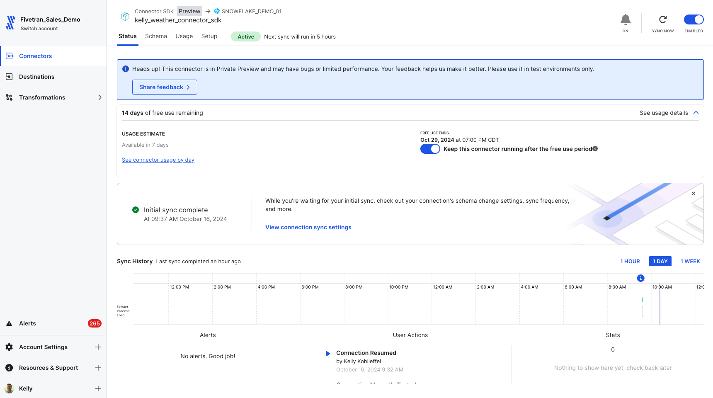
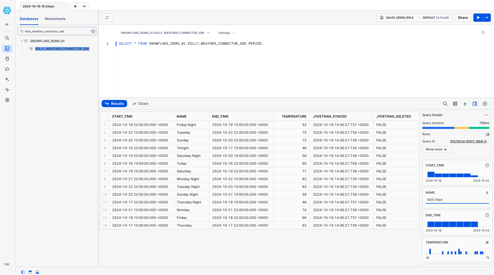

# Fivetran_Connector_SDK
 ## Quickly build a custom weather data connector using the Fivetran SDK

[Fivetran's Connector SDK](https://fivetran.com/docs/connectors/connector-sdk) allows you to code a custom data connector using Python and deploy it as an extension of Fivetran. Fivetran automatically manages running the connector on your scheduled frequency and manages the required compute resources.

This is a simple example for how to work with the fivetran_connector_sdk module. 

It shows the use of a requirements.txt file and a connector that calls a publicly available API to get the weather forecast data for Myrtle Beach in South Carolina, USA. 

It also shows how to use the logging functionality provided by fivetran_connector_sdk, by logging important steps using log.info() and log.fine()

See the [Technical Reference documentation](https://fivetran.com/docs/connectors/connector-sdk/technical-reference#update) and [Best Practices documentation](https://fivetran.com/docs/connectors/connector-sdk/best-practices) for details.

### Fivetran Connector SDK: Fivetran Sync Status

### Fivetran Connector SDK: Data moved with the Connector SDK to Snowflake

