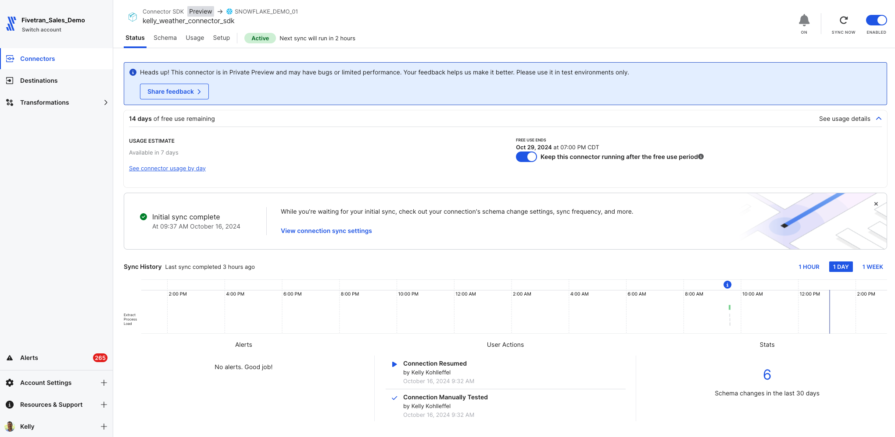
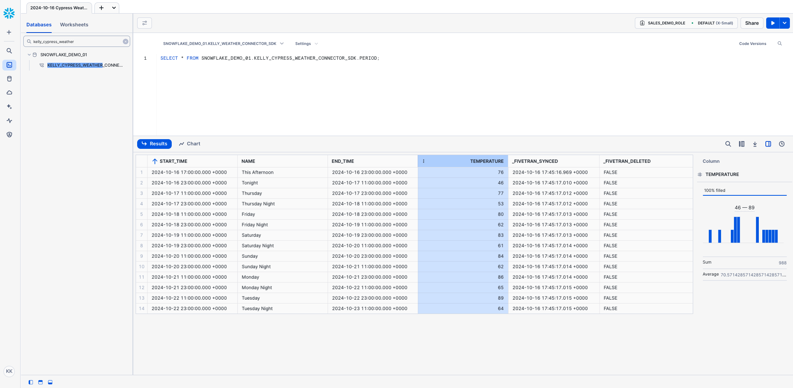
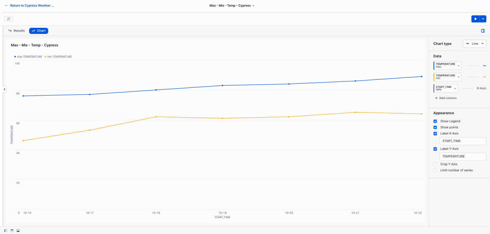

# Fivetran_Connector_SDK
 ## Quickly build custom connectors using the Fivetran Connector SDK

[Fivetran's Connector SDK](https://fivetran.com/docs/connectors/connector-sdk) allows you to code a custom data connector using Python and deploy it as an extension of Fivetran. Fivetran automatically manages running the connector on your scheduled frequency and manages the required compute resources.

These are simple examples for how to work with the fivetran_connector_sdk module. 

They show the use of a requirements.txt file and a connector.py file that call publicly available APIs.

They also show how to use the logging functionality provided by fivetran_connector_sdk, by logging important steps using log.info() and log.fine()

See the [Technical Reference documentation](https://fivetran.com/docs/connectors/connector-sdk/technical-reference#update) and [Best Practices documentation](https://fivetran.com/docs/connectors/connector-sdk/best-practices) for details.

**APIs used in these examples**:

- Book data from the [OpenLibrary API](https://openlibrary.org/dev/docs/api/search)
- Meals data from [TheMealsDB API](https://www.themealdb.com/api.php)
- US National Parks data from the [US National Park Service API](https://www.nps.gov/subjects/developer/api-documentation.htm) (extracts data from multiple tables)
- Solar system data from the [Solar System OpenData API](https://api.le-systeme-solaire.net/en/)
- SpaceX launch data from the [SpaceX API](https://github.com/r-spacex/SpaceX-API/tree/master/docs#rspacex-api-docs)
- Weather forecast data from the [National Weather Service API](https://www.weather.gov/documentation/services-web-api) for Cypress, TX, USA 

## Quick reference bash commands for running in your IDE (e.g. VS Code terminal)

### From this path: 
(.venv) kelly.kohlleffel@kelly Fivetran_Connector_SDK %

### Navigate to the quick_start_example/weather
```
cd examples/quick_start_examples/weather
```
### Run the custom connector code
```
python connector.py
```
### Deploy the connector to Fivetran

This repo uses a **deploy.sh** file to prompt for the following:
* Fivetran Account Name (this references an API key in the config.json file that is associated with the Fivetran Account Name input)
* Fivetran Destination Name
* Fivetran Connector Name

For demo purposes, there is a default Fivetran account (in brackets) and default Fivetran destination. Simply clicking ENTER will use those defaults. A Fivetran connector name is required.

* You will be prompted for the **Fivetran Account Name** **Fivetran Destination Name** and a unique **Fivetran Connector Name**

```
chmod +x files/deploy.sh
./files/deploy.sh
```

### For reference, this is the Fivetran deployment script that runs in the deploy.sh file when executed.
```
fivetran deploy --api-key <FIVETRAN-API-KEY> --destination <DESTINATION-NAME> --connection <CONNECTION-NAME>
```

## Alternatively: 

### Ensure the directory exists
```
mkdir -p files
```
### Activate your virtual environment
```
source .venv/bin/activate
```
### Navigate to the quick_start_example/weather
```
cd examples/quick_start_examples/weather
```
### Install the Fivetran requirements.txt file
```
pip install -r requirements.txt
```
### Run the custom connector code
```
python connector.py
```
### Deploy the connector to Fivetran

This repo uses a **deploy.sh** file to prompt for the following:
* Fivetran Account Name (this references an API key in the config.json file that is associated with the Fivetran Account Name input)
* Fivetran Destination Name
* Fivetran Connector Name

For demo purposes, there is a default Fivetran account (in brackets) and default Fivetran destination. Simply clicking ENTER will use those defaults. A Fivetran connector name is required.

* You will be prompted for the **Fivetran Account Name** **Fivetran Destination Name** and a unique **Fivetran Connector Name**

```
chmod +x files/deploy.sh
./files/deploy.sh
```

### For reference, this is the Fivetran deployment script that runs in the deploy.sh file when executed.
```
fivetran deploy --api-key <FIVETRAN-API-KEY> --destination <DESTINATION-NAME> --connection <CONNECTION-NAME>
```
## Fivetran Connector SDK in action

### Fivetran Connector SDK: Fivetran Sync Status



### Fivetran Connector SDK: Data moved with the Connector SDK to Snowflake



### Fivetran Connector SDK: Snowflake Snowsight Dashboard with the new temperature data


