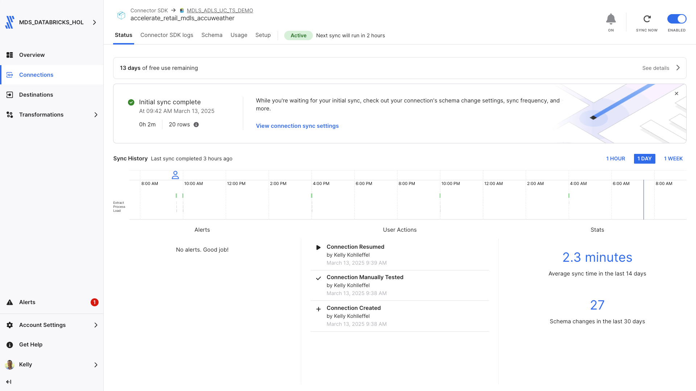

# Fivetran Custom Connector: AccuWeather Forecast API

## Overview
This Fivetran custom connector leverages the Fivetran Connector SDK to retrieve weather forecast data from the AccuWeather Forecast API. The connector synchronizes comprehensive weather forecast data including temperature, precipitation probabilities, and wind conditions for multiple locations. It processes this data into standardized tables suitable for analysis and visualization.

Fivetran's Connector SDK enables you to use Python to code the interaction with the AccuWeather API data source. The connector is deployed as an extension of Fivetran, which automatically manages running the connector on your scheduled frequency and handles the required compute resources, orchestration, scaling, resyncs, and log management.

See the [Technical Reference documentation](https://fivetran.com/docs/connectors/connector-sdk/technical-reference#update) and [Best Practices documentation](https://fivetran.com/docs/connectors/connector-sdk/best-practices) for details.



## Attribution


This custom connector uses the AccuWeather API but is not endorsed or certified by AccuWeather. For more information about AccuWeather API terms of use and attribution requirements, please visit:
[AccuWeather API Documentation](https://developer.accuweather.com/)

## Features
- Retrieves comprehensive daily forecast data for multiple locations
- Captures detailed weather metrics including temperature, precipitation, and wind data
- Implements robust error handling with retry mechanisms
- Handles AccuWeather API rate limits efficiently (50 requests total for free tier)
- Supports incremental syncs through state tracking
- Masks sensitive API credentials in logs
- Provides detailed logging for troubleshooting
- Location-based data collection strategy
- Works with free tier AccuWeather API limitations (5-day forecast access)

## API Interaction

### Core Functions

#### create_retry_session()
Configures HTTP request sessions with built-in retry logic:
```python
retries = Retry(
    total=5,
    backoff_factor=2,
    status_forcelist=[408, 429, 500, 502, 503, 504]
)
```
- Implements automatic retry for specific HTTP status codes
- Uses exponential backoff to handle rate limits
- Handles connection timeouts and server errors

#### make_api_request()
Manages API calls with comprehensive error handling and logging:
```python
base_url = "https://dataservice.accuweather.com"
```
- Completely masks sensitive API credentials in logs
- Implements 30-second timeout for requests
- Provides detailed logging of request parameters
- Handles rate limiting with cooldown periods

### Data Retrieval Strategy

#### Data Collection
The connector implements a location-based approach for weather data:
- Processes multiple locations:
  - Cypress, TX
  - Brooklyn, NY
  - Chicago, IL
  - San Francisco, CA
- Retrieves 5-day forecasts for each location (compatible with free tier API access)
- Collects detailed weather metrics and forecast data

#### Response Processing
Each API response is processed with:
- Validation of response structure
- Type conversion for numeric fields
- Status tracking for data completeness
- JSON parsing of nested details

#### Update Function Implementation
The update function orchestrates a streamlined data sync process:

1. Configuration Handling
   - Validates API credentials
   - Initializes fresh session for each request
   - Initializes logging system
   - Manages state tracking

2. Location-Based Processing
   - Iterates through predefined locations
   - Configures request parameters:
     - Language settings
     - Detail level
     - Measurement units

3. Data Collection and Transformation
   - Makes API requests with error handling
   - Processes response data into standardized format
   - Performs field transformations:
     - Converts values to appropriate types
     - Standardizes date formats
     - Processes weather metrics
   - Creates checkpoint records

### Error Handling

#### Network Issues
- Automatic retry mechanism with 5 total attempts
- Exponential backoff with factor of 2 for rate limits
- Handles specific status codes: 408, 429, 500, 502, 503, 504
- 30-second timeout handling
- Fresh session creation for each request

#### Data Validation
- Validates required fields in API responses
- Type conversion and null value handling
- Graceful handling of missing data
- Detailed error logging
- Exception capture and reporting

### Performance Optimization

#### Request Management
- Uses 5-day forecast endpoint (optimal for free tier)
- Retry strategy with exponential backoff
- Fresh session for each request
- Detailed request logging
- Optimized request parameters

#### Data Processing
- Efficient JSON parsing
- Memory-optimized transformations
- Streamlined processing pipeline
- Comprehensive checkpoint system

### Security Features
- Complete API key masking in logs
- Secure configuration handling
- Protected credential management
- Configuration files excluded from version control
- Sanitized error messages
- Secure session management

## Directory Structure
```
accuweather/
├── __pycache__/
├── files/
│   ├── spec.json
│   ├── state.json
│   └── warehouse.db
├── images/
├── configuration.json
├── connector.py
├── debug.sh
├── deploy.sh
├── README.md
├── requirements.txt
└── spec.json
```

## File Details

### connector.py
Main connector implementation containing:
- API authentication and requests
- Data retrieval and transformation
- Schema definition
- Error handling and logging

### configuration.json
Configuration file containing API credentials:
```json
{
    "api_key": "your_accuweather_api_key"
}
```
**Note**: Do not commit this file to version control.

### deploy.sh
Script for deploying to Fivetran production:
```bash
#!/bin/bash

# Locate the root-level config.json file
ROOT_CONFIG="config.json"
CONFIG_PATH=$(pwd)
while [[ "$CONFIG_PATH" != "/" ]]; do
    if [[ -f "$CONFIG_PATH/$ROOT_CONFIG" ]]; then
        break
    fi
    CONFIG_PATH=$(dirname "$CONFIG_PATH")
done

# Validate the root config.json file exists
if [[ ! -f "$CONFIG_PATH/$ROOT_CONFIG" ]]; then
    echo "Error: Root config.json not found!"
    exit 1
fi

# Validate the local configuration.json file exists
if [[ ! -f "configuration.json" ]]; then
    echo "Error: Local configuration.json not found!"
    exit 1
fi

# Prompt for the Fivetran Account Name
read -p "Enter your Fivetran Account Name [MDS_DATABRICKS_HOL]: " ACCOUNT_NAME
ACCOUNT_NAME=${ACCOUNT_NAME:-"MDS_DATABRICKS_HOL"}

# Fetch the API key from config.json
API_KEY=$(jq -r ".fivetran.api_keys.$ACCOUNT_NAME" "$CONFIG_PATH/$ROOT_CONFIG")
if [[ "$API_KEY" == "null" ]]; then
    echo "Error: Account name not found in $ROOT_CONFIG!"
    exit 1
fi

# Prompt for the Fivetran Destination Name
read -p "Enter your Fivetran Destination Name [MDLS_ADLS_UC_TS_DEMO]: " DESTINATION_NAME
DESTINATION_NAME=${DESTINATION_NAME:-"MDLS_ADLS_UC_TS_DEMO"}

# Prompt for the Fivetran Connector Name
read -p "Enter a unique Fivetran Connector Name [default-connection]: " CONNECTION_NAME
CONNECTION_NAME=${CONNECTION_NAME:-"default-connection"}

# Deploy the connector using the configuration file
echo "Deploying connector..."
fivetran deploy --api-key "$API_KEY" --destination "$DESTINATION_NAME" --connection "$CONNECTION_NAME" --configuration configuration.json
```

### debug.sh
Debug script for local testing:
```bash
#!/bin/bash
echo "Starting debug process..."

# Ensure the files directory exists
echo "Creating files directory..."
mkdir -p files

# Copy configuration files to the files directory
echo "Copying configuration files to files directory for temporary use..."
cp -v configuration.json files/configuration.json
cp -v spec.json files/spec.json

# Verify that the original configuration.json is preserved
if [[ ! -f "configuration.json" ]]; then
    echo "Error: configuration.json file is missing!"
    exit 1
fi

echo "Contents of files directory:"
ls -la files/

# Run the Fivetran debug command
echo "Running fivetran debug..."
fivetran debug
```

### files/spec.json
Generated copy of connector specification file.

### files/state.json
Tracks the state of incremental syncs.

### files/warehouse.db
DuckDB database used for local testing.

### requirements.txt
Python package dependencies:
```
requests>=2.25.0
urllib3>=2.0.0
```

### spec.json
Main specification file defining the configuration schema:
```json
{
    "configVersion": 1,
    "connectionSpecification": {
        "type": "object",
        "required": ["api_key"],
        "properties": {
            "api_key": {
                "type": "string",
                "description": "Enter your AccuWeather API key",
                "configurationGroupKey": "Authentication",
                "secret": true
            }
        }
    }
}
```

## Setup Instructions

### Prerequisites
- Python 3.8+
- Fivetran Connector SDK
- AccuWeather API key (free tier works)
- Fivetran Account with destination configured

### Installation Steps
1. Create project directory:
```bash
mkdir -p accuweather
cd accuweather
```

2. Create virtual environment:
```bash
python3 -m venv .venv
source .venv/bin/activate  # Windows: .venv\Scripts\activate
```

3. Install SDK:
```bash
pip install fivetran-connector-sdk requests
```

4. Create necessary files:
```bash
touch connector.py configuration.json spec.json
chmod +x debug.sh deploy.sh
```

5. Configure your AccuWeather API key:
- Add your API key to configuration.json
- Keep this file secure

## Usage

### Local Testing
```bash
chmod +x debug.sh
./debug.sh
```

### Production Deployment
```bash
chmod +x deploy.sh
./deploy.sh
```

### Expected Output
The connector will create and populate:

#### daily_forecasts
Primary table containing weather forecast data:
- id (STRING, Primary Key)
- location_key (STRING)
- location_name (STRING)
- forecast_date (STRING)
- min_temp_f (FLOAT)
- max_temp_f (FLOAT)
- day_icon (INT)
- day_icon_phrase (STRING)
- day_precipitation_probability (INT)
- day_rain_probability (INT)
- day_snow_probability (INT)
- day_ice_probability (INT)
- day_wind_speed_mph (FLOAT)
- day_wind_direction (STRING)
- night_icon (INT)
- night_icon_phrase (STRING)
- night_precipitation_probability (INT)
- night_rain_probability (INT)
- night_snow_probability (INT)
- night_ice_probability (INT)
- night_wind_speed_mph (FLOAT)
- night_wind_direction (STRING)
- mobile_link (STRING)
- link (STRING)
- last_modified (STRING)

## Troubleshooting

### Common Issues

1. API Key Issues:
```
Authentication failed. Please check your API key and ensure it's still valid.
```
- Verify API key in configuration.json
- Check API key validity
- Ensure you're not exceeding free tier limits

2. Rate Limiting:
```
Rate limit reached. Implementing backoff...
```
- Automatic retry will handle this
- Check API quota limits (50 requests/day for the free tier)

3. Endpoint Access:
```
Error: 401 Unauthorized
```
- Free tier is limited to specific endpoints (1-day and 5-day forecasts)
- 10-day forecasts require a paid plan

## Security Notes
- Never commit API keys
- Use .gitignore for sensitive files
- Keep virtual environment isolated
- API keys are completely masked in logs
- Error messages are sanitized to remove credentials

## Development Notes
- Make code changes in connector.py
- Test changes using debug.sh
- Monitor logs for issues
- Follow AccuWeather API guidelines
- Use the Fivetran SDK documentation

## Support
For issues or questions:
1. Check [AccuWeather API Documentation](https://developer.accuweather.com/)
2. Review [Fivetran Connector SDK Documentation](https://fivetran.com/docs/connectors/connector-sdk)
3. Contact your Fivetran administrator

## Bonus: Modifying the Connector

### Adding or Changing Locations
You can customize the locations tracked by modifying the `get_locations()` function in connector.py:

```python
def get_locations():
    """Return a list of location dictionaries with keys and names."""
    return [
        {"key": "33748_PC", "name": "Cypress, TX"},
        {"key": "4125_PC", "name": "Brooklyn, NY"},
        {"key": "26457_PC", "name": "Chicago, IL"},
        {"key": "39375_PC", "name": "San Francisco, CA"}
        # Add more locations here
    ]
```

To find location keys for new cities, you need to use the AccuWeather Locations API:

1. Use the Postal Code Search endpoint: https://dataservice.accuweather.com/locations/v1/postalcodes/search
2. Make a request with your API key and postal code:

```
https://dataservice.accuweather.com/locations/v1/postalcodes/search?apikey=YOUR_API_KEY&q=POSTAL_CODE&country=US
```

3. From the response, extract the Key value for the location you want to track:

```
[
  {
    "Version": 1,
    "Key": "39375_PC",
    "Type": "PostalCode",
    "Rank": 35,
    "LocalizedName": "San Francisco",
    "Country": {
      "ID": "US",
      "LocalizedName": "United States"
    },
    ...
  }
]
```

4. Add the new location to the get_locations() function with the obtained key and a descriptive name.

**Note:** The Locations API calls count toward your daily API call limit, so it's recommended to perform these lookups separately from your regular connector runs and save the results.

### Upgrading to Paid API Tier
If you upgrade to a paid AccuWeather API plan, you can modify the connector to use the 10-day forecast endpoint:

```python
# In update() function
endpoint = f"forecasts/v1/daily/10day/{location_key}"
```

## AccuWeather API Pricing

For information about AccuWeather API pricing packages and subscription options, visit:
[https://developer.accuweather.com/packages](https://developer.accuweather.com/packages)