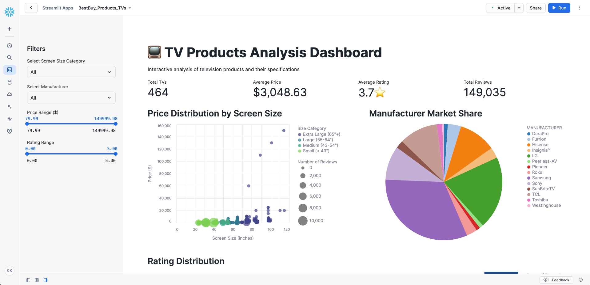

# Fivetran_Connector_SDK: BestBuy Products API

## Overview
This Fivetran custom connector leverages the Fivetran Connector SDK to retrieve television product data from the [BestBuy Products API](https://developer.bestbuy.com/). The connector focuses on extracting detailed information about TV products, including specifications, pricing, customer reviews, and product features.

The connector uses Python to interact with the BestBuy Products API and is deployed as a Fivetran extension. Fivetran automatically manages the connector's execution schedule, compute resources, orchestration, scaling, resyncs, and log management. Additionally, Fivetran handles comprehensive writing to your chosen destination, managing retries, schema inference, security, and idempotency.

See the [Technical Reference documentation](https://fivetran.com/docs/connectors/connector-sdk/technical-reference#update) and [Best Practices documentation](https://fivetran.com/docs/connectors/connector-sdk/best-practices) for details.


## Attribution


This custom connector uses the BestBuy API but is not endorsed or certified by BestBuy. For more information about the BestBuy API terms of use and attribution requirements, please visit:
[BestBuy API Terms](https://bestbuyapis.github.io/api-documentation/#user-guide)

## Features
- Retrieves comprehensive TV product information
- Captures detailed product attributes including:
  - Product specifications (screen size, dimensions)
  - Pricing information (regular and sale prices)
  - Customer reviews and ratings
  - Product features and descriptions
  - Digital and connectivity features
- Implements robust error handling and retry mechanisms
- Uses rate limiting to handle API quotas efficiently
- Supports incremental syncs through state tracking
- Masks sensitive API credentials in logs
- Provides detailed logging for troubleshooting
- Follows Fivetran Connector SDK best practices

## API Interaction

### Core Functions

#### create_retry_session()
Configures HTTP request sessions with built-in retry logic:
```python
retries = Retry(
    total=3,
    backoff_factor=1,
    status_forcelist=[408, 429, 500, 502, 503, 504]
)
```
- Implements automatic retry for specific HTTP status codes
- Uses exponential backoff to handle rate limits
- Handles connection timeouts and server errors

#### get_api_key()
Manages API key authentication with BestBuy API:
- Validates API key presence
- Secures API credentials
- Handles authentication errors

### Data Retrieval Strategy

#### Data Collection
The connector implements a focused approach for TV product data:
- Uses the "/v1/products" endpoint with TV category filter
- Retrieves most reviewed products first
- Implements pagination with configurable limits
- Processes up to 500 records per sync

#### Response Processing
Each API response is processed with:
- Validation of response structure
- Extraction of relevant TV information
- Status tracking for data completeness

#### Update Function Implementation
The update function orchestrates the data sync:

1. Authentication
   - Validates API key
   - Handles authentication errors

2. Data Retrieval
   - Implements pagination
   - Applies rate limiting
   - Tracks progress

3. Data Processing
   - Extracts TV information
   - Handles product features
   - Processes pricing data

### Error Handling

#### Network Issues
- Automatic retry for transient failures
- Exponential backoff for rate limits
- Timeout handling for unresponsive endpoints

#### Data Validation
- Checks for required fields
- Handles missing or null values
- Provides detailed error logging

### Performance Optimization

#### Request Management
- Implements 1-second delay between pages
- Maximum 5 pages per sync
- Efficient pagination handling
- Response caching when appropriate

#### Data Processing
- Direct data transformation
- Efficient memory usage
- Comprehensive logging
- Clean state management

## Security Features
- API key masking in logs
- Secure credential handling
- Configuration files excluded from version control
- Protected sensitive data fields

## Directory Structure
```
bestbuy_products/
├── __pycache__/        # Python bytecode cache directory
├── files/              # Directory containing configuration and state files
│   ├── spec.json       # Configuration specification file
│   ├── state.json      # State tracking for incremental updates
│   └── warehouse.db    # Local database for testing
├── images/             # Directory for storing project images
├── configuration.json  # Main configuration settings
├── connector.py        # Primary connector implementation
├── debug.sh           # Script for debugging purposes
├── deploy.sh          # Deployment script for production
├── README.md          # Project documentation and instructions
└── spec.json          # Main specification file for the connector
```

## File Details

### connector.py
Main connector implementation handling:
- API authentication and requests
- Data retrieval and transformation
- Schema definition
- Error handling and logging

### configuration.json
Configuration file containing API credentials:
```json
{
    "api_key": "YOUR_BESTBUY_API_KEY"
}
```
**Note**: This file is automatically copied to the files directory during debug. Do not commit this file to version control.

### deploy.sh
Script for deploying to Fivetran production:
```bash
#!/bin/bash

# Find config.json by searching up through parent directories
CONFIG_PATH=$(pwd)
while [[ "$CONFIG_PATH" != "/" ]]; do
    if [[ -f "$CONFIG_PATH/config.json" ]]; then
        break
    fi
    CONFIG_PATH=$(dirname "$CONFIG_PATH")
done

# Prompt for the Fivetran Account Name
read -p "Enter your Fivetran Account Name [MDS_SNOWFLAKE_HOL]: " ACCOUNT_NAME
ACCOUNT_NAME=${ACCOUNT_NAME:-"MDS_SNOWFLAKE_HOL"}

# Read API key from config.json based on account name
API_KEY=$(jq -r ".fivetran.api_keys.$ACCOUNT_NAME" "$CONFIG_PATH/config.json")

if [ "$API_KEY" == "null" ]; then
    echo "Error: Account name not found in config.json"
    exit 1
fi

# Prompt for the Fivetran Destination Name
read -p "Enter your Fivetran Destination Name [NEW_SALES_ENG_HANDS_ON_LAB]: " DESTINATION_NAME
DESTINATION_NAME=${DESTINATION_NAME:-"NEW_SALES_ENG_HANDS_ON_LAB"}

# Prompt for the Fivetran Connector Name
read -p "Enter a unique Fivetran Connector Name [default-connection]: " CONNECTION_NAME
CONNECTION_NAME=${CONNECTION_NAME:-"default-connection"}

# Deploy with configuration file
fivetran deploy --api-key "$API_KEY" --destination "$DESTINATION_NAME" \
                --connection "$CONNECTION_NAME" --configuration configuration.json
```

### debug.sh
Debug script for local testing:
```bash
#!/bin/bash
echo "Starting debug process..."

echo "Running fivetran reset..."
fivetran reset

echo "Creating files directory..."
mkdir -p files

echo "Copying configuration files to files directory..."
cp -v configuration.json files/
cp -v spec.json files/

echo "Contents of files directory:"
ls -la files/

echo "Running fivetran debug..."
fivetran debug
```

### files/spec.json
Generated copy of the connector specification file.

### files/state.json
Tracks the state of incremental syncs.

### files/warehouse.db
DuckDB database used for local testing.

### images/
Contains documentation screenshots and images for the example

### spec.json
Main specification file defining the configuration schema:
```json
{
    "configVersion": 1,
    "connectionSpecification": {
        "type": "object",
        "required": ["api_key"],
        "properties": {
            "api_key": {
                "type": "string",
                "description": "Enter your BestBuy API key",
                "configurationGroupKey": "Authentication",
                "secret": true
            }
        }
    }
}
```

### .gitignore
Git ignore file containing:
```bash
# Generated files
files/
warehouse.db/

# Configuration files with sensitive information
configuration.json

# Python virtual environment
.venv/
__pycache__/
*.pyc

# OS generated files
.DS_Store
.DS_Store?
._*
```

## Setup Instructions

### Prerequisites
- Python 3.8+
- Fivetran Connector SDK and a virtual environment
- BestBuy API key (obtain from [BestBuy Developer Portal](https://developer.bestbuy.com/))
- Fivetran Account with destination configured

### Installation Steps
1. Create project directory:
```bash
mkdir -p bestbuy
cd bestbuy
```

2. Create virtual environment:
```bash
python3 -m venv .venv
source .venv/bin/activate  # Windows: .venv\Scripts\activate
```

3. Install SDK:
```bash
pip install fivetran-connector-sdk
```

4. Create necessary files:
```bash
touch connector.py configuration.json spec.json
chmod +x debug.sh deploy.sh
```

5. Configure your BestBuy API key:
- Add your api_key to configuration.json
- Keep this file secure and do not commit to version control

## Usage

### Local Testing
```bash
chmod +x debug.sh
./debug.sh
```

The debug process will:
1. Reset any existing state
2. Create the files directory
3. Retrieve BestBuy TV data
4. Log the process details
5. Create local database files for testing

### Production Deployment
```bash
chmod +x deploy.sh
./deploy.sh
```

The script will:
- Find and read your Fivetran configuration
- Prompt for account details and deployment options
- Deploy the connector to your Fivetran destination

### Expected Output
The connector will sync up to 500 TV product records with detailed information about each product.

## Data Tables

### tv_products
Primary table containing TV product information:
- sku (STRING, Primary Key)
- name (STRING)
- manufacturer (STRING)
- model_number (STRING)
- regular_price (FLOAT)
- sale_price (FLOAT)
- on_sale (BOOLEAN)
- customer_review_average (FLOAT)
- customer_review_count (INTEGER)
- description (STRING)
- features (STRING, JSON array)
- color (STRING)
- depth (STRING)
- height (STRING)
- weight (STRING)
- width (STRING)
- condition (STRING)
- digital (BOOLEAN)
- hdmi_inputs (INTEGER)
- screen_size (FLOAT)
- last_updated (TIMESTAMP)

## Using the BestBuy Dataset - TV Products Streamlit in Snowflake Data App

### Required Setup

1. Create a CLEAN_TV_PRODUCTS Table

Open up a new Snowflake Snowsight worksheet and run this SQL to create a CLEAN_TV_PRODUCTS table:

```sql
CREATE OR REPLACE TABLE CLEAN_TV_PRODUCTS AS
SELECT 
    SKU,
    NAME,
    MANUFACTURER,
    MODEL_NUMBER,
    REGULAR_PRICE,
    SALE_PRICE,
    CASE WHEN ON_SALE = 1 THEN TRUE ELSE FALSE END as ON_SALE,
    COALESCE(CUSTOMER_REVIEW_AVERAGE, 0) as REVIEW_RATING,
    COALESCE(CUSTOMER_REVIEW_COUNT, 0) as REVIEW_COUNT,
    COALESCE(COLOR, 'Not Specified') as COLOR,
    COALESCE(SCREEN_SIZE, 0) as SCREEN_SIZE,
    CASE 
        WHEN SCREEN_SIZE < 43 THEN 'Small (< 43")'
        WHEN SCREEN_SIZE < 55 THEN 'Medium (43-54")'
        WHEN SCREEN_SIZE < 65 THEN 'Large (55-64")'
        ELSE 'Extra Large (65"+)'
    END as SIZE_CATEGORY,
    CASE WHEN DIGITAL = 1 THEN TRUE ELSE FALSE END as IS_DIGITAL,
    LAST_UPDATED
FROM TV_PRODUCTS
WHERE _FIVETRAN_DELETED = FALSE;
```

### Streamlit in Snowflake Data App Components

#### This Streamlit app provides:

1. Top-level metrics showing:
* Total TVs
* Average Price
* Average Rating
* Total Reviews

2. Interactive sidebar filters for:
* Screen Size Category
* Manufacturer
* Price Range
* Rating Range

3. Four main visualizations:
* Price Distribution by Screen Size (bubble chart)
    * Bubble chart showing relationship between screen size and price
    * Circle size indicates number of reviews
    * Color-coded by size category
    * Interactive tooltips with detailed product information
* Manufacturer Market Share (pie chart)
    * Pie chart showing distribution of TVs by manufacturer
    * Interactive tooltips with manufacturer details and counts
    * Color-coded by manufacturer
* Rating Distribution (histogram)
    * Histogram showing distribution of customer ratings
    * Color intensity indicates frequency
    * Binned by 0.5 rating increments
    * Interactive tooltips with count information
* Price Comparison (regular vs. sale) by Manufacturer (bar chart)
    * Bar chart comparing average prices across manufacturers
    * Color-coded to indicate sale status
    * Interactive tooltips with regular and sale price information
    * Sorted by average price
4. Interactive data table with sortable columns showing:
* Model Name
* Manufacturer
* Screen Size
* Price
* Rating
* Review Count

### Streamlit in Snowflake Code Block

```python
import streamlit as st
import pandas as pd
import altair as alt
from snowflake.snowpark.context import get_active_session

# Set page configuration
st.set_page_config(page_title="TV Products Analysis", layout="wide")

# Get the active Snowflake session
session = get_active_session()

# Load data function
def load_tv_data():
    return session.sql("""
        SELECT *
        FROM CLEAN_TV_PRODUCTS
        ORDER BY SCREEN_SIZE DESC
    """).to_pandas()

# Main dashboard
try:
    # Load data
    with st.spinner("Loading TV product data..."):
        df = load_tv_data()

    # Title and description
    st.title("📺 TV Products Analysis Dashboard")
    st.markdown("Interactive analysis of television products and their specifications")

    # Sidebar filters
    st.sidebar.header("Filters")
    
    # Size category filter
    size_options = ['All'] + sorted(df['SIZE_CATEGORY'].unique().tolist())
    selected_size = st.sidebar.selectbox("Select Screen Size Category", size_options)
    
    # Manufacturer filter
    manufacturer_options = ['All'] + sorted(df['MANUFACTURER'].unique().tolist())
    selected_manufacturer = st.sidebar.selectbox("Select Manufacturer", manufacturer_options)
    
    # Price range filter
    price_range = st.sidebar.slider(
        "Price Range ($)",
        float(df['REGULAR_PRICE'].min()),
        float(df['REGULAR_PRICE'].max()),
        (float(df['REGULAR_PRICE'].min()), float(df['REGULAR_PRICE'].max()))
    )
    
    # Rating filter
    rating_range = st.sidebar.slider(
        "Rating Range",
        float(df['REVIEW_RATING'].min()),
        float(df['REVIEW_RATING'].max()),
        (float(df['REVIEW_RATING'].min()), float(df['REVIEW_RATING'].max()))
    )

    # Apply filters
    filtered_df = df.copy()
    if selected_size != 'All':
        filtered_df = filtered_df[filtered_df['SIZE_CATEGORY'] == selected_size]
    if selected_manufacturer != 'All':
        filtered_df = filtered_df[filtered_df['MANUFACTURER'] == selected_manufacturer]
    filtered_df = filtered_df[
        (filtered_df['REGULAR_PRICE'] >= price_range[0]) &
        (filtered_df['REGULAR_PRICE'] <= price_range[1]) &
        (filtered_df['REVIEW_RATING'] >= rating_range[0]) &
        (filtered_df['REVIEW_RATING'] <= rating_range[1])
    ]

    # Metrics Row
    col1, col2, col3, col4 = st.columns(4)
    
    with col1:
        total_tvs = len(filtered_df)
        st.metric("Total TVs", f"{total_tvs:,}")
    
    with col2:
        avg_price = filtered_df['REGULAR_PRICE'].mean()
        st.metric("Average Price", f"${avg_price:,.2f}")
    
    with col3:
        avg_rating = filtered_df['REVIEW_RATING'].mean()
        st.metric("Average Rating", f"{avg_rating:.1f}⭐")
    
    with col4:
        total_reviews = filtered_df['REVIEW_COUNT'].sum()
        st.metric("Total Reviews", f"{total_reviews:,}")

    # Create two columns for main charts
    chart_col1, spacer, chart_col2 = st.columns([1, 0.1, 1])

    with chart_col1:
        st.subheader("Price Distribution by Screen Size")
        
        size_price_chart = alt.Chart(filtered_df).mark_circle(opacity=0.7).encode(
            x=alt.X('SCREEN_SIZE:Q', title='Screen Size (inches)'),
            y=alt.Y('REGULAR_PRICE:Q', title='Price ($)'),
            size=alt.Size('REVIEW_COUNT:Q', 
                         scale=alt.Scale(range=[100, 1000]),
                         legend=alt.Legend(title="Number of Reviews")),
            color=alt.Color('SIZE_CATEGORY:N', 
                          scale=alt.Scale(scheme='viridis'),
                          legend=alt.Legend(title="Size Category")),
            tooltip=['NAME:N', 'MANUFACTURER:N', 'SCREEN_SIZE:Q', 
                    'REGULAR_PRICE:Q', 'REVIEW_RATING:Q']
        ).properties(height=400)
        
        st.altair_chart(size_price_chart, use_container_width=True)

    with chart_col2:
        st.subheader("Manufacturer Market Share")
        
        manufacturer_data = (
            filtered_df.groupby('MANUFACTURER')
            .size()
            .reset_index(name='count')
        )
        
        pie_chart = alt.Chart(manufacturer_data).mark_arc().encode(
            theta='count:Q',
            color=alt.Color('MANUFACTURER:N', 
                          scale=alt.Scale(scheme='category20')),
            tooltip=['MANUFACTURER:N', 'count:Q']
        ).properties(height=400)
        
        st.altair_chart(pie_chart, use_container_width=True)

    # Rating Distribution
    st.subheader("Rating Distribution")
    
    rating_hist = alt.Chart(filtered_df).mark_bar().encode(
        x=alt.X('REVIEW_RATING:Q', 
                bin=alt.Bin(step=0.5), 
                title='Rating'),
        y=alt.Y('count():Q', title='Number of TVs'),
        color=alt.Color('count():Q', scale=alt.Scale(scheme='blues')),
        tooltip=['count():Q', 'REVIEW_RATING:Q']
    ).properties(height=300)
    
    st.altair_chart(rating_hist, use_container_width=True)

    # Price Comparison
    st.subheader("Price Comparison by Manufacturer")
    
    price_comparison = alt.Chart(filtered_df).mark_bar().encode(
        x=alt.X('MANUFACTURER:N', sort='-y'),
        y=alt.Y('mean(REGULAR_PRICE):Q', title='Average Price ($)'),
        color=alt.condition(
            alt.datum.ON_SALE == True,
            alt.value('orange'),
            alt.value('steelblue')
        ),
        tooltip=['MANUFACTURER:N', 
                alt.Tooltip('mean(REGULAR_PRICE):Q', format='$.2f'),
                alt.Tooltip('mean(SALE_PRICE):Q', format='$.2f')]
    ).properties(height=300)
    
    st.altair_chart(price_comparison, use_container_width=True)

    # Available TVs Table
    st.subheader("Available TVs")
    st.markdown("Click on any column header to sort")
    
    display_cols = ['NAME', 'MANUFACTURER', 'SCREEN_SIZE', 
                   'REGULAR_PRICE', 'REVIEW_RATING', 'REVIEW_COUNT']
    st.dataframe(
        filtered_df[display_cols],
        height=400
    )

except Exception as e:
    st.error(f"An error occurred: {str(e)}")
```

### Streamlit in Snowflake Data App
