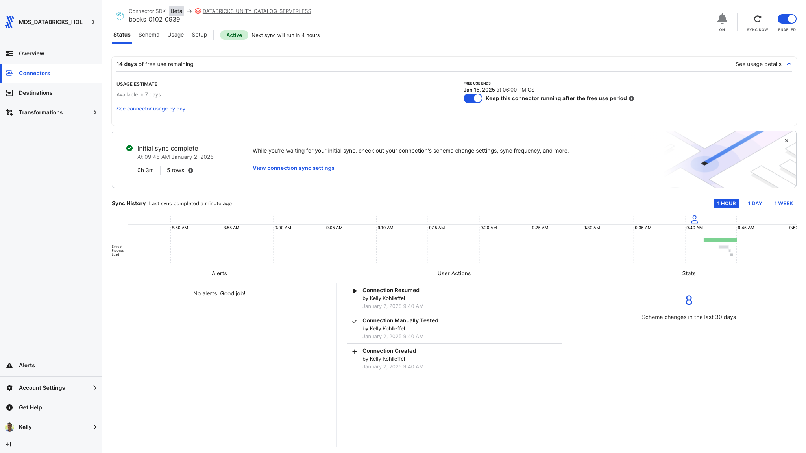
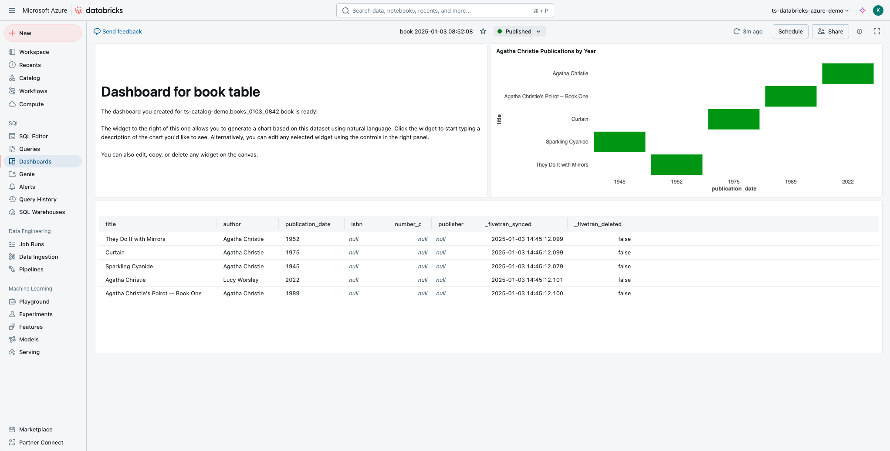

# Fivetran_Connector_SDK: OpenLibrary API

## Overview
This Fivetran custom connector leverages the Fivetran Connector SDK to retrieve data from the [OpenLibrary API](https://openlibrary.org/developers/api), enabling syncing of comprehensive book information including titles, authors, publication dates, ISBNs, and publisher information.

Fivetran's Connector SDK enables you to use Python to code the interaction with the OpenLibrary API data source. This example shows the use of a connector.py file that calls OpenLibrary API. From there, the connector is deployed as an extension of Fivetran. Fivetran automatically manages running the connector on your scheduled frequency and manages the required compute resources, orchestration, scaling, resyncs, and log management. In addition, Fivetran handles comprehensive writing to the destination of your choice managing retries, schema inference, security, and idempotency.

See the [Technical Reference documentation](https://fivetran.com/docs/connectors/connector-sdk/technical-reference) and [Best Practices documentation](https://fivetran.com/docs/connectors/connector-sdk/best-practices) for details.



## Attribution


This custom connector uses the Open Library API. Data provided by Open Library.

For more information about Open Library's terms of use, please visit:
[Open Library Developers](https://openlibrary.org/developers)

## Features
- Retrieves comprehensive book data from OpenLibrary API
- Configurable search query parameter (defaults to "Agatha Christie")
- Implements incremental syncs using publication dates
- Handles missing data fields gracefully
- Supports debug mode for local testing
- Provides detailed logging for troubleshooting

## API Interaction
The connector establishes interaction with the OpenLibrary API through several key components:

### Core Functions

#### API Request Implementation
```python
response = rq.get(f"https://openlibrary.org/search.json?q={search_query}")
```

- Uses simple GET request to OpenLibrary search endpoint
- Returns JSON response with book records
- No authentication required
- Default timeout handling via requests library
- Native error handling for HTTP responses

#### Data Processing Functions

- Extracts book details from JSON response
- Handles missing fields with default values:
```
title = book.get("title", "Unknown Title")
author = ", ".join(book.get("author_name", ["Unknown Author"]))
publication_date = str(book.get("first_publish_year", None))
```

- Manages cursor implementation for incremental syncs
- Provides debug logging of processed records

#### Error Handling

- Skips records with missing publication dates
- Handles multiple authors via join operations
- Validates dates against cursor for incremental updates
- Logs processing details for debugging

### Data Retrieval Strategy
- Uses search queries to retrieve book records
- Handles batch processing of book results
- Supports incremental syncs via publication date tracking

### Response Processing
- Field validation and extraction
- Default value handling for missing data
- Publication date cursor management
- Data transformation for Fivetran schema

### Security Features
- No API key required
- Safe handling of configuration data
- Protected credential management through Fivetran's infrastructure
- Secure logging practices

## Directory Structure
```
openlibrary/
├── __pycache__/        # Python bytecode cache directory
├── files/              # Generated directory for Fivetran files
│   ├── state.json      # State tracking for incremental syncs
│   └── warehouse.db    # Local testing database
├── images/             # Documentation images
├── connector.py        # Main connector implementation
├── debug.sh            # Debug deployment script
├── deploy.sh           # Production deployment script
├── README.md           # Project documentation
└── requirements.txt    # Python dependencies
```

## File Details

### connector.py
Main connector implementation file that handles:
- API requests and response processing
- Data transformation and schema definition
- Incremental sync logic
- Error handling and logging

### deploy.sh
```bash
#!/bin/bash

# Find config.json by searching up through parent directories
CONFIG_PATH=$(pwd)
while [[ "$CONFIG_PATH" != "/" ]]; do
    if [[ -f "$CONFIG_PATH/config.json" ]]; then
        break
    fi
    CONFIG_PATH=$(dirname "$CONFIG_PATH")
done

# Prompt for the Fivetran Account Name
read -p "Enter your Fivetran Account Name [MDS_DATABRICKS_HOL]: " ACCOUNT_NAME
ACCOUNT_NAME=${ACCOUNT_NAME:-"MDS_DATABRICKS_HOL"}

# Read API key from config.json based on account name
API_KEY=$(jq -r ".fivetran.api_keys.$ACCOUNT_NAME" "$CONFIG_PATH/config.json")

if [ "$API_KEY" == "null" ]; then
    echo "Error: Account name not found in config.json"
    exit 1
fi

# Prompt for the Fivetran Destination Name
read -p "Enter your Fivetran Destination Name [DATABRICKS_UNITY_CATALOG_SERVERLESS]: " DESTINATION_NAME
DESTINATION_NAME=${DESTINATION_NAME:-"DATABRICKS_UNITY_CATALOG_SERVERLESS"}

# Prompt for the Fivetran Connector Name
read -p "Enter a unique Fivetran Connector Name [default-connection]: " CONNECTION_NAME
CONNECTION_NAME=${CONNECTION_NAME:-"default-connection"}

fivetran deploy --api-key "$API_KEY" --destination "$DESTINATION_NAME" --connection "$CONNECTION_NAME"
```

### debug.sh
```bash
#!/bin/bash
echo "Starting debug process..."

echo "Running fivetran reset..."
fivetran reset

echo "Creating files directory..."
mkdir -p files

echo "Contents of files directory:"
ls -la files/

echo "Running fivetran debug..."
fivetran debug
```

### images/
Contains documentation screenshots and images:
- Directory structure screenshots
- Sample output images
- Configuration examples
- Other visual documentation

## Setup Instructions

### Prerequisites
* Python 3.8+
* Fivetran Connector SDK
* Fivetran Account with at least one Fivetran destination setup

### Installation Steps
1. Create the project directory structure:
```bash
mkdir -p openlibrary
cd openlibrary
```

2. Create a Python virtual environment:
```bash
python3 -m venv .venv
source .venv/bin/activate  # On Windows: .venv\Scripts\activate
```

3. Install the Fivetran Connector SDK:
```bash
pip install fivetran-connector-sdk
```

4. Create the necessary files:
```bash
touch connector.py debug.sh deploy.sh
chmod +x debug.sh deploy.sh
```

5. Set up .gitignore:
```bash
touch .gitignore
echo "files/
__pycache__/
*.pyc
.DS_Store" > .gitignore
```

## Usage

### Local Testing
1. Ensure your virtual environment is activated
2. Run the debug script:
```bash
chmod +x debug.sh
./debug.sh
```

The debug process will:
1. Reset any existing state
2. Create the files directory
3. Retrieve book data
4. Log the process details
5. Create local database files for testing

### Production Deployment
Execute the deployment script:
```bash
chmod +x deploy.sh
./deploy.sh
```

The script will:
* Find and read your Fivetran configuration
* Prompt for account details and deployment options
* Deploy the connector to your Fivetran destination

### Expected Output
The connector will:
1. Display the search query being used
2. Show number of books retrieved
3. Print a formatted table of books:
   - Title
   - Author(s)
   - Publication Date
4. Log sync statistics and cursor updates

## Data Tables

### books
Primary table containing book information:
* title (STRING, Primary Key)
* author (STRING)
* publication_date (STRING)
* isbn (STRING)
* number_of_pages (INT)
* publisher (STRING)

## Troubleshooting

### Common Issues
1. Search Query Issues:
```
Error: No books found for search query
```
* Verify search query returns results via OpenLibrary website
* Check for typos in search term

2. Directory Structure:
```
No such file or directory: 'files/warehouse.db'
```
* Ensure debug.sh has created the files directory
* Check file permissions

3. Python Environment:
```
ModuleNotFoundError: No module named 'fivetran_connector_sdk'
```
* Verify virtual environment is activated
* Reinstall SDK if necessary

## Security Notes
* Use .gitignore to prevent accidental commits of sensitive files
* Keep your virtual environment isolated from other projects
* Follow Fivetran's security best practices for deployment

## Development Notes
* Make code changes in connector.py
* Test changes using debug.sh
* Monitor logs for any issues
* Use the Fivetran SDK documentation for reference

## Support
For issues or questions:
1. Check the [OpenLibrary API Documentation](https://openlibrary.org/developers/api)
2. Review the [Fivetran Connector SDK Documentation](https://fivetran.com/docs/connectors/connector-sdk)
3. Contact your organization's Fivetran administrator

## Using the new Books dataset
