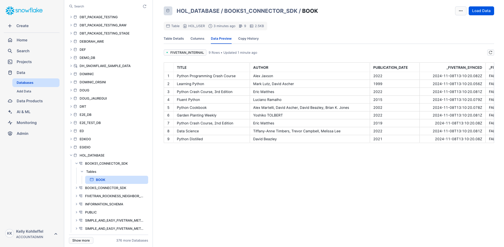
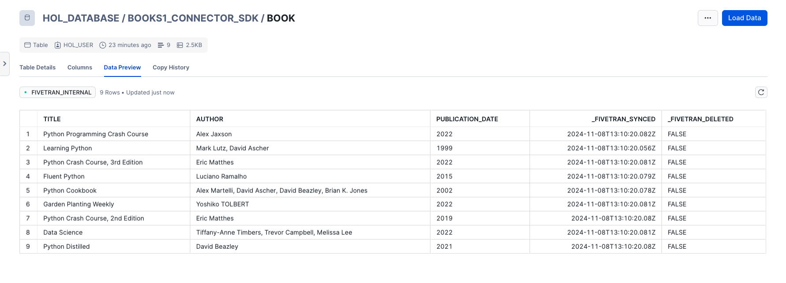
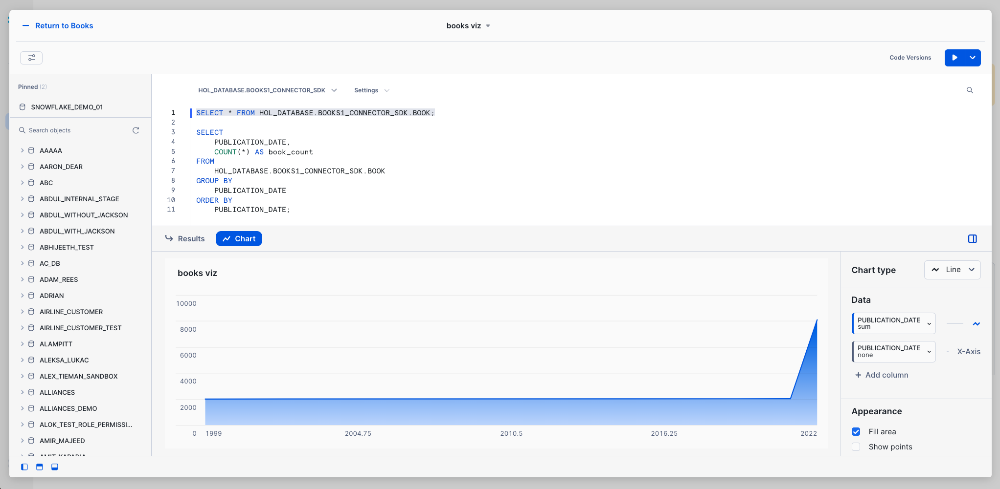

# Fivetran_Connector_SDK
 ## Quickly build custom connectors using the Fivetran SDK

[Fivetran's Connector SDK](https://fivetran.com/docs/connectors/connector-sdk) allows you to code a custom data connector using Python and deploy it as an extension of Fivetran. Fivetran automatically manages running the connector on your scheduled frequency and manages the required compute resources.

This is a simple example for how to work with the fivetran_connector_sdk module. 

It shows the use of a requirements.txt file and a connector that calls a publicly available API:

- Book data from the OpenLibrary API

It also shows how to use the logging functionality provided by fivetran_connector_sdk, by logging important steps using log.info() and log.fine()

See the [Technical Reference documentation](https://fivetran.com/docs/connectors/connector-sdk/technical-reference#update) and [Best Practices documentation](https://fivetran.com/docs/connectors/connector-sdk/best-practices) for details.

## Quick reference bash commands for running in the VS Code terminal

### From this path: 
(.venv) kelly.kohlleffel@kelly Fivetran_Connector_SDK %

### Navigate to the quick_start_example/weather
```
cd examples/quick_start_examples/books
```
### Run the custom connector code
```
python connector.py
```
### Deploy the connector to Fivetran
```
fivetran deploy --api-key <FIVETRAN-API-KEY> --destination <DESTINATION-NAME> --connection <CONNECTION-NAME>
```
## Alternatively: 

### Navigate to the Fivetran_Connector_SDK directory in Documents/Github
```
cd ~/Documents/Github/Fivetran_Connector_SDK
```
### Ensure the directory exists
```
mkdir -p files
```
### Activate your virtual environment
```
source .venv/bin/activate
```
### Navigate to the quick_start_example/books
```
cd examples/quick_start_examples/books
```
### Install the Fivetran requirements.txt file
```
pip install -r requirements.txt
```
### Run the custom connector code
```
python connector.py
```
### Deploy the connector to Fivetran
```
fivetran deploy --api-key <FIVETRAN-API-KEY> --destination <DESTINATION-NAME> --connection <CONNECTION-NAME>
```
## Fivetran Connector SDK in action

### Fivetran Connector SDK: Fivetran Sync Status



### Fivetran Connector SDK: Data moved with the Connector SDK to Snowflake



### Fivetran Connector SDK: Snowflake Snowsight Dashboard with the new books data


