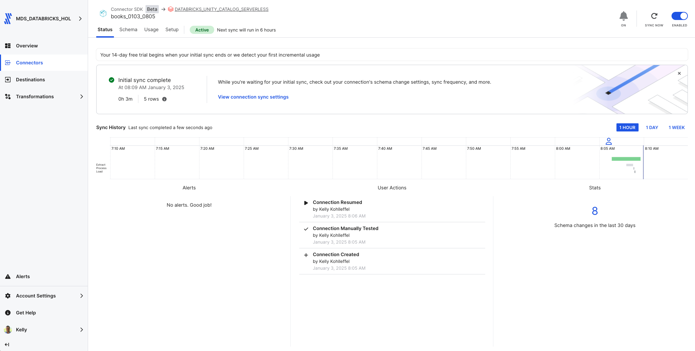

# Fivetran_Connector_SDK: OpenLibrary API

## Overview
This Fivetran custom connector leverages the Fivetran Connector SDK to retrieve book information from the OpenLibrary API. It enables syncing of comprehensive book data including titles, authors, publication dates, ISBNs, and publisher information.

Fivetran's Connector SDK enables you to use Python to code the interaction with the OpenLibrary API data source. This example shows the use of a connector.py file that calls OpenLibrary API. From there, the connector is deployed as an extension of Fivetran. Fivetran automatically manages running the connector on your scheduled frequency and manages the required compute resources, orchestration, scaling, resyncs, and log management. In addition, Fivetran handles comprehensive writing to the destination of your choice managing retries, schema inference, security, and idempotency.

See the [Technical Reference documentation](https://fivetran.com/docs/connectors/connector-sdk/technical-reference) and [Best Practices documentation](https://fivetran.com/docs/connectors/connector-sdk/best-practices) for details.


## Features
- Retrieves comprehensive book data from OpenLibrary API
- Configurable search query parameter (defaults to "Agatha Christie")
- Implements incremental syncs using publication dates
- Handles missing data fields gracefully
- Supports debug mode for local testing
- Provides detailed logging for troubleshooting

## API Interaction
The connector establishes interaction with the OpenLibrary API through several key components:

### Data Retrieval Strategy
- Uses search queries to retrieve book records
- Handles batch processing of book results
- Supports incremental syncs via publication date tracking

### Response Processing
- Field validation and extraction
- Default value handling for missing data
- Publication date cursor management
- Data transformation for Fivetran schema

### Security Features
- No API key required
- Safe handling of configuration data
- Protected credential management through Fivetran's infrastructure
- Secure logging practices

## Directory Structure
```
openlibrary/
├── __pycache__/        # Python bytecode cache directory
├── files/              # Generated directory for Fivetran files
│   ├── state.json       # State tracking for incremental syncs
│   └── warehouse.db    # Local testing database
├── images/             # Documentation images
├── connector.py        # Main connector implementation
├── debug.sh           # Debug deployment script
├── deploy.sh          # Production deployment script
├── README.md          # Project documentation
└── requirements.txt    # Python dependencies
```

## File Details

### connector.py
Main connector implementation file that handles:
- API requests and response processing
- Data transformation and schema definition
- Incremental sync logic
- Error handling and logging

### deploy.sh
```bash
#!/bin/bash
# Find config.json by searching up through parent directories
CONFIG_PATH=$(pwd)
while [[ "$CONFIG_PATH" != "/" ]]; do
    if [[ -f "$CONFIG_PATH/config.json" ]]; then
        break
    fi
    CONFIG_PATH=$(dirname "$CONFIG_PATH")
done

# Prompt for Fivetran configuration
read -p "Enter your Fivetran Account Name [MDS_DATABRICKS_HOL]: " ACCOUNT_NAME
ACCOUNT_NAME=${ACCOUNT_NAME:-"MDS_DATABRICKS_HOL"}

# Read API key from config.json
API_KEY=$(jq -r ".fivetran.api_keys.$ACCOUNT_NAME" "$CONFIG_PATH/config.json")

# Additional prompts for deployment
read -p "Enter your Fivetran Destination Name [ADLS_UNITY_CATALOG]: " DESTINATION_NAME
read -p "Enter a unique Fivetran Connector Name [default-connection]: " CONNECTION_NAME

# Deploy connector
fivetran deploy --api-key "$API_KEY" --destination "$DESTINATION_NAME" --connection "$CONNECTION_NAME"
```

### debug.sh
```bash
#!/bin/bash
echo "Starting debug process..."

echo "Running fivetran reset..."
fivetran reset

echo "Creating files directory..."
mkdir -p files

echo "Contents of files directory:"
ls -la files/

echo "Running fivetran debug..."
fivetran debug
```

### images/
Contains documentation screenshots and images:
- Directory structure screenshots
- Sample output images
- Configuration examples
- Other visual documentation

## Setup Instructions

### Prerequisites
* Python 3.8+
* Fivetran Connector SDK
* Fivetran Account with at least one Fivetran destination setup

### Installation Steps
1. Create the project directory structure:
```bash
mkdir -p openlibrary
cd openlibrary
```

2. Create a Python virtual environment:
```bash
python3 -m venv .venv
source .venv/bin/activate  # On Windows: .venv\Scripts\activate
```

3. Install the Fivetran Connector SDK:
```bash
pip install fivetran-connector-sdk
```

4. Create the necessary files:
```bash
touch connector.py debug.sh deploy.sh
chmod +x debug.sh deploy.sh
```

5. Set up .gitignore:
```bash
touch .gitignore
echo "files/
__pycache__/
*.pyc
.DS_Store" > .gitignore
```

## Usage

### Local Testing
1. Ensure your virtual environment is activated
2. Run the debug script:
```bash
chmod +x debug.sh
./debug.sh
```

The debug process will:
1. Reset any existing state
2. Create the files directory
3. Retrieve book data
4. Log the process details
5. Create local database files for testing

### Production Deployment
Execute the deployment script:
```bash
chmod +x files/deploy.sh
./files/deploy.sh
```

The script will:
* Find and read your Fivetran configuration
* Prompt for account details and deployment options
* Deploy the connector to your Fivetran destination

### Expected Output
The connector will:
1. Display the search query being used
2. Show number of books retrieved
3. Print a formatted table of books:
   - Title
   - Author(s)
   - Publication Date
4. Log sync statistics and cursor updates

## Data Tables

### books
Primary table containing book information:
* title (STRING, Primary Key)
* author (STRING)
* publication_date (STRING)
* isbn (STRING)
* number_of_pages (INT)
* publisher (STRING)

## Troubleshooting

### Common Issues
1. Search Query Issues:
```
Error: No books found for search query
```
* Verify search query returns results via OpenLibrary website
* Check for typos in search term

2. Directory Structure:
```
No such file or directory: 'files/warehouse.db'
```
* Ensure debug.sh has created the files directory
* Check file permissions

3. Python Environment:
```
ModuleNotFoundError: No module named 'fivetran_connector_sdk'
```
* Verify virtual environment is activated
* Reinstall SDK if necessary

## Security Notes
* Use .gitignore to prevent accidental commits of sensitive files
* Keep your virtual environment isolated from other projects
* Follow Fivetran's security best practices for deployment

## Development Notes
* Make code changes in connector.py
* Test changes using debug.sh
* Monitor logs for any issues
* Use the Fivetran SDK documentation for reference

## Support
For issues or questions:
1. Check the [OpenLibrary API Documentation](https://openlibrary.org/developers/api)
2. Review the [Fivetran Connector SDK Documentation](https://fivetran.com/docs/connectors/connector-sdk)
3. Contact your organization's Fivetran administrator

## Fivetran Sync Status for the Books Custom Connector



# Fivetran_Connector_SDK: Books Data
 ## Quickly build a custom OpenLibrary books data connector using the Fivetran Connector SDK

[Fivetran's Connector SDK](https://fivetran.com/docs/connectors/connector-sdk) allows you to code a custom data connector using Python and deploy it as an extension of Fivetran. Fivetran automatically manages running the connector on your scheduled frequency and manages the required compute resources.

This is a simple example for how to work with the fivetran_connector_sdk module. 

It shows the use of a connector.py file that calls a publicly available API.

It also shows how to use the logging functionality provided by fivetran_connector_sdk, by logging important steps using log.info() and log.fine()

See the [Technical Reference documentation](https://fivetran.com/docs/connectors/connector-sdk/technical-reference#update) and [Best Practices documentation](https://fivetran.com/docs/connectors/connector-sdk/best-practices) for details.

## Book data from the OpenLibrary API

[OpenLibrary API](https://openlibrary.org/dev/docs/api/search)

This script connects to the OpenLibrary API using the Fivetran Connector SDK. It retrieves book information such as title, author, and publication date based on a search query, and stores the data in Fivetran using the SDK's upsert operation.

**Example usage**: This script can be used to demonstrate pulling book data from OpenLibrary, making it useful to better understand how the Fivetran Connector SDK works.

**Configuration**:
- A **search term** (e.g., "Python, SQL, History, etc.") can be provided in the configuration to customize the data retrieval and limit records.

## Quick reference bash commands for running in your IDE (e.g. VS Code terminal)

### From this path: 
(.venv) kelly.kohlleffel@kelly Fivetran_Connector_SDK %

### Navigate to the quick_start_example/books
```
cd examples/quick_start_examples/books
```
### Run the custom connector code
```
python connector.py
```
### Deploy the connector to Fivetran

This repo uses a **deploy.sh** file to prompt for the following:
* Fivetran Account Name (this references an API key in the config.json file that is associated with the Fivetran Account Name input)
* Fivetran Destination Name
* Fivetran Connector Name

For demo purposes, there is a default Fivetran account (in brackets) and default Fivetran destination. Simply clicking ENTER will use those defaults. A Fivetran connector name is required.

* You will be prompted for the **Fivetran Account Name** **Fivetran Destination Name** and a unique **Fivetran Connector Name**

```
chmod +x files/deploy.sh
./files/deploy.sh
```

### For reference, this is the Fivetran deployment script that runs in the deploy.sh file when executed.
```
fivetran deploy --api-key <FIVETRAN-API-KEY> --destination <DESTINATION-NAME> --connection <CONNECTION-NAME>
```
## Alternatively: 

### Navigate to the Fivetran_Connector_SDK directory in Documents/Github
```
cd ~/Documents/Github/Fivetran_Connector_SDK
```
### Navigate up one level from weather to books, for example
```
cd ../books
```
### Ensure the directory exists
```
mkdir -p files
```
### Activate your virtual environment
```
source .venv/bin/activate
```
### Navigate to the quick_start_example/books
```
cd examples/quick_start_examples/books
```
### Install the Fivetran requirements.txt file
```
pip install -r requirements.txt
```
### Run the custom connector code
```
python connector.py
```
### Deploy the connector to Fivetran

This repo uses a **deploy.sh** file to prompt for the following:
* Fivetran Account Name (this references an API key in the config.json file that is associated with the Fivetran Account Name input)
* Fivetran Destination Name
* Fivetran Connector Name

For demo purposes, there is a default Fivetran account (in brackets) and default Fivetran destination. Simply clicking ENTER will use those defaults. A Fivetran connector name is required.

* You will be prompted for the **Fivetran Account Name** **Fivetran Destination Name** and a unique **Fivetran Connector Name**

```
chmod +x files/deploy.sh
./files/deploy.sh
```

### For reference, this is the Fivetran deployment script that runs in the deploy.sh file when executed.
```
fivetran deploy --api-key <FIVETRAN-API-KEY> --destination <DESTINATION-NAME> --connection <CONNECTION-NAME>
```
## Fivetran Connector SDK in action

### Fivetran Connector SDK: Fivetran Sync Status


### Fivetran Connector SDK: Data moved with the Connector SDK to Snowflake


### Fivetran Connector SDK: Snowflake Snowsight Dashboard with the new books data


### SQL query for all books (update the database and schema names)
```
SELECT * FROM HOL_DATABASE.BOOKS1_CONNECTOR_SDK.BOOK;
```

### SQL query for the books visualization (update the database and schema names)
```
SELECT 
    PUBLICATION_DATE, 
    COUNT(*) AS book_count
FROM 
    HOL_DATABASE.BOOKS1_CONNECTOR_SDK.BOOK
GROUP BY 
    PUBLICATION_DATE
ORDER BY 
    PUBLICATION_DATE;
```
