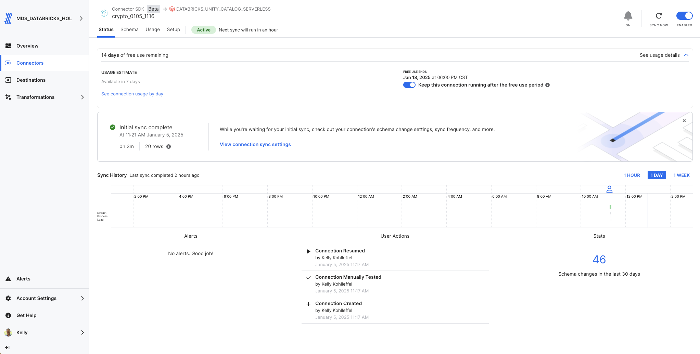
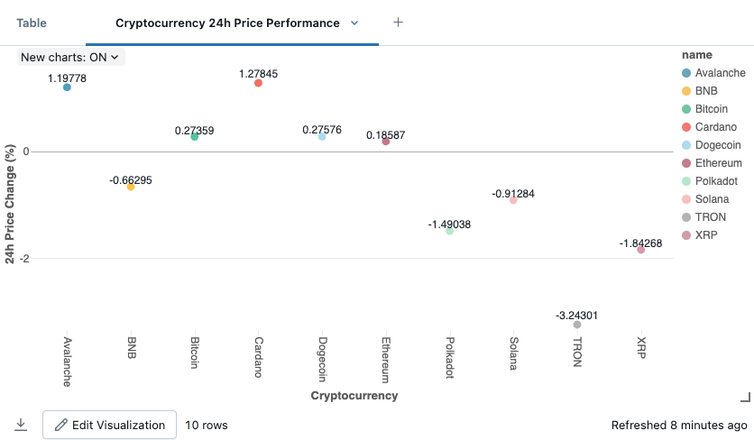
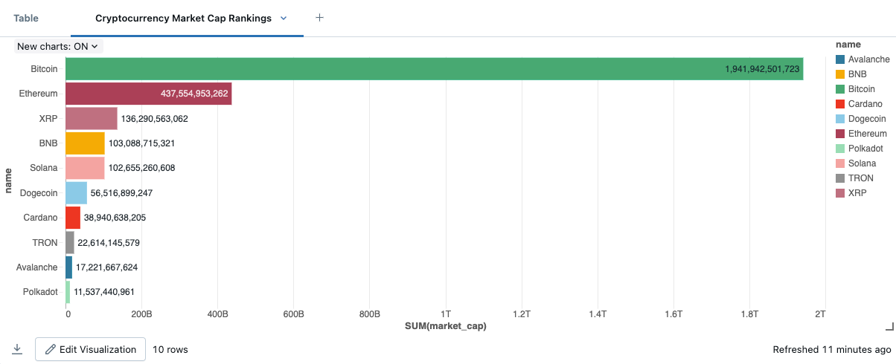
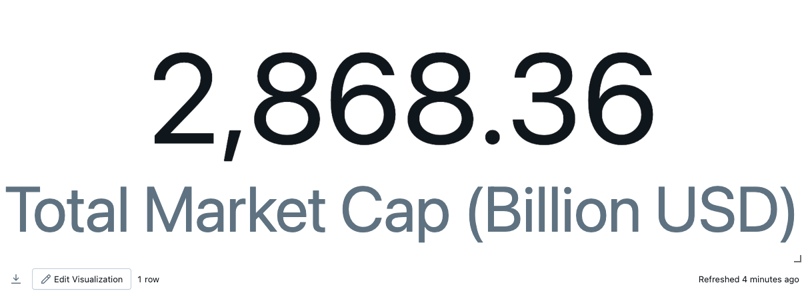
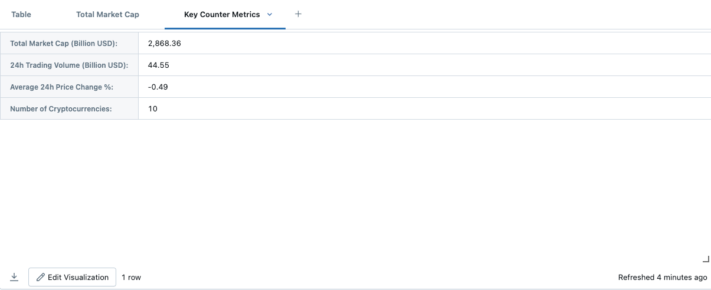

# Fivetran_Connector_SDK: CoinGecko API

## Overview
This Fivetran custom connector leverages the Fivetran Connector SDK to retrieve cryptocurrency data from the [CoinGecko API](https://www.coingecko.com/en/api). The connector focuses specifically on tracking the top 10 cryptocurrencies by market capitalization, including Bitcoin, Ethereum, and others. It synchronizes comprehensive cryptocurrency information, including detailed coin data and real-time market metrics.

The connector uses Python to interact with the CoinGecko API and is deployed as a Fivetran extension. Fivetran automatically manages the connector's execution schedule, compute resources, orchestration, scaling, resyncs, and log management. Additionally, Fivetran handles comprehensive writing to your chosen destination, managing retries, schema inference, security, and idempotency.

See the [Technical Reference documentation](https://fivetran.com/docs/connectors/connector-sdk/technical-reference#update) and [Best Practices documentation](https://fivetran.com/docs/connectors/connector-sdk/best-practices) for details.



## Attribution


This custom connector uses the CoinGecko API but is not endorsed or certified by CoinGecko.

For more information about CoinGecko API terms of use and logos, please visit:
[CoinGecko API Terms](https://www.coingecko.com/en/api/terms)

## Features
- Tracks top 10 cryptocurrencies by market capitalization
- Retrieves comprehensive cryptocurrency details including:
  - Basic information (name, symbol, genesis date)
  - Technical details (block time, hashing algorithm)
  - Market metrics (market cap, trading volume, price changes)
  - Community and developer metrics
- Implements robust rate limiting (6-second delay between API calls)
- Uses batch processing for efficient data retrieval
- Provides detailed error handling and retry mechanisms
- Supports incremental updates through state tracking
- Includes comprehensive logging for troubleshooting
- Follows Fivetran Connector SDK best practices

## API Interaction

### Core Functions

#### make_request()
Manages API calls with comprehensive error handling:
```python
def make_request(url, params=None, max_retries=3):
    """
    Make a request to the Coingecko API with retry logic.
    """
```
- Implements automatic retry with exponential backoff
- Handles rate limiting and API errors
- Provides detailed error logging

#### handle_rate_limit()
Manages API rate limiting:
```python
def handle_rate_limit(response):
    """
    Handle rate limiting from the Coingecko API.
    """
```
- Respects API's retry-after header
- Implements waiting periods for rate limit compliance
- Returns retry status for request management

### Data Retrieval Strategy

#### Data Collection
The connector implements a focused approach for cryptocurrency data:
- Maintains list of top 10 cryptocurrencies
- Processes cryptocurrencies in configurable batch sizes
- Collects both detailed coin information and market data

#### Response Processing
Each API response is processed with:
- Validation of response structure
- Extraction of relevant cryptocurrency information
- Status tracking for data completeness

#### Update Function Implementation
The update function orchestrates two main data syncs:

1. Cryptocurrency Details Sync
- Retrieves basic cryptocurrency information
- Processes technical details and metrics
- Handles community and developer scores

2. Market Data Sync
- Processes current market metrics
- Captures price changes and trading volumes
- Links market data to specific cryptocurrencies

### Error Handling

#### Network Issues
- Implements exponential backoff for failed requests
- Provides configurable retry attempts
- Handles API timeouts and server errors

#### Data Validation
- Validates required fields in responses
- Handles missing or null values gracefully
- Provides detailed error logging

### Performance Optimization

#### Request Management
- Implements 6-second delay between API calls
- Processes cryptocurrencies in batches of 3
- Maintains consistent request patterns

#### Data Processing
- Efficient data structure handling
- Optimized batch processing
- Comprehensive logging of operations

## Security Features
- Protected API endpoint handling
- Secure configuration management
- Error logging with sensitive data protection
- Configuration files excluded from version control

## Directory Structure
```
crypto/
├── __pycache__/
├── files/
│   ├── state.json
│   └── warehouse.db
├── images/
├── connector.py
├── debug.sh
├── deploy.sh
├── README.md
```

## File Details
### connector.py
Main connector implementation file that handles:
- API authentication and requests
- Data retrieval and transformation
- Schema definition
- Error handling and logging

### deploy.sh
```bash
#!/bin/bash

# Locate the root-level config.json file
ROOT_CONFIG="config.json"
CONFIG_PATH=$(pwd)
while [[ "$CONFIG_PATH" != "/" ]]; do
    if [[ -f "$CONFIG_PATH/$ROOT_CONFIG" ]]; then
        break
    fi
    CONFIG_PATH=$(dirname "$CONFIG_PATH")
done

# Validate the root config.json file exists
if [[ ! -f "$CONFIG_PATH/$ROOT_CONFIG" ]]; then
    echo "Error: Root config.json not found!"
    exit 1
fi

# Prompt for the Fivetran Account Name
read -p "Enter your Fivetran Account Name [MDS_SNOWFLAKE_HOL]: " ACCOUNT_NAME
ACCOUNT_NAME=${ACCOUNT_NAME:-"MDS_SNOWFLAKE_HOL"}

# Fetch the API key from config.json
API_KEY=$(jq -r ".fivetran.api_keys.$ACCOUNT_NAME" "$CONFIG_PATH/$ROOT_CONFIG")
if [[ "$API_KEY" == "null" ]]; then
    echo "Error: Account name not found in $ROOT_CONFIG!"
    exit 1
fi

# Prompt for the Fivetran Destination Name
read -p "Enter your Fivetran Destination Name [NEW_SALES_ENG_HANDS_ON_LAB]: " DESTINATION_NAME
DESTINATION_NAME=${DESTINATION_NAME:-"NEW_SALES_ENG_HANDS_ON_LAB"}

# Prompt for the Fivetran Connector Name
read -p "Enter a unique Fivetran Connector Name [default-connection]: " CONNECTION_NAME
CONNECTION_NAME=${CONNECTION_NAME:-"default-connection"}

# Deploy the connector using the configuration file
echo "Deploying connector..."
fivetran deploy --api-key "$API_KEY" --destination "$DESTINATION_NAME" --connection "$CONNECTION_NAME"
```

### debug.sh
```bash
#!/bin/bash
echo "Starting debug process..."

# Ensure files directory exists
echo "Ensuring files directory exists..."
mkdir -p files

# List contents of the files directory
echo "Contents of files directory:"
ls -la files/

# Run fivetran debug
echo "Running fivetran debug..."
fivetran debug

echo "Debug process complete."
```

### files/state.json
Tracks the state of incremental syncs.

### files/warehouse.db
DuckDB database used for local testing.

### images/
Contains documentation screenshots and images:
- Directory structure screenshots
- Sample output images
- Configuration examples
- Other visual documentation

## Setup Instructions

### Prerequisites
- Python 3.8+
- Fivetran Connector SDK and a virtual environment
- CoinGecko API access
- Fivetran Account with destination configured

### Installation Steps
1. Create project directory:
```bash
mkdir -p crypto
cd crypto
```

2. Create virtual environment:
```bash
python3 -m venv .venv
source .venv/bin/activate  # Windows: .venv\Scripts\activate
```

3. Install SDK:
```bash
pip install fivetran-connector-sdk requests
```

4. Create necessary files:
```bash
touch connector.py configuration.json spec.json
chmod +x debug.sh deploy.sh
```

## Usage

### Local Testing
```bash
chmod +x debug.sh
./debug.sh
```

The debug process will:
1. Reset any existing state
2. Create the files directory
3. Retrieve CoinGecko crypto data
4. Log the process details
5. Create local database files for testing

### Production Deployment
```bash
chmod +x deploy.sh
./deploy.sh
```

The script will:
- Find and read your Fivetran configuration
- Prompt for account details and deployment options
- Deploy the connector to your Fivetran destination

### Expected Output
The connector will:
1. Reset any existing state
2. Create the files directory
3. Retrieve cryptocurrency details for top 10 coins
4. Process market data in configured batches
5. Calculate and store real-time metrics
6. Log process details and rate limiting status
7. Create local database files for testing

## Data Tables

### cryptocurrencies
Primary table containing cryptocurrency information:
- id (STRING, Primary Key)
- name (STRING)
- symbol (STRING)
- block_time_in_minutes (INTEGER)
- hashing_algorithm (STRING)
- description_en (STRING)
- genesis_date (STRING)
- sentiment_votes_up_percentage (FLOAT)
- sentiment_votes_down_percentage (FLOAT)
- market_cap_rank (INTEGER)
- coingecko_rank (INTEGER)
- coingecko_score (FLOAT)
- developer_score (FLOAT)
- community_score (FLOAT)
- liquidity_score (FLOAT)
- public_interest_score (FLOAT)
- last_updated (STRING)

### market_data
Table containing real-time market information:
- id (STRING, Primary Key)
- currency_id (STRING)
- symbol (STRING)
- name (STRING)
- current_price (FLOAT)
- market_cap (FLOAT)
- market_cap_rank (INTEGER)
- fully_diluted_valuation (FLOAT)
- total_volume (FLOAT)
- high_24h (FLOAT)
- low_24h (FLOAT)
- price_change_24h (FLOAT)
- price_change_percentage_24h (FLOAT)
- market_cap_change_24h (FLOAT)
- market_cap_change_percentage_24h (FLOAT)
- circulating_supply (FLOAT)
- total_supply (FLOAT)
- max_supply (FLOAT)
- ath (FLOAT)
- ath_change_percentage (FLOAT)
- ath_date (STRING)
- atl (FLOAT)
- atl_change_percentage (FLOAT)
- atl_date (STRING)
- timestamp (STRING)
- last_updated (STRING)

## Troubleshooting

### Common Issues

1. Rate Limiting:
```
Rate limit hit. Waiting 60 seconds...
```
- Automatic retry will handle this
- Check API quota limits

2. API Response Errors:
```
API request failed with status 404
```
- Verify cryptocurrency IDs
- Check API endpoint URLs

3. Batch Processing:
```
Failed to fetch market data for batch
```
- Check batch size configuration
- Verify API connectivity

4. Python Environment:
```
ModuleNotFoundError: No module named 'fivetran_connector_sdk'
```
- Verify virtual environment is activated
- Reinstall SDK if necessary

## Security Notes
- Never commit API keys
- Use .gitignore for sensitive files
- Keep virtual environment isolated
- Monitor API usage and rate limits

## Development Notes
- Make code changes in connector.py 
- Monitor rate limiting carefully
- Test changes using debug.sh
- Monitor logs for issues
- Follow CoinGecko API guidelines
- Use the Fivetran SDK documentation

## Support
For issues or questions:
1. Check [CoinGecko API Documentation](https://www.coingecko.com/api/documentation)
2. Review [Fivetran Connector SDK Documentation](https://fivetran.com/docs/connectors/connector-sdk)
3. Contact your Fivetran administrator

## Bonus: Adding More Cryptocurrencies

Want to track different or additional cryptocurrencies? Here's how to modify the connector:

1. Update the TOP_CRYPTOCURRENCIES list in connector.py:
```python
TOP_CRYPTOCURRENCIES = [
    "bitcoin",
    "ethereum",
    "tether",
    "binancecoin",
    # Add more cryptocurrencies here
]
```

2. Important Considerations:
- Rate Limiting: More cryptocurrencies mean more API calls
- Memory Usage: Monitor memory usage with larger datasets
- API Quotas: Check your CoinGecko API limits

3. Common Cryptocurrency IDs:
- Bitcoin: "bitcoin"
- Ethereum: "ethereum"
- Tether: "tether"
- BNB: "binancecoin"
- Solana: "solana"

Note: Test thoroughly after adding new cryptocurrencies to ensure rate limits and performance remain optimal.

## Using the new Crypto dataset - Data Transformation: Analysis View

### From a Databricks Notebook

1. Copy and paste into cell 1 to create the refined analysis view
```python
# Create a refined view combining cryptocurrency and market data with additional metrics
spark.sql("""
CREATE OR REPLACE TABLE `ts-catalog-demo`.`crypto_0105_1116`.`crypto_and_market_analysis_view` AS
SELECT 
    c.id as crypto_id,
    c.name,
    c.symbol,
    COALESCE(c.block_time_minutes, 0) as block_time_minutes,
    COALESCE(c.hashing_algorithm, 'Not Specified') as hashing_algorithm,
    c.genesis_date,
    c.sentiment_votes_up_percentage,
    m.current_price,
    m.market_cap,
    m.market_cap_rank,
    m.total_volume,
    m.price_change_percentage_24_h,
    m.circulating_supply,
    m.total_supply,
    m.max_supply,
    m.ath,
    m.ath_change_percentage,
    TO_TIMESTAMP(m.ath_date) as ath_date,
    m.atl,
    m.atl_change_percentage,
    TO_TIMESTAMP(m.atl_date) as atl_date,
    TO_TIMESTAMP(m.timestamp) as data_timestamp,
    -- Calculate additional metrics for analysis
    (m.current_price / NULLIF(m.atl, 0) - 1) * 100 as price_growth_from_atl,
    (m.current_price / NULLIF(m.ath, 0) - 1) * 100 as price_decline_from_ath,
    (m.circulating_supply / NULLIF(m.total_supply, 0)) * 100 as supply_circulation_percentage
FROM `ts-catalog-demo`.`crypto_0105_1116`.`cryptocurrencies` c
LEFT JOIN `ts-catalog-demo`.`crypto_0105_1116`.`market_data` m
    ON c.id = m.currency_id
WHERE c._fivetran_deleted = false
""")
```

2. Copy and paste into cell 2 to verify the view creation and examine sample data
```python
# Verify the table was created and display sample data
display(spark.sql("SELECT * FROM `ts-catalog-demo`.`crypto_0105_1116`.`crypto_and_market_analysis_view` LIMIT 5"))
```

### Transformation Details

The script performs the following transformations:
- Joins cryptocurrency reference data with market data using crypto ID
- Handles null values in block_time_minutes and hashing_algorithm
- Converts timestamp strings to proper timestamp format
- Calculates additional analytical metrics:
  - Price growth from all-time low (ATL)
  - Price decline from all-time high (ATH)
  - Supply circulation percentage
- Filters out deleted records

### Key Metrics Available in View
- Market metrics: current_price, market_cap, total_volume
- Price changes: price_change_percentage_24_h, ath_change_percentage, atl_change_percentage
- Supply metrics: circulating_supply, total_supply, max_supply
- Sentiment: sentiment_votes_up_percentage
- Technical details: block_time_minutes, hashing_algorithm
- Time-based data: genesis_date, ath_date, atl_date, data_timestamp

### Usage Notes
- Update the catalog and schema names as needed for your environment
- The view updates/replaces automatically when rerun
- All timestamps are standardized to proper timestamp format
- Null values are handled with COALESCE for certain fields
- The view is optimized for visualization and analysis purposes

## Using the new Crypto dataset - Visualization 1: 24h Price Performance

### From a Databricks Notebook

1. Copy and paste into cell 2
```python
from pyspark.sql.functions import *

# Read the data from Unity Catalog
df = spark.table("`ts-catalog-demo`.`crypto_0105_1116`.`crypto_and_market_analysis_view`")

# Create bar chart visualization
display(df.select("name",
                 "price_change_percentage_24_h",
                 "market_cap_rank")
        .orderBy("price_change_percentage_24_h"))
```
2. Click on the "+" to the right of "Table" and select visualization and then customize as needed.

### Visualization Settings
1. Select "Scatter Plot"
2. Configure Plot Options:
 * X Column: name
 * Y Column: price_change_percentage_24_h
 * Group By: name
 * Title: "Cryptocurrency 24h Price Performance"

### Customization
* Default color scheme used (automatically assigns unique colors to each cryptocurrency)
* Display data points showing exact percentage values
* Show values for each point
* Enable grid lines for better readability
* X-axis shows cryptocurrency names
* Y-axis shows price change percentage
* Enable hover tooltips to show exact values

This visualization creates a scatter plot showing the 24-hour price performance of different cryptocurrencies, with each point representing a cryptocurrency's percentage change. The zero line makes it easy to distinguish between currencies that have gained (above line) versus lost (below line) value in the past 24 hours.



## Using the new Crypto dataset - Visualization 2: Market Cap Rankings

### From a Databricks Notebook

1. Copy and paste into cell 1
```python
from pyspark.sql.functions import *

# Read the data from Unity Catalog
df = spark.table("`ts-catalog-demo`.`crypto_0105_1116`.`crypto_and_market_analysis_view`")

# Create bar chart for market cap rankings
display(df.select("name",
                 "market_cap")
        .orderBy(col("market_cap").desc()))  # Sort from highest to lowest
```
2. Click on the "+" to the right of "Table" and select visualization and then customize as needed.

### Visualization Settings
1. Select "Bar Chart"
2. Configure Plot Options:
 * Y Column: name
 * X Column: market_cap
 * Group By: name
 * Title: "Cryptocurrency Market Cap Rankings"

### Customization
* Default color scheme is used (automatically assigns unique colors to each cryptocurrency)
* Horizontal bar orientation
* Display values on bars
* Enable grid lines for better readability
* X-axis shows market cap values
* Y-axis shows cryptocurrency names

This visualization creates a clear horizontal bar chart showing the market capitalization of different cryptocurrencies, making it easy to compare their relative market sizes. Bitcoin's dominant position is immediately visible at the top, followed by Ethereum and other major cryptocurrencies in descending order.



## Using the new Crypto dataset - Visualization 3: Market Overview Metrics

### From a Databricks Notebook

1. Copy and paste into cell 3 (update with your Unity Catalog and your schema name)
```python
from pyspark.sql.functions import *

# Read the data and calculate key metrics
df = spark.table("`ts-catalog-demo`.`crypto_0105_1116`.`crypto_and_market_analysis_view`")

metrics_df = df.agg(
    format_number(sum("market_cap")/1e9, 2).alias("Total Market Cap (Billion USD)"),
    format_number(sum("total_volume")/1e9, 2).alias("24h Trading Volume (Billion USD)"),
    round(avg("price_change_percentage_24_h"), 2).alias("Average 24h Price Change %"),
    count("name").alias("Number of Cryptocurrencies")
)

display(metrics_df)
```
2. Click on the "+" to the right of "Table" and select visualization and then customize as needed.

### Visualization Settings
1. Select "Counter"
2. Configure General settings for each metric:
 * Value column: Select each metric
 * Label: Use the alias names
 * Colors: Green for positive values, Red for negative

These visualizations provide clear, concise metrics for the cryptocurrency market.

### Customization
* Use currency formatting for monetary values
* Use percentage formatting for change metrics
* Add appropriate icons for each counter
* Use clear, large font for readability
* Enable automatic refreshing if supported

This creates a dashboard-style overview of key market metrics.



