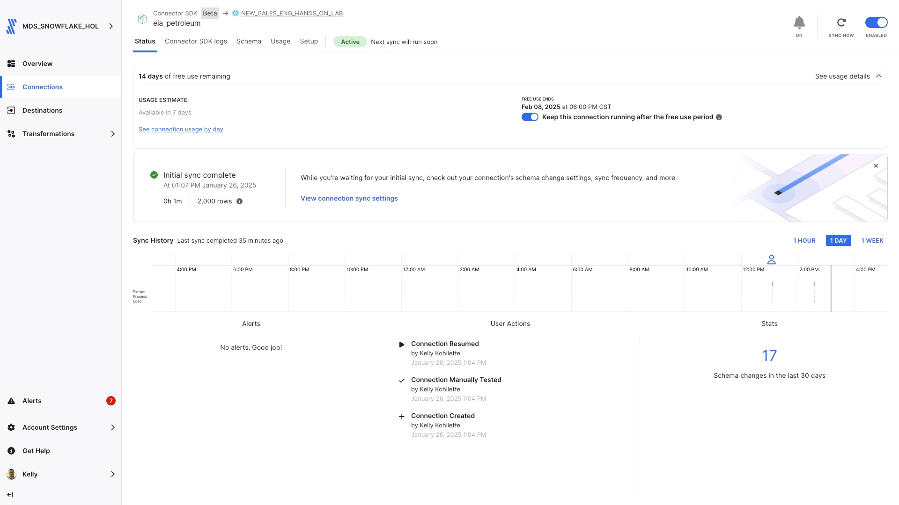
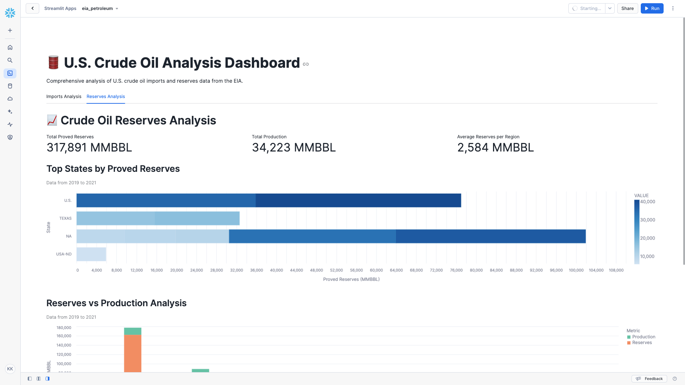
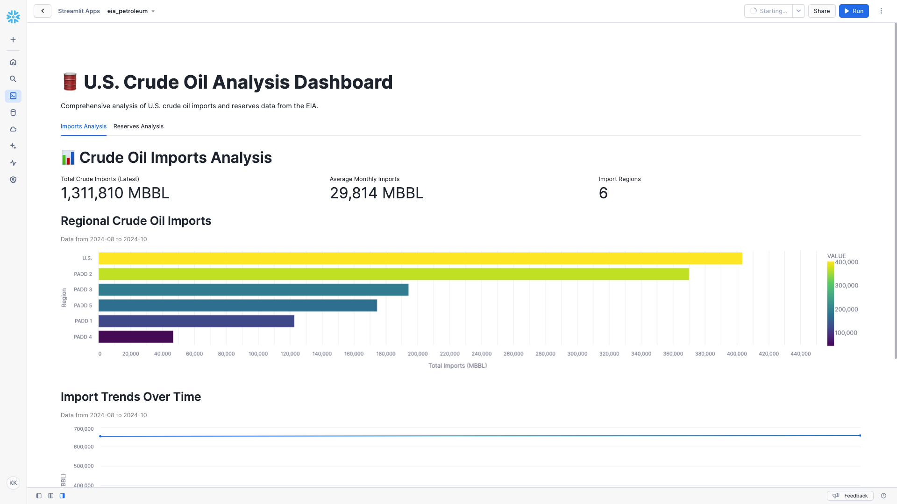

# Fivetran_Connector_SDK: U.S. Energy Information Administration (EIA) API

## Overview
This Fivetran custom connector leverages the Fivetran Connector SDK to retrieve data from the U.S. Energy Information Administration (EIA) API. The connector synchronizes comprehensive petroleum data including crude oil reserves, production statistics, and import information across various regions and time periods.

Fivetran's Connector SDK enables you to use Python to code the interaction with the EIA API data source. The connector is deployed as an extension of Fivetran, which automatically manages running the connector on your scheduled frequency and handles the required compute resources, orchestration, scaling, resyncs, and log management.

See the [Technical Reference documentation](https://fivetran.com/docs/connectors/connector-sdk/technical-reference#update) and [Best Practices documentation](https://fivetran.com/docs/connectors/connector-sdk/best-practices) for details.



## Attribution


This custom connector uses the U.S. Energy Information Administration (EIA) API but is not endorsed or certified by the EIA or any government agency.

For more information about EIA API terms of use and attribution requirements, please visit:
[EIA Open Data Terms of Service](https://www.eia.gov/opendata/documentation.php)

## Features
- Retrieves comprehensive petroleum data
- Captures detailed crude oil reserves and production information
- Collects import statistics across regions
- Implements robust error handling with retry mechanisms
- Uses rate limiting to handle API quotas efficiently
- Supports incremental syncs through state tracking
- Masks sensitive API credentials in logs
- Provides detailed logging for troubleshooting
- Routes-based data collection strategy
- Processes multiple data series efficiently

## API Interaction

### Core Functions

#### create_retry_session()
Configures HTTP request sessions with built-in retry logic:
```python
retries = Retry(
    total=5,
    backoff_factor=2,
    status_forcelist=[408, 429, 500, 502, 503, 504]
)
```
- Implements automatic retry for specific HTTP status codes
- Uses exponential backoff to handle rate limits
- Handles connection timeouts and server errors

#### make_api_request()
Manages API calls with comprehensive error handling and logging:
```python
base_url = "https://api.eia.gov/v2"
params = {
    'api_key': api_key,
    'frequency': frequency,
    'data[0]': 'value',
    'sort[0][column]': 'period',
    'sort[0][direction]': 'desc'
}
```
- Masks sensitive API credentials in logs
- Implements 30-second timeout for requests
- Provides detailed logging of request parameters
- Handles rate limiting with cooldown periods

### Data Retrieval Strategy

#### Data Collection
The connector implements a route-based approach for petroleum data:
- Processes multiple data routes:
  - Crude Reserves and Production
  - Crude Imports
- Retrieves configurable number of records per route
- Collects detailed metadata and series information

#### Response Processing
Each API response is processed with:
- Validation of response structure
- Extraction of relevant series information
- Status tracking for data completeness
- JSON parsing of nested details

#### Update Function Implementation
The update function orchestrates a streamlined data sync process:

1. Configuration Handling
* Validates API credentials and retrieves API key
* Creates retry-enabled session with backoff logic
* Reads record limit from configuration (defaults to 500)
* Initializes comprehensive logging system

2. Route-Based Processing
* Defines routes for different data types:
  - Crude reserves and production (annual frequency)
  - Crude imports (monthly frequency)
* Configures request parameters for each route:
  - Time range (from 2014 to present)
  - Sort order (most recent first)
  - Record limit per route
  - Frequency settings

3. Data Collection and Transformation
* Makes API requests with error handling
* Processes response data into standardized format
* Performs field transformations:
  - Converts values to appropriate types
  - Standardizes date formats
  - Normalizes unit representations
* Creates checkpoint records for sync tracking

4. Record Management
* Generates upsert operations for each record
* Implements batch processing for efficiency
* Creates checkpoints after successful syncs
* Provides detailed logging of processed records

### Error Handling

#### Network Issues
* Automatic retry mechanism with 5 total attempts
* Exponential backoff with factor of 2 for rate limits
* Handles specific status codes: 408, 429, 500, 502, 503, 504
* 30-second timeout handling for unresponsive endpoints
* Comprehensive session management with retry logic

#### Data Validation
* Validates required fields in API responses
* Type conversion and null value handling for numeric data
* Graceful handling of missing or malformed data
* Detailed error logging with masked sensitive information
* Exception capture and reporting at multiple levels

### Performance Optimization

#### Request Management
* Configurable record limits per route
* Retry strategy with exponential backoff for failed requests
* Efficient session reuse across requests
* Detailed request logging for monitoring and debugging
* Optimized request parameters for data retrieval

#### Data Processing
* Efficient JSON parsing of API responses
* Memory-optimized data transformation
* Streamlined record processing pipeline
* Batch processing of records for database operations
* Comprehensive checkpoint system for sync tracking

### Security Features
* API key masking in all log outputs
* Secure configuration handling
* Protected credential management
* Configuration files excluded from version control
* Sanitized error messages without sensitive data
* Secure session management for API requests

## Directory Structure
```
eia_petroleum/
├── __pycache__/
├── files/
│   ├── spec.json
│   ├── state.json
│   └── warehouse.db
│   └── streamlit.py
├── images/
├── configuration.json
├── connector.py
├── debug.sh
├── deploy.sh
├── README.md
├── requirements.txt
└── spec.json
```
## File Details

### connector.py
Main connector implementation handling:
- API authentication and requests
- Data retrieval and transformation
- Schema definition
- Error handling and logging

### configuration.json
Configuration file containing API credentials and desired record limit:
```json
{
    "api_key": "your_eia_api_key",
    "record_limit": "1000"
 }
```
**Note**: This file is automatically copied to the files directory during debug. Do not commit this file to version control.

### deploy.sh
Script for deploying to Fivetran production:
```bash
#!/bin/bash

# Locate the root-level config.json file
ROOT_CONFIG="config.json"
CONFIG_PATH=$(pwd)
while [[ "$CONFIG_PATH" != "/" ]]; do
    if [[ -f "$CONFIG_PATH/$ROOT_CONFIG" ]]; then
        break
    fi
    CONFIG_PATH=$(dirname "$CONFIG_PATH")
done

# Validate the root config.json file exists
if [[ ! -f "$CONFIG_PATH/$ROOT_CONFIG" ]]; then
    echo "Error: Root config.json not found!"
    exit 1
fi

# Validate the local configuration.json file exists
if [[ ! -f "configuration.json" ]]; then
    echo "Error: Local configuration.json not found!"
    exit 1
fi

# Prompt for the Fivetran Account Name
read -p "Enter your Fivetran Account Name [MDS_SNOWFLAKE_HOL]: " ACCOUNT_NAME
ACCOUNT_NAME=${ACCOUNT_NAME:-"MDS_SNOWFLAKE_HOL"}

# Fetch the API key from config.json
API_KEY=$(jq -r ".fivetran.api_keys.$ACCOUNT_NAME" "$CONFIG_PATH/$ROOT_CONFIG")
if [[ "$API_KEY" == "null" ]]; then
    echo "Error: Account name not found in $ROOT_CONFIG!"
    exit 1
fi

# Prompt for the Fivetran Destination Name
read -p "Enter your Fivetran Destination Name [NEW_SALES_ENG_HANDS_ON_LAB]: " DESTINATION_NAME
DESTINATION_NAME=${DESTINATION_NAME:-"NEW_SALES_ENG_HANDS_ON_LAB"}

# Prompt for the Fivetran Connector Name
read -p "Enter a unique Fivetran Connector Name [default-connection]: " CONNECTION_NAME
CONNECTION_NAME=${CONNECTION_NAME:-"default-connection"}

# Deploy the connector using the configuration file
echo "Deploying connector..."
fivetran deploy --api-key "$API_KEY" --destination "$DESTINATION_NAME" --connection "$CONNECTION_NAME" --configuration configuration.json
```

### debug.sh
Debug script for local testing:
```bash
#!/bin/bash
echo "Starting debug process..."

# Ensure the files directory exists
echo "Creating files directory..."
mkdir -p files

# Copy configuration files to the files directory
echo "Copying configuration files to files directory for temporary use..."
cp -v configuration.json files/configuration.json
cp -v spec.json files/spec.json

# Verify that the original configuration.json is preserved
if [[ ! -f "configuration.json" ]]; then
    echo "Error: configuration.json file is missing!"
    exit 1
fi

echo "Contents of files directory:"
ls -la files/

# Run the Fivetran debug command
echo "Running fivetran debug..."
fivetran debug
```

### files/spec.json
Generated copy of the connector specification file.

### files/state.json
Tracks the state of incremental syncs.

### files/warehouse.db
DuckDB database used for local testing.

### images/
Contains documentation screenshots and images.

### requirements.txt
Python package dependencies that need to be installed for this connector.

urllib3==2.3.0   # HTTP client library for making requests

### spec.json
Main specification file defining the configuration schema:
```json
{
    "configVersion": 1,
    "connectionSpecification": {
        "type": "object",
        "required": ["api_key"],
        "properties": {
            "api_key": {
                "type": "string",
                "description": "Enter your US Energy Admin Open Data API key",
                "configurationGroupKey": "Authentication",
                "secret": true
            }
        }
    }
}
```

## Setup Instructions

### Prerequisites
- Python 3.8+
- Fivetran Connector SDK and a virtual environment
- EIA API Key (obtain from [EIA](https://www.eia.gov/opendata/))
- Fivetran Account with destination configured

### Installation Steps
1. Create project directory:
```bash
mkdir -p eia_petroleum
cd eia_petroleum
```

2. Create virtual environment:
```bash
python3 -m venv .venv
source .venv/bin/activate  # Windows: .venv\Scripts\activate
```

3. Install SDK:
```bash
pip install fivetran-connector-sdk requests
```

4. Create necessary files:
```bash
touch connector.py configuration.json spec.json
chmod +x debug.sh deploy.sh
```

5. Configure your EIA API key:
- Add your API key to configuration.json
- Keep this file secure and do not commit to version control

## Usage

### Local Testing
```bash
chmod +x debug.sh
./debug.sh
```

### Production Deployment
```bash
chmod +x deploy.sh
./deploy.sh
```

### Expected Output
The connector will create and populate:

### crude_reserves_production
Primary table containing reserves and production data:
- period (STRING, Primary Key part 1)
- series (STRING, Primary Key part 2)
- value (FLOAT)
- area_name (STRING)
- description (STRING)
- units (STRING)
- last_updated (STRING)

### crude_imports
Primary table containing import statistics:
- period (STRING, Primary Key part 1)
- series (STRING, Primary Key part 2)
- value (FLOAT)
- area_name (STRING)
- description (STRING)
- units (STRING)
- last_updated (STRING)

## Troubleshooting

### Common Issues

1. API Key Issues:
```
Error retrieving API key: 'No API key found in configuration'
```
- Verify API key in configuration.json
- Check API key validity on EIA website

2. Rate Limiting:
```
API request failed: 429 Too Many Requests
```
- Automatic retry will handle this
- Check API quota limits
- Adjust record_limit in configuration

3. Data Processing:
```
Error processing series data: Invalid response format
```
- Check API response format
- Verify data transformation logic
- Ensure correct route configuration

## Security Notes
- Never commit API keys
- Use .gitignore for sensitive files
- Keep virtual environment isolated
- Mask sensitive information in logs

## Development Notes
- Make code changes in connector.py
- Test changes using debug.sh
- Monitor logs for issues
- Follow EIA API guidelines
- Use the Fivetran SDK documentation

## Support
For issues or questions:
1. Check [EIA API Documentation](https://www.eia.gov/opendata/documentation.php)
2. Review [Fivetran Connector SDK Documentation](https://fivetran.com/docs/connectors/connector-sdk)
3. Contact your Fivetran administrator

## Bonus: Configuring Record Limits and Time Ranges

You can modify the connector's behavior by adjusting the configuration.json file:

```json
{
    "api_key": "YOUR_EIA_API_KEY",
    "record_limit": 1000
}
```

### Configuration Options:
1. record_limit (default: 1000)
   - Controls how many records to fetch per route
   - Adjust based on your data needs and API quotas
   - Example: Set to 1000 for more historical data

### Modifying Time Ranges:
The connector's update function includes default time range parameters that you can adjust:

```python
params = {
    'frequency': route['frequency'],
    'start': '2014-01',  # Modify this for different start date
    'end': datetime.now().strftime('%Y-%m'),
    'sort[0][column]': 'period',
    'sort[0][direction]': 'desc',
    'data[0]': 'value',
    'offset': 0,
    'length': route['length']
}
```

To modify the time range:
1. Open connector.py
2. Locate the update function
3. Adjust the 'start' parameter to your desired starting point
4. The 'end' parameter defaults to current date
5. Test changes using debug.sh

## Using the EIA Petroleum Dataset

The following Streamlit in Snowflake application provides comprehensive analysis of petroleum data:

### Streamlit in Snowflake Data App Components

#### This Streamlit data app provides:

1. Key performance metrics showing:
* Total Crude Imports
* Average Monthly Imports
* Import Regions Count
* Total Proved Reserves
* Total Production
* Average Reserves per Region

2. Two main analysis tabs:
* Imports Analysis
* Reserves Analysis

3. Interactive visualizations including:
* Regional Crude Oil Imports (bar chart)
* Import Trends Over Time (line chart)
* Top States by Proved Reserves (bar chart)
* Reserves vs Production Analysis (comparative bar chart)

4. Features:
* Time-based filtering
* Regional analysis
* Production comparisons
* Detailed data views

#### This Streamlit data app helps users understand:
- Import patterns and trends
- Regional distribution of reserves
- Production efficiency by state
- Temporal changes in crude oil metrics

### Streamlit in Snowflake Implementation Notes
* Requires the crude_imports and crude_reserves_production tables
* Uses Snowpark DataFrame operations for efficient querying
* Implements tabbed interface for organized data presentation
* Provides clear error messaging for database context issues
* Utilizes Altair for all visualizations
* Handles null values and deleted records appropriately
* Includes comprehensive tooltips for data exploration
* Maintains consistent sorting across categorical data
* Efficiently processes large datasets through filtered queries

### Streamlit in Snowflake Application Code

```python
import examples.quick_start_examples.eia_petroleum.files.streamlit as st
import pandas as pd
import altair as alt
from snowflake.snowpark.context import get_active_session

# Page configuration
st.set_page_config(
    page_title="Crude Oil Analysis Dashboard",
    layout="wide",
    initial_sidebar_state="expanded"
)

# Get Snowflake session
session = get_active_session()

# Load data functions
def load_import_data():
    return session.sql("""
        SELECT 
            PERIOD,
            SERIES,
            VALUE,
            AREA_NAME,
            DESCRIPTION,
            UNITS
        FROM crude_imports
        WHERE _FIVETRAN_DELETED = FALSE
        AND PERIOD >= '2019-01'
    """).to_pandas()

def load_reserves_data():
    return session.sql("""
        SELECT 
            PERIOD,
            SERIES,
            VALUE,
            AREA_NAME,
            DESCRIPTION,
            UNITS
        FROM crude_reserves_production
        WHERE _FIVETRAN_DELETED = FALSE
        AND PERIOD >= '2019'
    """).to_pandas()

try:
    # Load data
    with st.spinner("Loading crude oil data..."):
        imports_data = load_import_data()
        reserves_data = load_reserves_data()

    # Dashboard Title
    st.title("🛢️ U.S. Crude Oil Analysis Dashboard")
    st.markdown("""
    Comprehensive analysis of U.S. crude oil imports and reserves data from the EIA.
    """)

    # Tabs for different analyses
    tab1, tab2 = st.tabs(["Imports Analysis", "Reserves Analysis"])

    with tab1:
        st.header("📊 Crude Oil Imports Analysis")

        # Key Metrics for Imports
        col1, col2, col3 = st.columns(3)
        
        with col1:
            latest_imports = imports_data[
                imports_data['DESCRIPTION'].str.contains('Imports of Crude Oil', case=False, na=False)
            ]['VALUE'].sum()
            st.metric("Total Crude Imports (Latest)", f"{latest_imports:,.0f} MBBL")
        
        with col2:
            avg_imports = imports_data[
                imports_data['DESCRIPTION'].str.contains('Imports of Crude Oil', case=False, na=False)
            ]['VALUE'].mean()
            st.metric("Average Monthly Imports", f"{avg_imports:,.0f} MBBL")
        
        with col3:
            unique_areas = imports_data['AREA_NAME'].nunique()
            st.metric("Import Regions", str(unique_areas))

        # Regional Imports Analysis
        st.subheader("Regional Crude Oil Imports")
        st.caption(f"Data from {imports_data['PERIOD'].min()} to {imports_data['PERIOD'].max()}")
        region_data = imports_data[
            imports_data['DESCRIPTION'].str.contains('Imports of Crude Oil', case=False, na=False)
        ].groupby('AREA_NAME')['VALUE'].sum().reset_index()
        
        region_chart = alt.Chart(region_data).mark_bar().encode(
            x=alt.X('VALUE:Q', title='Total Imports (MBBL)'),
            y=alt.Y('AREA_NAME:N', sort='-x', title='Region'),
            color=alt.Color('VALUE:Q', scale=alt.Scale(scheme='viridis')),
            tooltip=[
                alt.Tooltip('AREA_NAME:N', title='Region'),
                alt.Tooltip('VALUE:Q', title='Total Imports', format=',')
            ]
        ).properties(height=300)
        
        st.altair_chart(region_chart, use_container_width=True)

        # Time Series Analysis
        st.subheader("Import Trends Over Time")
        st.caption(f"Data from {imports_data['PERIOD'].min()} to {imports_data['PERIOD'].max()}")
        time_data = imports_data[
            imports_data['DESCRIPTION'].str.contains('Imports of Crude Oil', case=False, na=False)
        ].groupby('PERIOD')['VALUE'].sum().reset_index()
        
        line_chart = alt.Chart(time_data).mark_line(point=True).encode(
            x=alt.X('PERIOD:T', title='Date'),
            y=alt.Y('VALUE:Q', title='Imports (MBBL)'),
            tooltip=[
                alt.Tooltip('PERIOD:T', title='Date'),
                alt.Tooltip('VALUE:Q', title='Imports', format=',')
            ]
        ).properties(height=400)
        
        st.altair_chart(line_chart, use_container_width=True)

    with tab2:
        st.header("📈 Crude Oil Reserves Analysis")

        # Key Metrics for Reserves
        col1, col2, col3 = st.columns(3)
        
        with col1:
            total_reserves = reserves_data[
                reserves_data['DESCRIPTION'].str.contains('Proved Reserves', case=False, na=False)
            ]['VALUE'].sum()
            st.metric("Total Proved Reserves", f"{total_reserves:,.0f} MMBBL")
        
        with col2:
            total_production = reserves_data[
                reserves_data['DESCRIPTION'].str.contains('Production from Reserves', case=False, na=False)
            ]['VALUE'].sum()
            st.metric("Total Production", f"{total_production:,.0f} MMBBL")
        
        with col3:
            avg_reserves = reserves_data[
                reserves_data['DESCRIPTION'].str.contains('Proved Reserves', case=False, na=False)
            ]['VALUE'].mean()
            st.metric("Average Reserves per Region", f"{avg_reserves:,.0f} MMBBL")

        # Top States by Reserves
        st.subheader("Top States by Proved Reserves")
        st.caption(f"Data from {reserves_data['PERIOD'].min()} to {reserves_data['PERIOD'].max()}")
        state_reserves = reserves_data[
            reserves_data['DESCRIPTION'].str.contains('Proved Reserves', case=False, na=False)
        ].nlargest(10, 'VALUE')
        
        states_chart = alt.Chart(state_reserves).mark_bar().encode(
            x=alt.X('VALUE:Q', title='Proved Reserves (MMBBL)'),
            y=alt.Y('AREA_NAME:N', sort='-x', title='State'),
            color=alt.Color('VALUE:Q', scale=alt.Scale(scheme='blues')),
            tooltip=[
                alt.Tooltip('AREA_NAME:N', title='State'),
                alt.Tooltip('VALUE:Q', title='Proved Reserves', format=',')
            ]
        ).properties(height=300)
        
        st.altair_chart(states_chart, use_container_width=True)

        # Reserves vs Production Analysis
        st.subheader("Reserves vs Production Analysis")
        st.caption(f"Data from {reserves_data['PERIOD'].min()} to {reserves_data['PERIOD'].max()}")
        
        # Create comparison data
        reserves_by_state = reserves_data[
            reserves_data['DESCRIPTION'].str.contains('Proved Reserves', case=False, na=False)
        ].groupby('AREA_NAME')['VALUE'].sum()
        
        production_by_state = reserves_data[
            reserves_data['DESCRIPTION'].str.contains('Production from Reserves', case=False, na=False)
        ].groupby('AREA_NAME')['VALUE'].sum()
        
        comparison_data = pd.DataFrame({
            'State': reserves_by_state.index,
            'Reserves': reserves_by_state.values,
            'Production': production_by_state
        }).dropna()
        
        comparison_data = comparison_data.melt(
            id_vars=['State'],
            var_name='Metric',
            value_name='Value'
        )
        
        comparison_chart = alt.Chart(comparison_data).mark_bar().encode(
            x=alt.X('State:N', title='State'),
            y=alt.Y('Value:Q', title='MMBBL'),
            color=alt.Color('Metric:N', scale=alt.Scale(scheme='set2')),
            tooltip=[
                alt.Tooltip('State:N', title='State'),
                alt.Tooltip('Metric:N', title='Metric'),
                alt.Tooltip('Value:Q', title='Value', format=',')
            ]
        ).properties(height=400)
        
        st.altair_chart(comparison_chart, use_container_width=True)

        # Detailed Data View
        if st.checkbox("Show Raw Data"):
            st.dataframe(reserves_data)

except Exception as e:
    st.error(f"An error occurred while loading the dashboard: {str(e)}")
    st.error("Please ensure you have the correct database and schema context set in Streamlit in Snowflake.")
```

### Streamlit in Snowflake Reserves Analysis Tab


### Streamlit in Snowflake Imports Analysis Tab
