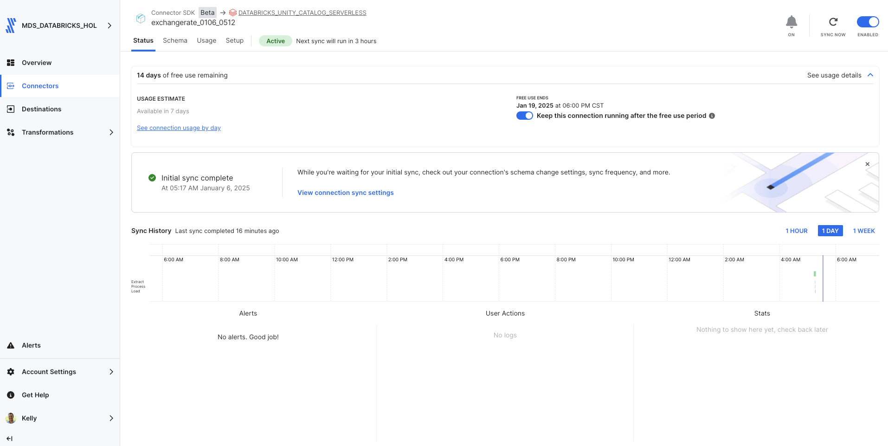

# Fivetran_Connector_SDK: ExchangeRate API

## Overview
This Fivetran custom connector leverages the Fivetran Connector SDK to retrieve exchange rate data from [ExchangeRate API](https://www.exchangerate-api.com/docs/overview). The connector obtains real-time exchange rates for major currency pairs using USD as the base currency, paired with EUR, GBP, JPY, and AUD. It combines real-time rates with simulated historical data to provide a 7-day trend analysis.

The connector uses the free tier of the ExchangeRate API which provides current rates, while historical data is simulated using small variations from the current rates to enable trend analysis without requiring a paid API subscription.

Fivetran's Connector SDK enables you to use Python to code the interaction with the ExchangeRate API data source. The connector is deployed as an extension of Fivetran, which automatically manages scheduling, compute resources, orchestration, scaling, resyncs, and log management.

See the [Technical Reference documentation](https://fivetran.com/docs/connectors/connector-sdk/technical-reference#update) and [Best Practices documentation](https://fivetran.com/docs/connectors/connector-sdk/best-practices) for details.



## Attribution


This custom connector uses the ExchangeRate API but is not endorsed or certified by ExchangeRate API.

Data provided by ExchangeRate API (https://www.exchangerate-api.com)

For more information about ExchangeRate API terms of use and attribution requirements, please visit:
[ExchangeRate API Terms of Use](https://www.exchangerate-api.com/terms)

## Features
- Retrieves real-time exchange rates for major currency pairs (USD to EUR, GBP, JPY, AUD)
- Creates simulated 7-day historical data based on current rates
- Maintains consistent currency pair tracking and relationships
- Implements robust error handling and retry mechanisms
- Uses rate limiting to handle API quotas efficiently
- Supports incremental syncs through state tracking
- Masks sensitive API credentials in logs
- Provides detailed logging for troubleshooting
- Follows Fivetran Connector SDK best practices

## API Interaction

### Core Functions

#### create_retry_session()
Configures HTTP request sessions with built-in retry logic:
```python
retries = Retry(
    total=3,
    backoff_factor=1,
    status_forcelist=[408, 429, 500, 502, 503, 504]
)
```
- Implements automatic retry for specific HTTP status codes
- Uses exponential backoff to handle rate limits
- Handles connection timeouts and server errors

#### make_api_request()
Manages API calls with comprehensive error handling and logging:
- Masks sensitive API credentials in logs
- Implements 30-second timeout for requests
- Provides detailed logging of request parameters
- Handles rate limiting with 60-second cooldown periods

### Data Retrieval Strategy

#### Data Collection
The connector implements a multi-tier data strategy:
1. Real-time Data (API):
   - Uses the "/latest/{base_currency}" endpoint
   - Retrieves current exchange rates for major currency pairs
   - Single API call per sync

2. Historical Data (Simulated):
   - Creates 7 days of historical data
   - Based on current rates with ±0.1% daily variations
   - Provides realistic trend analysis capability

3. Reference Data (Static):
   - Maintains currency pair metadata
   - Tracks relationship between currencies
   - Provides consistent identifiers for joins

#### Response Processing
Each API response is processed with:
- Validation of response structure and success status
- Extraction of relevant exchange rate information
- Creation of unique identifiers for rates and currency pairs
- Generation of simulated historical variations

#### Update Function Implementation
The update function orchestrates three main data syncs:

1. Currency Pairs Sync
- Creates and maintains currency pair metadata
- Generates unique currency pair identifiers
- Tracks major pair status and updates

2. Latest Rates Sync (Real Data)
- Retrieves current exchange rates
- Processes rate timestamps
- Links rates to currency pairs

3. Historical Rates Sync (Simulated)
- Creates 7-day historical record
- Applies realistic rate variations
- Maintains consistent data patterns

### Error Handling

#### Network Issues
- Automatic retry for transient network failures
- Exponential backoff for rate limit compliance
- Timeout handling for unresponsive endpoints

#### Data Validation
- Checks for required fields in responses
- Handles missing or null values gracefully
- Validates rate values and currency codes

### Performance Optimization

#### Request Management
- Single API call for latest rates
- Efficient handling of rate limits
- Maintains consistent request patterns

#### Data Processing
- Optimized data structures for rate storage
- Efficient currency pair tracking
- Minimized API calls through data reuse

## Security Features
- API key masking in all logs
- Secure handling of configuration data
- Protected credential management
- Configuration files excluded from version control

## Directory Structure
```
exchangerate/
├── __pycache__/        # Python bytecode cache directory
├── files/              # Directory containing configuration and state files
│   ├── spec.json       # Configuration specification file
│   ├── state.json      # State tracking for incremental updates
│   └── warehouse.db    # Local database for testing
├── images/             # Directory for storing project images
├── configuration.json  # Main configuration settings
├── connector.py        # Primary connector implementation
├── debug.sh            # Script for debugging purposes
├── deploy.sh           # Deployment script for production
├── README.md           # Project documentation and instructions
└── spec.json           # Main specification file for the connector
```

## File Details

### connector.py
Main connector implementation file that handles:
- API authentication and requests
- Exchange rate data retrieval and transformation
- Schema definition for currency pairs and rates
- Error handling and logging

### configuration.json
Configuration file containing API credentials:
```json
{
    "api_key": "YOUR_EXCHANGERATE_API_KEY"
}
```
**Note**: This file is automatically copied to the files directory during debug. Do not commit this file to version control.

### deploy.sh
Script for deploying to Fivetran production:
```bash
#!/bin/bash
# Find config.json by searching up through parent directories
CONFIG_PATH=$(pwd)
while [[ "$CONFIG_PATH" != "/" ]]; do
    if [[ -f "$CONFIG_PATH/config.json" ]]; then
        break
    fi
    CONFIG_PATH=$(dirname "$CONFIG_PATH")
done

# Prompt for the Fivetran Account Name
read -p "Enter your Fivetran Account Name [MDS_DATABRICKS_HOL]: " ACCOUNT_NAME
ACCOUNT_NAME=${ACCOUNT_NAME:-"MDS_DATABRICKS_HOL"}

# Read API key from config.json based on account name
API_KEY=$(jq -r ".fivetran.api_keys.$ACCOUNT_NAME" "$CONFIG_PATH/config.json")

if [ "$API_KEY" == "null" ]; then
    echo "Error: Account name not found in config.json"
    exit 1
fi

# Prompt for the Fivetran Destination Name
read -p "Enter your Fivetran Destination Name [DATABRICKS_UNITY_CATALOG_SERVERLESS]: " DESTINATION_NAME
DESTINATION_NAME=${DESTINATION_NAME:-"DATABRICKS_UNITY_CATALOG_SERVERLESS"}

# Prompt for the Fivetran Connector Name
read -p "Enter a unique Fivetran Connector Name [default-connection]: " CONNECTION_NAME
CONNECTION_NAME=${CONNECTION_NAME:-"default-connection"}

# Deploy with configuration file
fivetran deploy --api-key "$API_KEY" --destination "$DESTINATION_NAME" \
                --connection "$CONNECTION_NAME" --configuration configuration.json
```

### debug.sh
Debug script for local testing:
```bash
#!/bin/bash
echo "Starting debug process..."

echo "Running fivetran reset..."
fivetran reset

echo "Creating files directory..."
mkdir -p files

echo "Copying configuration files to files directory..."
cp -v configuration.json files/
cp -v spec.json files/

echo "Contents of files directory:"
ls -la files/

echo "Running fivetran debug..."
fivetran debug
```

### files/spec.json
Generated copy of the connector specification file.

### files/state.json
Tracks the state of incremental syncs.

### files/warehouse.db
DuckDB database used for local testing.

### spec.json
Main specification file defining the configuration schema:
```json
{
    "configVersion": 1,
    "connectionSpecification": {
        "type": "object",
        "required": ["api_key"],
        "properties": {
            "api_key": {
                "type": "string",
                "description": "Enter your ExchangeRate API key",
                "configurationGroupKey": "Authentication",
                "secret": true
            }
        }
    }
}
```

### .gitignore
Git ignore file containing:
```
# Generated files
files/
warehouse.db/

# Configuration files with sensitive information
configuration.json

# Python virtual environment
.venv/
__pycache__/
*.pyc

# OS generated files
.DS_Store
.DS_Store?
._*
```

## Setup Instructions

### Prerequisites
- Python 3.8+
- Fivetran Connector SDK and a virtual environment
- ExchangeRate API Key (obtain from [ExchangeRate API Developer Portal](https://www.exchangerate-api.com))
- Fivetran Account with destination configured

### Installation Steps
1. Create project directory:
```bash
mkdir -p exchangerate
cd exchangerate
```

2. Create virtual environment:
```bash
python3 -m venv .venv
source .venv/bin/activate  # Windows: .venv\Scripts\activate
```

3. Install SDK:
```bash
pip install fivetran-connector-sdk
```

4. Create necessary files:
```bash
touch connector.py configuration.json spec.json
chmod +x debug.sh deploy.sh
```

5. Configure your ExchangeRate API key:
- Add your API key to configuration.json
- Keep this file secure and do not commit to version control

6. Set up .gitignore:
```bash
# Generated files
files/
warehouse.db/

# Configuration files with sensitive information
configuration.json

# Python virtual environment
.venv/
__pycache__/
*.pyc

# OS generated files
.DS_Store
.DS_Store?
._*
```

## Usage

### Local Testing
```bash
chmod +x debug.sh
./debug.sh
```

The debug process will:
1. Reset any existing state
2. Create the files directory
3. Retrieve exchange rate data
4. Log the process details
5. Create local database files for testing

### Production Deployment
```bash
chmod +x deploy.sh
./deploy.sh
```

The script will:
- Find and read your Fivetran configuration
- Prompt for account details and deployment options
- Deploy the connector to your Fivetran destination

### Expected Output
The connector will:
1. Create currency pair entries for USD to EUR, GBP, JPY, AUD
2. Retrieve latest exchange rates for all pairs
3. Generate historical rates for the past 7 days
4. Log all sync activities and rate limiting details
5. Create local database files with three tables:
   - Currency pairs table
   - Latest rates table
   - Historical rates table
6. Generate sync completion report with:
   - Total currency pairs processed
   - Total rate entries created
   - Processing duration
   - Any rate limiting events encountered

## Data Tables

### currency_pairs
Primary table containing currency pair information:
- currency_pair_id (STRING, Primary Key)
- base_currency (STRING)
- target_currency (STRING)
- pair_name (STRING)
- is_major_pair (STRING)
- last_updated (STRING)

### latest_rates
Table containing real-time exchange rates:
- rate_id (STRING, Primary Key)
- currency_pair_id (STRING)
- base_currency (STRING)
- target_currency (STRING)
- exchange_rate (STRING)
- timestamp (STRING)
- last_updated (STRING)

### historical_rates
Table containing simulated historical exchange rates:
- rate_id (STRING, Primary Key)
- currency_pair_id (STRING)
- base_currency (STRING)
- target_currency (STRING)
- exchange_rate (STRING)
- date (STRING)

Note: Since we are using the ExchangeRate free tier, historical rates are simulated based on current rates with small variations to provide trend analysis capabilities.

## Troubleshooting

### Common Issues

1. API Key Issues:
```
Error retrieving API key: 'No API key found in configuration'
```
- Verify API key in configuration.json
- Check API key validity on ExchangeRate API dashboard

2. Rate Limiting:
```
API request failed: 429 Too Many Requests
```
- Automatic retry will handle this
- Check your API quota limits
- Consider upgrading plan if hitting limits frequently

3. Directory Structure:
```
No such file or directory: 'files/configuration.json'
```
- Ensure debug.sh has created the files directory
- Check file permissions
- Verify configuration files are copied correctly

4. Python Environment:
```
ModuleNotFoundError: No module named 'fivetran_connector_sdk'
```
- Verify virtual environment is activated
- Reinstall SDK if necessary

## Security Notes
- Never commit API keys to version control
- Keep configuration files secure
- Monitor API usage and quotas
- Follow security best practices for credential management

## Development Notes
- Make code changes in connector.py
- Test changes using debug.sh
- Monitor logs for issues
- Follow ExchangeRate API guidelines
- Use the Fivetran SDK documentation for reference

## Support
For issues or questions:
1. Check [ExchangeRate API Documentation](https://www.exchangerate-api.com/docs)
2. Review [Fivetran Connector SDK Documentation](https://fivetran.com/docs/connectors/connector-sdk)
3. Contact your Fivetran administrator

## Bonus: Changing Base Currency to EUR
Want to analyze exchange rates with a different base currency? Here's how to modify the connector for EUR as base:

1. Update the BASE_CURRENCY constant in connector.py:
```python
BASE_CURRENCY = 'EUR'
MAJOR_CURRENCIES = ['USD', 'GBP', 'JPY', 'AUD']
```

2. The connector will automatically:
   * Use EUR as the base currency
   * Calculate rates against other major currencies
   * Maintain the same data structure and functionality
   * Update all tables with the new currency perspective

Note: Ensure your API plan supports base currency changes.

## Using the Exchange Rate Dataset

### Visualization 1: Exchange Rate Trends Analysis

From a Databricks Notebook:

1. Copy and paste into cell 1:
```python
from pyspark.sql.functions import *

# Read the data from Unity Catalog
df = spark.table("`ts-catalog-demo`.`exchangerate_0106_0512`.`historical_rates`")

# Create visualization data for exchange rate trends
rate_trends = df.groupBy("date", "currency_pair_id") \
    .agg(
        avg("exchange_rate").cast("double").alias("exchange_rate")
    ) \
    .orderBy("date", "currency_pair_id")

display(rate_trends)
```

### Visualization Settings
1. Select "Line Chart"
2. Configure settings:
  * X-axis: date
  * Y-axis: exchange_rate
  * Group by: currency_pair_id
  * Title: "Exchange Rate Trends Over Time"

### Customization
* Color scheme: Blue gradient for different currency pairs
* Enable hover tooltips showing exact rates
* Enable grid lines
* Y-axis label: "Exchange Rate (USD Base)"
* Add currency pair labels to legend


### Visualization 2: Currency Pair Rate Distribution

1. Copy and paste into cell 2:
```python
from pyspark.sql.functions import *

# Read the data from Unity Catalog
df_hist = spark.table("`ts-catalog-demo`.`exchangerate_0106_0512`.`historical_rates`")
df_latest = spark.table("`ts-catalog-demo`.`exchangerate_0106_0512`.`latest_rates`")

# Combine historical and latest data
rate_analysis = df_hist.groupBy("currency_pair_id") \
    .agg(
        min("exchange_rate").cast("double").alias("min_rate"),
        max("exchange_rate").cast("double").alias("max_rate"),
        avg("exchange_rate").cast("double").alias("avg_rate"),
        count("*").alias("data_points")
    ) \
    .orderBy("currency_pair_id")

display(rate_analysis)
```

### Visualization Settings
1. Select "Bar Chart"
2. Configure settings:
  * X-axis: currency_pair_id
  * Y-axis: avg_rate
  * Color: data_points
  * Error bars: min_rate, max_rate
  * Title: "Exchange Rate Distribution by Currency Pair"

Note: Visualizations include both real-time rates and simulated historical data to provide trend analysis.

