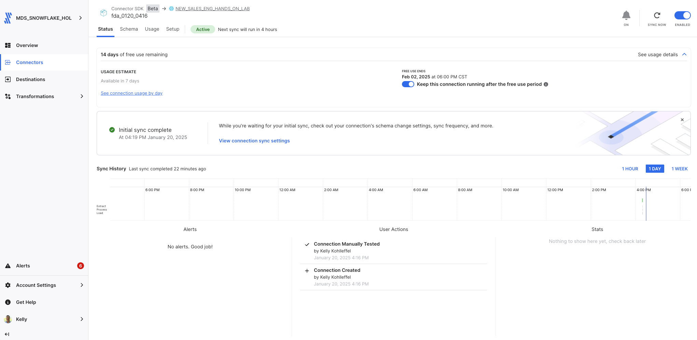
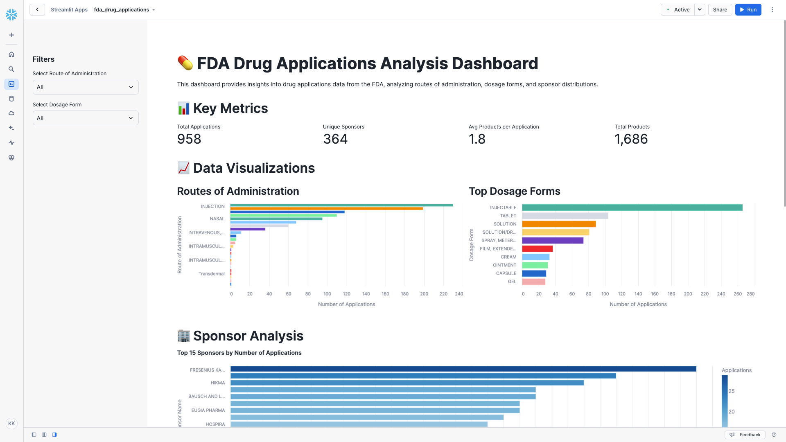

# Fivetran_Connector_SDK: OpenFDA Drug Applications API

## Overview
This Fivetran custom connector leverages the Fivetran Connector SDK to retrieve data from the [OpenFDA Drug Applications API](https://open.fda.gov/apis/drug/drugsfda/). The connector synchronizes comprehensive drug application data including dosage forms, routes of administration, product details, and sponsor information.

Fivetran's Connector SDK enables you to use Python to code the interaction with the OpenFDA API data source. The connector is deployed as an extension of Fivetran, which automatically manages running the connector on your scheduled frequency and handles the required compute resources, orchestration, scaling, resyncs, and log management.

See the [Technical Reference documentation](https://fivetran.com/docs/connectors/connector-sdk/technical-reference#update) and [Best Practices documentation](https://fivetran.com/docs/connectors/connector-sdk/best-practices) for details.



## Attribution


This custom connector uses the OpenFDA API but is not endorsed or certified by the U.S. Food and Drug Administration.

For more information about OpenFDA API terms of use and attribution requirements, please visit:
[OpenFDA Terms of Service](https://open.fda.gov/terms/)

## Features
- Retrieves comprehensive drug application data
- Captures detailed product information including dosage forms and routes
- Collects sponsor details and application metadata
- Implements robust error handling with retry mechanisms
- Uses rate limiting to handle API quotas efficiently
- Supports incremental syncs through state tracking
- Masks sensitive API credentials in logs
- Provides detailed logging for troubleshooting
- Routes-based data collection strategy
- Processes multiple drug applications efficiently

## API Interaction

### Core Functions

#### create_retry_session()
Configures HTTP request sessions with built-in retry logic:
```python
retries = Retry(
    total=3,
    backoff_factor=1,
    status_forcelist=[408, 429, 500, 502, 503, 504]
)
```
- Implements automatic retry for specific HTTP status codes
- Uses exponential backoff to handle rate limits
- Handles connection timeouts and server errors

#### make_api_request()
Manages API calls with comprehensive error handling and logging:
```python
base_url = "https://api.fda.gov/drug/drugsfda.json"
params = {
    'api_key': api_key,
    'limit': limit,
    'skip': skip
}
```
- Masks sensitive API credentials in logs
- Implements 30-second timeout for requests
- Provides detailed logging of request parameters
- Handles rate limiting with cooldown periods

### Data Retrieval Strategy

#### Data Collection
The connector implements a route-based approach for drug applications:
- Processes multiple administration routes:
  - ORAL
  - TOPICAL
  - INTRAVENOUS
  - INTRAMUSCULAR
  - SUBCUTANEOUS
  - OPHTHALMIC
  - NASAL
  - DENTAL
  - TRANSDERMAL
- Retrieves 100 records per route for comprehensive coverage
- Collects detailed product and application metadata

#### Response Processing
Each API response is processed with:
- Validation of response structure
- Extraction of relevant application information
- Status tracking for data completeness
- JSON parsing of nested product details

#### Update Function Implementation
The update function orchestrates a streamlined data sync process:

1. Configuration Handling
- Validates API credentials
- Prepares session with retry logic
- Initializes logging and monitoring

2. Route-Based Processing
- Iterates through administration routes
- Manages pagination for each route
- Implements rate limiting between requests

3. Data Transformation
- Processes application metadata
- Handles nested product information
- Creates standardized records
- Manages JSON serialization

### Error Handling

#### Network Issues
- Automatic retry for transient network failures
- Exponential backoff for rate limit compliance
- Timeout handling for unresponsive endpoints

#### Data Validation
- Checks for required fields in responses
- Handles missing or null values gracefully
- Provides detailed error logging

### Performance Optimization

#### Request Management
- Rate limiting: 1-second delay between requests
- Maximum 3 retry attempts for failed requests
- Exponential backoff with 1-second base delay
- Detailed request logging for monitoring

#### Data Processing
- Efficient JSON handling for nested structures
- Batched processing of applications
- Memory-efficient data transformation
- Comprehensive error logging

## Security Features
- API key masking in all logs
- Secure handling of configuration data
- Protected credential management
- Configuration files excluded from version control

## Directory Structure
```
fda_drugs/
├── __pycache__/
├── files/
│   ├── spec.json
│   ├── state.json
│   └── warehouse.db
├── images/
├── connector.py
├── configuration.json
├── debug.sh
├── deploy.sh
├── README.md
└── spec.json
```

## File Details

### connector.py
Main connector implementation handling:
- API authentication and requests
- Data retrieval and transformation
- Schema definition
- Error handling and logging

### configuration.json
Configuration file containing API credentials:
```json
{
    "api_key": "YOUR_FDA_API_KEY"
}
```
**Note**: This file is automatically copied to the files directory during debug. Do not commit this file to version control.

### deploy.sh
Script for deploying to Fivetran production:
```bash
#!/bin/bash

# Locate the root-level config.json file
ROOT_CONFIG="config.json"
CONFIG_PATH=$(pwd)
while [[ "$CONFIG_PATH" != "/" ]]; do
    if [[ -f "$CONFIG_PATH/$ROOT_CONFIG" ]]; then
        break
    fi
    CONFIG_PATH=$(dirname "$CONFIG_PATH")
done

# Validate the root config.json file exists
if [[ ! -f "$CONFIG_PATH/$ROOT_CONFIG" ]]; then
    echo "Error: Root config.json not found!"
    exit 1
fi

# Prompt for the Fivetran Account Name
read -p "Enter your Fivetran Account Name [MDS_SNOWFLAKE_HOL]: " ACCOUNT_NAME
ACCOUNT_NAME=${ACCOUNT_NAME:-"MDS_SNOWFLAKE_HOL"}

# Fetch the API key from config.json
API_KEY=$(jq -r ".fivetran.api_keys.$ACCOUNT_NAME" "$CONFIG_PATH/$ROOT_CONFIG")
if [[ "$API_KEY" == "null" ]]; then
    echo "Error: Account name not found in $ROOT_CONFIG!"
    exit 1
fi

# Prompt for the Fivetran Destination Name
read -p "Enter your Fivetran Destination Name [NEW_SALES_ENG_HANDS_ON_LAB]: " DESTINATION_NAME
DESTINATION_NAME=${DESTINATION_NAME:-"NEW_SALES_ENG_HANDS_ON_LAB"}

# Prompt for the Fivetran Connector Name
read -p "Enter a unique Fivetran Connector Name [default-connection]: " CONNECTION_NAME
CONNECTION_NAME=${CONNECTION_NAME:-"default-connection"}

# Deploy the connector using the configuration file
echo "Deploying connector..."
fivetran deploy --api-key "$API_KEY" --destination "$DESTINATION_NAME" --connection "$CONNECTION_NAME"
```

### debug.sh
Debug script for local testing:
```bash
#!/bin/bash
echo "Starting debug process..."

# Ensure files directory exists
echo "Ensuring files directory exists..."
mkdir -p files

# List contents of the files directory
echo "Contents of files directory:"
ls -la files/

# Run fivetran debug
echo "Running fivetran debug..."
fivetran debug

echo "Debug process complete."
```

### files/spec.json
Generated copy of the connector specification file.

### files/state.json
Tracks the state of incremental syncs.

### files/warehouse.db
DuckDB database used for local testing.

### images/
Contains documentation screenshots and images.

### spec.json
Main specification file defining the configuration schema:
```json
{
    "configVersion": 1,
    "connectionSpecification": {
        "type": "object",
        "required": ["api_key"],
        "properties": {
            "api_key": {
                "type": "string",
                "description": "Enter your FDA API key",
                "configurationGroupKey": "Authentication",
                "secret": true
            }
        }
    }
}
```

## Setup Instructions

### Prerequisites
- Python 3.8+
- Fivetran Connector SDK and a virtual environment
- OpenFDA API Key (obtain from [OpenFDA](https://open.fda.gov/apis/authentication/))
- Fivetran Account with destination configured

### Installation Steps
1. Create project directory:
```bash
mkdir -p fda_drugs
cd fda_drugs
```

2. Create virtual environment:
```bash
python3 -m venv .venv
source .venv/bin/activate  # Windows: .venv\Scripts\activate
```

3. Install SDK:
```bash
pip install fivetran-connector-sdk requests
```

4. Create necessary files:
```bash
touch connector.py configuration.json spec.json
chmod +x debug.sh deploy.sh
```

5. Configure your FDA API key:
- Add your API key to configuration.json
- Keep this file secure and do not commit to version control

## Usage

### Local Testing
```bash
chmod +x debug.sh
./debug.sh
```

### Production Deployment
```bash
chmod +x deploy.sh
./deploy.sh
```

### Expected Output
The connector will create and populate:

### drug_applications
Primary table containing drug application information:
- application_number (STRING, Primary Key)
- sponsor_name (STRING)
- product_count (INTEGER)
- primary_dosage_form (STRING)
- primary_route (STRING)
- product_details (STRING, JSON array)
- last_updated (STRING)

## Troubleshooting

### Common Issues

1. API Key Issues:
```
Error retrieving API key: 'No API key found in configuration'
```
- Verify API key in configuration.json

2. Rate Limiting:
```
API request failed: 429 Too Many Requests
```
- Automatic retry will handle this
- Check API quota limits

3. Data Processing:
```
Error processing product details: Invalid JSON format
```
- Check response format
- Verify data transformation

## Security Notes
- Never commit API keys
- Use .gitignore for sensitive files
- Keep virtual environment isolated

## Development Notes
- Make code changes in connector.py
- Test changes using debug.sh
- Monitor logs for issues
- Follow OpenFDA API guidelines
- Use the Fivetran SDK documentation

## Support
For issues or questions:
1. Check [OpenFDA API Documentation](https://open.fda.gov/apis/)
2. Review [Fivetran Connector SDK Documentation](https://fivetran.com/docs/connectors/connector-sdk)
3. Contact your Fivetran administrator

## Bonus: Changing the Time Frame for Drug Applications
To modify the connector for different time periods:

1. Locate the update function in connector.py
2. Adjust the max_records_per_route value (default: 100)
3. Modify the routes list to include different administration routes
4. Update the search parameters as needed

## Using the FDA Drugs Dataset

The following Streamlit in Snowflake application provides comprehensive analysis of drug applications data:

### Streamlit in Snowflake Data App Components

#### This Streamlit app provides:

1. Key performance metrics showing:
* Total Applications
* Unique Sponsors
* Average Products per Application
* Total Products in Database

2. Interactive sidebar filters for:
* Route of Administration
* Dosage Form Selection

3. Four main visualizations:
* Routes of Administration Distribution (horizontal bar chart)
* Top Dosage Forms Analysis (horizontal bar chart)
* Top 15 Sponsors by Applications (color-gradient bar chart)
* Product Distribution Analysis (frequency distribution)

4. Interactive data table showing:
* Application Number
* Sponsor Name
* Primary Dosage Form
* Route of Administration
* Product Count

#### Key features:

* Modern layout with responsive columns
* Consistent color schemes (blues, viridis)
* Interactive tooltips on all visualizations
* Intuitive sidebar filtering
* Proper handling of categorical data
* Comprehensive error handling and loading states

#### The app allows users to:

* Filter drug applications by route and form
* Analyze sponsor distributions and patterns
* Explore dosage form prevalence
* Track product count distributions
* View detailed application records
* Identify trends in administration routes

### Streamlit in Snowflake Implementation Notes
* Requires the drug_applications table with Fivetran sync data
* Uses Snowpark DataFrame operations for efficient querying
* Implements responsive multi-column layout
* Provides clear error messaging for database context issues
* Utilizes Altair for all visualizations
* Handles null values and deleted records appropriately
* Includes comprehensive tooltips for data exploration
* Maintains consistent sorting across categorical data
* Efficiently processes large datasets through filtered queries

### Streamlit in Snowflake Application: Drug Application Analysis Data App

```python
import streamlit as st
import pandas as pd
import altair as alt
from snowflake.snowpark.context import get_active_session

# Set page configuration
st.set_page_config(
    page_title="FDA Drug Applications Analysis",
    layout="wide",
    initial_sidebar_state="expanded"
)

# Get the active Snowflake session
session = get_active_session()

# Load data function
def load_drug_data():
    return session.sql("""
        SELECT 
            APPLICATION_NUMBER,
            SPONSOR_NAME,
            PRIMARY_DOSAGE_FORM,
            PRIMARY_ROUTE,
            PRODUCT_COUNT,
            _FIVETRAN_DELETED
        FROM drug_applications
        WHERE _FIVETRAN_DELETED = FALSE
    """).to_pandas()

# Main dashboard
try:
    # Load data
    with st.spinner("Loading drug application data..."):
        drug_data = load_drug_data()

    # Dashboard Title and Description
    st.title("💊 FDA Drug Applications Analysis Dashboard")
    st.markdown("""
    This dashboard provides insights into drug applications data from the FDA, 
    analyzing routes of administration, dosage forms, and sponsor distributions.
    """)

    # Sidebar filters
    st.sidebar.header("Filters")
    
    # Define allowed routes
    allowed_routes = [
        'ORAL',
        'TOPICAL',
        'INTRAVENOUS',
        'INTRAMUSCULAR',
        'SUBCUTANEOUS',
        'OPHTHALMIC',
        'NASAL',
        'DENTAL',
        'TRANSDERMAL'
    ]
    available_routes = drug_data[drug_data["PRIMARY_ROUTE"].isin(allowed_routes)]["PRIMARY_ROUTE"].unique().tolist()
    routes = ["All"] + sorted(available_routes)
    selected_route = st.sidebar.selectbox("Select Route of Administration", routes)
    
    dosage_forms = ["All"] + sorted(drug_data["PRIMARY_DOSAGE_FORM"].unique().tolist())
    selected_form = st.sidebar.selectbox("Select Dosage Form", dosage_forms)
    
    # Apply filters
    filtered_data = drug_data.copy()
    if selected_route != "All":
        filtered_data = filtered_data[filtered_data["PRIMARY_ROUTE"] == selected_route]
    if selected_form != "All":
        filtered_data = filtered_data[filtered_data["PRIMARY_DOSAGE_FORM"] == selected_form]

    # Key Metrics Section
    st.header("📊 Key Metrics")
    col1, col2, col3, col4 = st.columns(4)
    
    with col1:
        total_applications = len(filtered_data)
        st.metric("Total Applications", f"{total_applications:,}")
    
    with col2:
        unique_sponsors = filtered_data["SPONSOR_NAME"].nunique()
        st.metric("Unique Sponsors", f"{unique_sponsors:,}")
    
    with col3:
        avg_products = filtered_data["PRODUCT_COUNT"].mean()
        st.metric("Avg Products per Application", f"{avg_products:.1f}")
    
    with col4:
        total_products = filtered_data["PRODUCT_COUNT"].sum()
        st.metric("Total Products", f"{total_products:,}")

    # Visualization Section
    st.header("📈 Data Visualizations")

    # Create two columns for charts
    col1, col2 = st.columns(2)

    with col1:
        st.subheader("Routes of Administration")
        route_data = filtered_data["PRIMARY_ROUTE"].value_counts().reset_index()
        route_data.columns = ["Route", "Count"]
        
        route_chart = alt.Chart(route_data).mark_bar().encode(
            x=alt.X("Count:Q", title="Number of Applications"),
            y=alt.Y("Route:N", sort="-x", title="Route of Administration"),
            color=alt.Color("Route:N", legend=None),
            tooltip=[
                alt.Tooltip("Route:N", title="Route"),
                alt.Tooltip("Count:Q", title="Applications")
            ]
        ).properties(height=300)
        
        st.altair_chart(route_chart, use_container_width=True)

    with col2:
        st.subheader("Top Dosage Forms")
        form_data = filtered_data["PRIMARY_DOSAGE_FORM"].value_counts().head(10).reset_index()
        form_data.columns = ["Form", "Count"]
        
        form_chart = alt.Chart(form_data).mark_bar().encode(
            y=alt.Y("Form:N", sort="-x", title="Dosage Form"),
            x=alt.X("Count:Q", title="Number of Applications"),
            color=alt.Color("Form:N", legend=None),
            tooltip=[
                alt.Tooltip("Form:N", title="Dosage Form"),
                alt.Tooltip("Count:Q", title="Applications")
            ]
        ).properties(height=300)
        
        st.altair_chart(form_chart, use_container_width=True)

    # Sponsor Analysis Section
    st.header("🏢 Sponsor Analysis")
    
    # Top Sponsors Chart
    top_sponsors = filtered_data["SPONSOR_NAME"].value_counts().head(15)
    sponsor_data = pd.DataFrame({
        "Sponsor": top_sponsors.index,
        "Applications": top_sponsors.values
    })
    
    sponsor_chart = alt.Chart(sponsor_data).mark_bar().encode(
        x=alt.X("Applications:Q", title="Number of Applications"),
        y=alt.Y("Sponsor:N", sort="-x", title="Sponsor Name"),
        color=alt.Color("Applications:Q", scale=alt.Scale(scheme="blues")),
        tooltip=[
            alt.Tooltip("Sponsor:N", title="Sponsor"),
            alt.Tooltip("Applications:Q", title="Total Applications")
        ]
    ).properties(
        height=400,
        title="Top 15 Sponsors by Number of Applications"
    )
    
    st.altair_chart(sponsor_chart, use_container_width=True)

    # Product Distribution Analysis
    st.header("📦 Product Distribution Analysis")
    
    # Product Count Distribution
    product_dist = filtered_data["PRODUCT_COUNT"].value_counts().sort_index()
    product_data = pd.DataFrame({
        "Products per Application": product_dist.index,
        "Frequency": product_dist.values
    })
    
    product_chart = alt.Chart(product_data).mark_bar().encode(
        x=alt.X("Products per Application:N", title="Number of Products"),
        y=alt.Y("Frequency:Q", title="Number of Applications"),
        color=alt.Color("Frequency:Q", scale=alt.Scale(scheme="viridis")),
        tooltip=[
            alt.Tooltip("Products per Application:N", title="Products"),
            alt.Tooltip("Frequency:Q", title="Applications")
        ]
    ).properties(
        height=300,
        title="Distribution of Products per Application"
    )
    
    st.altair_chart(product_chart, use_container_width=True)

    # Detailed Data View
    st.header("🔍 Detailed Data View")
    if st.checkbox("Show Raw Data"):
        st.dataframe(
            filtered_data[["APPLICATION_NUMBER", "SPONSOR_NAME", "PRIMARY_DOSAGE_FORM", 
                         "PRIMARY_ROUTE", "PRODUCT_COUNT"]]
        )

except Exception as e:
    st.error(f"An error occurred while loading the dashboard: {str(e)}")
    st.error("Please ensure you have the correct database and schema context set in Streamlit in Snowflake.")
```

### Streamlit in Snowflake Data App
