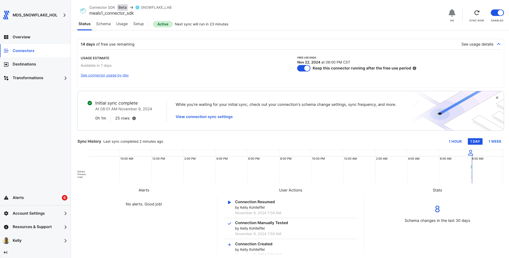
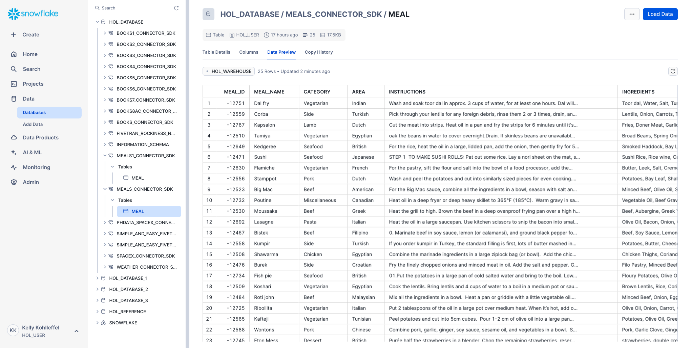
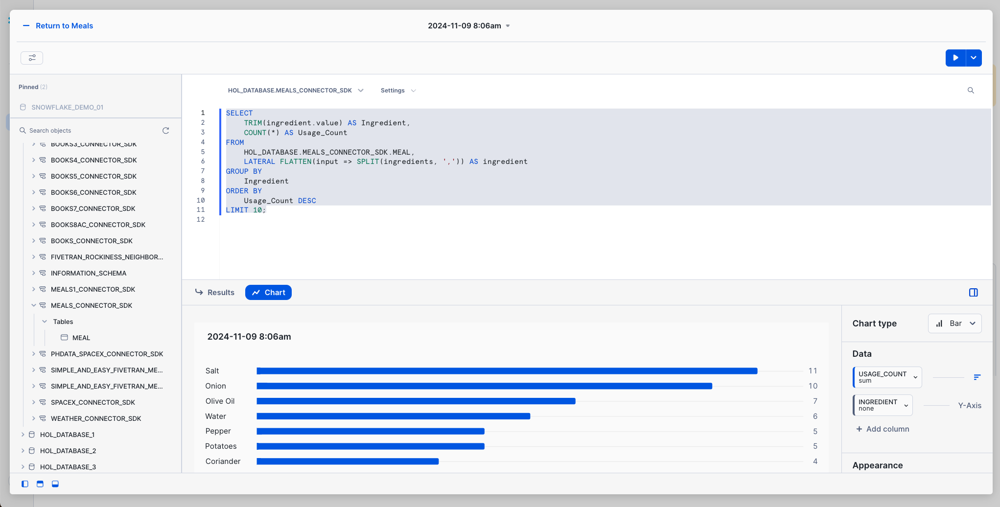

# Fivetran_Connector_SDK: Meals Data
 ## Quickly build a custom The MealDB data connector using the Fivetran SDK

[Fivetran's Connector SDK](https://fivetran.com/docs/connectors/connector-sdk) allows you to code a custom data connector using Python and deploy it as an extension of Fivetran. Fivetran automatically manages running the connector on your scheduled frequency and manages the required compute resources.

This is a simple example for how to work with the fivetran_connector_sdk module. 

It shows the use of a connector.py file that calls a publicly available API.

It also shows how to use the logging functionality provided by fivetran_connector_sdk, by logging important steps using log.info() and log.fine()

See the [Technical Reference documentation](https://fivetran.com/docs/connectors/connector-sdk/technical-reference#update) and [Best Practices documentation](https://fivetran.com/docs/connectors/connector-sdk/best-practices) for details.

## Meals data from the MealsDB API

[TheMealsDB API](https://www.themealdb.com/api.php)

This script connects to TheMealDB API using the Fivetran Connector SDK. It retrieves information about meals, including meal name, category, cuisine, instructions, and main ingredients, and stores this data in Fivetran using the SDK's upsert operation.

**Example usage**: This script can be used to demonstrate pulling meal data from TheMealDB, making it useful for showcasing how the Fivetran Connector SDK works.

## Quick reference bash commands for running in the VS Code terminal

### From this path: 
(.venv) kelly.kohlleffel@kelly Fivetran_Connector_SDK %

### Navigate to the quick_start_example/meals
```
cd examples/quick_start_examples/meals
```
### Run the custom connector code
```
python connector.py
```
### Deploy the connector to Fivetran
```
fivetran deploy --api-key <FIVETRAN-API-KEY> --destination <DESTINATION-NAME> --connection <CONNECTION-NAME>
```
## Alternatively: 

### Navigate to the Fivetran_Connector_SDK directory in Documents/Github
```
cd ~/Documents/Github/Fivetran_Connector_SDK
```
### Navigate up one level from weather to meals, for example
```
cd ../meals
```
### Ensure the directory exists
```
mkdir -p files
```
### Activate your virtual environment
```
source .venv/bin/activate
```
### Navigate to the quick_start_example/meals
```
cd examples/quick_start_examples/meals
```
### Install the Fivetran requirements.txt file
```
pip install -r requirements.txt
```
### Run the custom connector code
```
python connector.py
```
### Deploy the connector to Fivetran
```
fivetran deploy --api-key <FIVETRAN-API-KEY> --destination <DESTINATION-NAME> --connection <CONNECTION-NAME>
```
## Fivetran Connector SDK in action

### Fivetran Connector SDK: Fivetran Sync Status



### Fivetran Connector SDK: Data moved with the Connector SDK to Snowflake



### Fivetran Connector SDK: Snowflake Snowsight Dashboard with the new Meals data



### SQL query to find the top ingredients across meals (update the database and schema names)
```
SELECT 
    TRIM(ingredient.value) AS Ingredient,
    COUNT(*) AS Usage_Count
FROM 
    HOL_DATABASE.MEALS_CONNECTOR_SDK.MEAL,
    LATERAL FLATTEN(input => SPLIT(ingredients, ',')) AS ingredient
GROUP BY 
    Ingredient
ORDER BY 
    Usage_Count DESC
LIMIT 100;
```