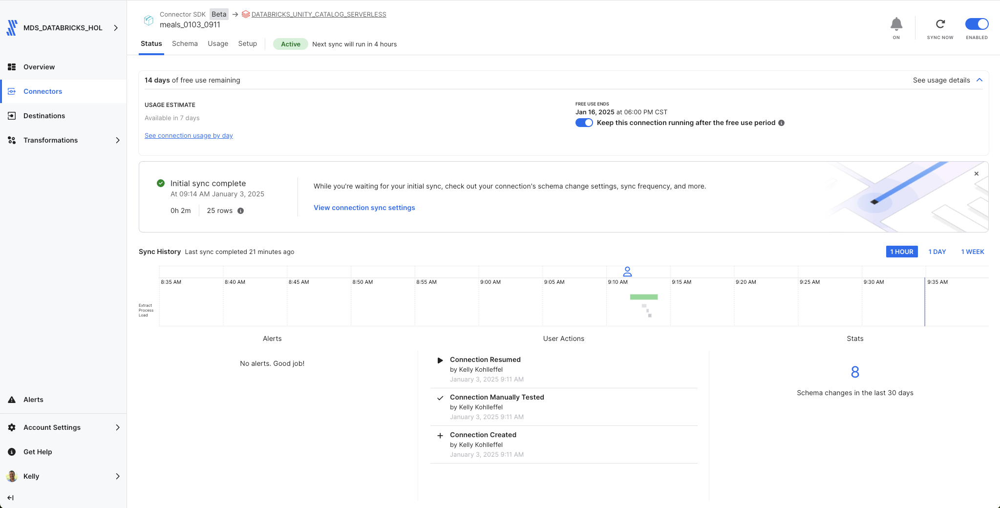
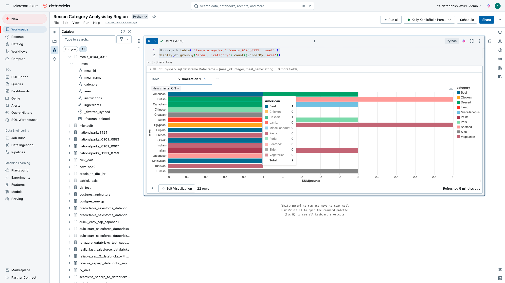
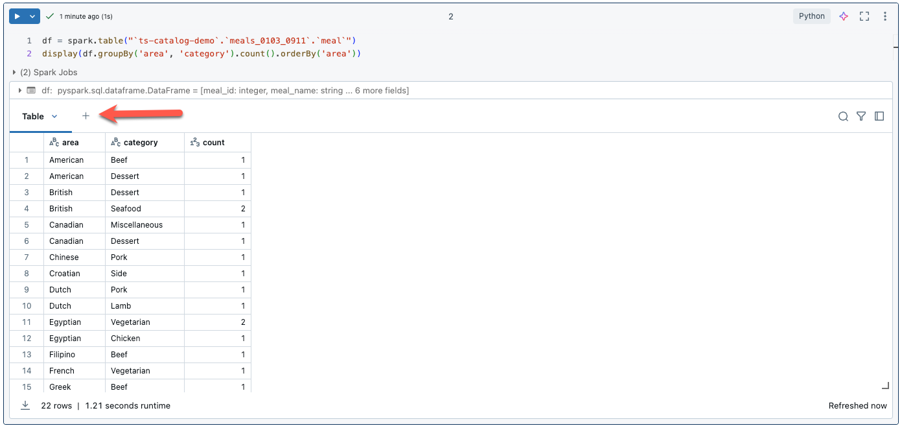
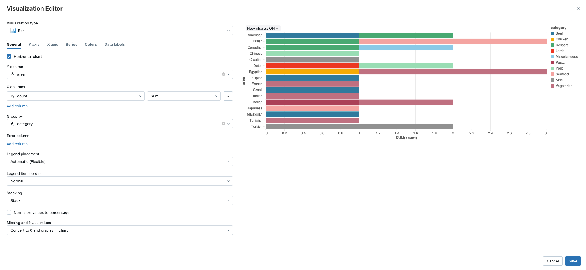

# Fivetran_Connector_SDK: TheMealDB API

## Overview
This Fivetran custom connector leverages the Fivetran Connector SDK to retrieve data from the [TheMealDB API](https://www.themealdb.com/api.php), enabling syncing of comprehensive meal information including names, categories, cuisines, instructions, and ingredients.

Fivetran's Connector SDK enables you to use Python to code the interaction with TheMealDB API data source. This example shows the use of a connector.py file that calls TheMealDB API. From there, the connector is deployed as an extension of Fivetran. Fivetran automatically manages running the connector on your scheduled frequency and manages the required compute resources, orchestration, scaling, resyncs, and log management. In addition, Fivetran handles comprehensive writing to the destination of your choice managing retries, schema inference, security, and idempotency.

See the [Technical Reference documentation](https://fivetran.com/docs/connectors/connector-sdk/technical-reference) and [Best Practices documentation](https://fivetran.com/docs/connectors/connector-sdk/best-practices) for details.



## Attribution


This custom connector uses TheMealDB API. While attribution is not required, we acknowledge TheMealDB as the data source.

For more information about TheMealDB API, please visit:
[TheMealDB API Documentation](https://themealdb.com/api.php)

## Features
- Retrieves comprehensive meal data from TheMealDB API
- Processes detailed meal information including instructions and ingredients
- Handles up to 20 ingredients per meal
- Supports debug mode for local testing
- Provides detailed logging for troubleshooting
- No authentication required

## API Interaction
The connector establishes interaction with TheMealDB API through several key components:

### Core Functions

#### API Request Implementation
```python
response = rq.get("https://www.themealdb.com/api/json/v1/1/search.php?s=")
```
- Uses simple GET request to TheMealDB search endpoint
- Returns JSON response with meal records
- No authentication required
- Default timeout handling via requests library
- Native error handling for HTTP responses

#### Data Processing Functions
- Extracts meal details from JSON response
- Handles missing fields with default values:
  ```python
  meal_id = int(meal.get("idMeal"))
  meal_name = meal.get("strMeal", "Unknown Meal")
  category = meal.get("strCategory", "Unknown Category")
  ```
- Processes up to 20 ingredients per meal
- Provides debug logging of processed records

#### Error Handling
- Handles missing ingredient fields
- Validates meal IDs
- Manages empty responses
- Logs processing details for debugging

### Data Retrieval Strategy

#### Meal Data Collection
- Uses search endpoint to retrieve meal records
- Processes all available meals
- Handles ingredient compilation

#### Response Processing 
- Field validation and extraction
- Default value handling for missing data
- Ingredient list processing
- Data transformation for Fivetran schema

### Security Features
- No API key required
- Safe handling of configuration data
- Protected credential management through Fivetran's infrastructure
- Secure logging practices

## Directory Structure
```
meals/
├── __pycache__/        # Python bytecode cache directory
├── files/              # Generated directory for Fivetran files
│   ├── state.json      # State tracking for incremental syncs
│   └── warehouse.db    # Local testing database
├── images/             # Documentation images
├── connector.py        # Main connector implementation
├── debug.sh            # Debug deployment script
├── deploy.sh           # Production deployment script
├── README.md           # Project documentation
└── requirements.txt    # Python dependencies
```

## File Details

### connector.py
Main connector implementation file that handles:
- API requests and response processing
- Data transformation and schema definition
- Ingredient processing logic
- Error handling and logging

### deploy.sh
```bash
#!/bin/bash

# Find config.json by searching up through parent directories
CONFIG_PATH=$(pwd)
while [[ "$CONFIG_PATH" != "/" ]]; do
    if [[ -f "$CONFIG_PATH/config.json" ]]; then
        break
    fi
    CONFIG_PATH=$(dirname "$CONFIG_PATH")
done

# Prompt for the Fivetran Account Name
read -p "Enter your Fivetran Account Name [MDS_DATABRICKS_HOL]: " ACCOUNT_NAME
ACCOUNT_NAME=${ACCOUNT_NAME:-"MDS_DATABRICKS_HOL"}

# Read API key from config.json based on account name
API_KEY=$(jq -r ".fivetran.api_keys.$ACCOUNT_NAME" "$CONFIG_PATH/config.json")

if [ "$API_KEY" == "null" ]; then
    echo "Error: Account name not found in config.json"
    exit 1
fi

# Prompt for the Fivetran Destination Name
read -p "Enter your Fivetran Destination Name [DATABRICKS_UNITY_CATALOG_SERVERLESS]: " DESTINATION_NAME
DESTINATION_NAME=${DESTINATION_NAME:-"DATABRICKS_UNITY_CATALOG_SERVERLESS"}

# Prompt for the Fivetran Connector Name
read -p "Enter a unique Fivetran Connector Name [default-connection]: " CONNECTION_NAME
CONNECTION_NAME=${CONNECTION_NAME:-"default-connection"}

fivetran deploy --api-key "$API_KEY" --destination "$DESTINATION_NAME" --connection "$CONNECTION_NAME"
```

### debug.sh
```bash
#!/bin/bash
echo "Starting debug process..."

echo "Running fivetran reset..."
fivetran reset

echo "Creating files directory..."
mkdir -p files

echo "Contents of files directory:"
ls -la files/

echo "Running fivetran debug..."
fivetran debug
```

### images/
Contains documentation screenshots and images:
- Directory structure screenshots
- Sample output images
- Configuration examples
- Other visual documentation

## Setup Instructions

### Prerequisites
* Python 3.8+
* Fivetran Connector SDK and a virtual environment
* Fivetran Account with at least one Fivetran destination setup

### Installation Steps
1. Create the project directory structure:
```bash
mkdir -p meals
cd meals
```

2. Create a Python virtual environment:
```bash
python3 -m venv .venv
source .venv/bin/activate  # On Windows: .venv\Scripts\activate
```

3. Install the Fivetran Connector SDK:
```bash
pip install fivetran-connector-sdk
```

4. Create the necessary files:
```bash
touch connector.py debug.sh deploy.sh
chmod +x debug.sh deploy.sh
```

5. Set up .gitignore:
```bash
touch .gitignore
echo "files/
__pycache__/
*.pyc
.DS_Store" > .gitignore
```

## Usage

### Local Testing
1. Ensure your virtual environment is activated
2. Run the debug script:
```bash
chmod +x debug.sh 
./debug.sh
```

The debug process will:
1. Reset any existing state
2. Create the files directory
3. Retrieve meal data
4. Log the process details
5. Create local database files for testing

### Production Deployment
Execute the deployment script:
```bash
chmod +x deploy.sh
./deploy.sh
```

The script will:
* Find and read your Fivetran configuration
* Prompt for account details and deployment options
* Deploy the connector to your Fivetran destination

### Expected Output
The connector will:
1. Display process status
2. Show number of meals retrieved
3. Print a formatted table of meals:
   - Meal ID
   - Meal Name
   - Category
   - Cuisine
   - Ingredients
4. Log sync statistics

## Data Tables

### meals
Primary table containing meal information:
* meal_id (INT, Primary Key)
* meal_name (STRING)
* category (STRING)
* area (STRING)
* instructions (STRING)
* ingredients (STRING)

## Troubleshooting

### Common Issues
1. API Response Issues:
```
Error: No meals found in response
```
* Verify TheMealDB API is accessible
* Check network connectivity

2. Directory Structure:
```
No such file or directory: 'files/warehouse.db'
```
* Ensure debug.sh has created the files directory
* Check file permissions

3. Python Environment:
```
ModuleNotFoundError: No module named 'fivetran_connector_sdk'
```
* Verify virtual environment is activated
* Reinstall SDK if necessary

## Security Notes
* Use .gitignore to prevent accidental commits of sensitive files
* Keep your virtual environment isolated from other projects
* Follow Fivetran's security best practices for deployment

## Development Notes
* Make code changes in connector.py
* Test changes using debug.sh
* Monitor logs for any issues
* Use the Fivetran SDK documentation for reference

## Support
For issues or questions:
1. Check the [TheMealDB API Documentation](https://www.themealdb.com/api.php)
2. Review the [Fivetran Connector SDK Documentation](https://fivetran.com/docs/connectors/connector-sdk)
3. Contact your organization's Fivetran administrator

## Using the new Meals dataset


### From a Databricks notebook:

1. Copy and paste into cell 1 (update with your Unity Catalog and your schema name)
```
df = spark.table("`ts-catalog-demo`.`meals_0103_0911`.`meal`")
display(df.groupBy('area', 'category').count().orderBy('area'))
```
2. Click on the "+" to the right of "Table" and select visualization



3. Customize as needed.

