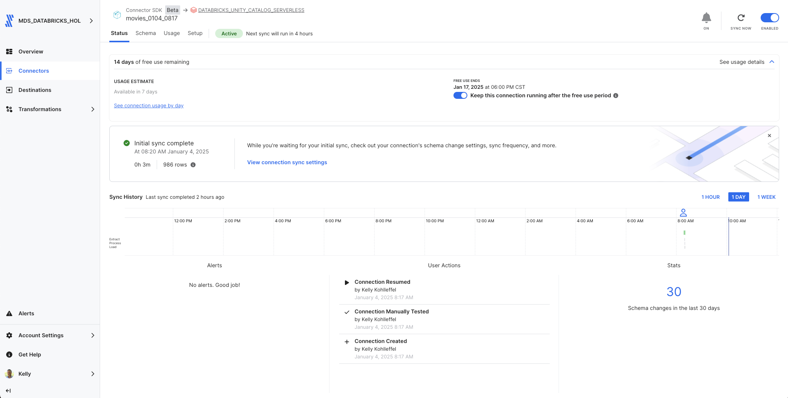
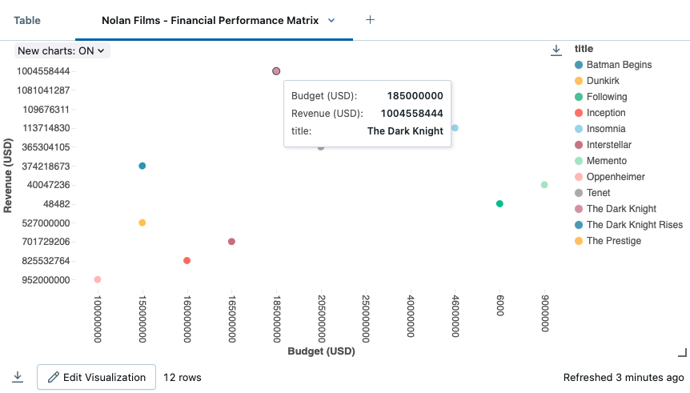
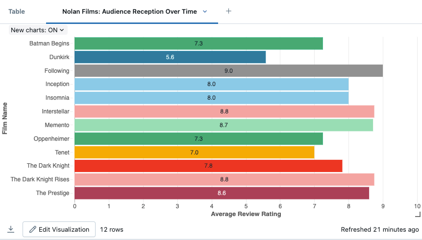
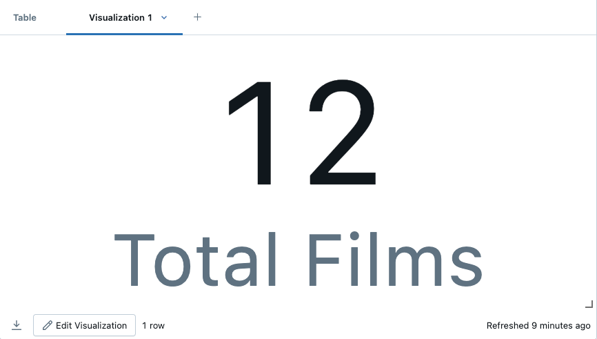
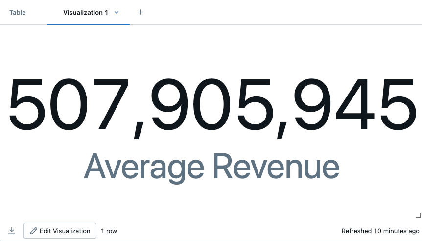
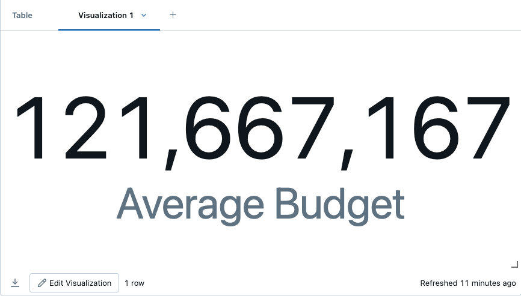

# Fivetran_Connector_SDK: TMDB API

## Overview
This Fivetran custom connector leverages the Fivetran Connector SDK to retrieve data from [The Movie Database (TMDB) API](https://developer.themoviedb.org/reference/configuration-details), focusing specifically on Christopher Nolan's filmography. The connector synchronizes comprehensive movie information, including details, cast credits, and reviews for all films directed by Christopher Nolan.

Fivetran's Connector SDK enables you to use Python to code the interaction with the TMDB API data source. This example shows the use of a connector.py file that calls TMDB API. From there, the connector is deployed as an extension of Fivetran. Fivetran automatically manages running the connector on your scheduled frequency and manages the required compute resources, orchestration, scaling, resyncs, and log management. In addition, Fivetran handles comprehensive writing to the destination of your choice managing retries, schema inference, security, and idempotency.

See the [Technical Reference documentation](https://fivetran.com/docs/connectors/connector-sdk/technical-reference#update) and [Best Practices documentation](https://fivetran.com/docs/connectors/connector-sdk/best-practices) for details.



## Features
- Retrieves comprehensive data about Christopher Nolan's filmography using the TMDB API
- Captures detailed movie information including budget, revenue, and ratings
- Collects cast credits with character information
- Gathers user reviews and ratings
- Implements robust error handling and retry mechanisms
- Uses rate limiting to handle API quotas efficiently
- Supports incremental syncs through state tracking
- Masks sensitive API credentials in logs
- Provides detailed logging for troubleshooting
- Follows Fivetran Connector SDK best practices

## API Interaction
The connector establishes a robust interaction with the TMDB API through several key components:

### Core Functions

#### create_retry_session()
Configures HTTP request sessions with built-in retry logic:
```python
retries = Retry(
    total=3,
    backoff_factor=1,
    status_forcelist=[408, 429, 500, 502, 503, 504]
)
```
- Implements automatic retry for specific HTTP status codes
- Uses exponential backoff to handle rate limits
- Handles connection timeouts and server errors

#### make_api_request()
Manages API calls with comprehensive error handling and logging:
- Masks sensitive API credentials in logs
- Implements 30-second timeout for requests
- Provides detailed logging of request parameters
- Handles rate limiting with 60-second cooldown periods

### Data Retrieval Strategy

#### Data Collection
The connector implements a targeted approach for Nolan's filmography:
- Uses Christopher Nolan's TMDB ID (525)
- Retrieves all movies where Nolan is credited as director
- Collects detailed information for each film

#### Response Processing
Each API response is processed with:
- Validation of response structure
- Extraction of relevant movie information
- Status tracking for data completeness

#### Update Function Implementation
The update function orchestrates three main data syncs:

1. Movies Sync
- Retrieves basic movie information
- Processes technical details (runtime, budget, revenue)
- Handles ratings and popularity metrics

2. Credits Sync
- Processes cast information for each movie
- Captures character names and casting order
- Links all credits to their respective movies

3. Reviews Sync
- Retrieves user reviews for each movie
- Processes review texts and ratings
- Links reviews to specific movies

### Error Handling

#### Network Issues
- Automatic retry for transient network failures
- Exponential backoff for rate limit compliance
- Timeout handling for unresponsive endpoints

#### Data Validation
- Checks for required fields in responses
- Handles missing or null values gracefully
- Provides detailed error logging

### Performance Optimization

#### Request Management
- Implements rate limiting (0.25s delay between requests)
- Uses single-movie requests for reliable data retrieval
- Maintains consistent request patterns

#### Data Processing
- Filters data during processing to minimize memory usage
- Structures data for efficient database insertion
- Logs performance metrics

## Security Features
- API key masking in all logs
- Secure handling of configuration data
- Protected credential management
- Configuration files excluded from version control

## Directory Structure
```
movies/
├── __pycache__/
├── files/
│   ├── spec.json
│   ├── state.json
│   └── warehouse.db
├── images/
├── configuration.json
├── connector.py
├── debug.sh
├── deploy.sh
├── README.md
└── spec.json
```

## File Details

### connector.py
Main connector implementation file that handles:
- API authentication and requests
- Data retrieval and transformation
- Schema definition
- Error handling and logging

### configuration.json
Configuration file containing API credentials:
```json
{
    "api_key": "YOUR_TMDB_API_KEY"
}
```
**Note**: This file is automatically copied to the files directory during debug. Do not commit this file to version control.

### deploy.sh
Script for deploying to Fivetran production:
```bash
#!/bin/bash
# Find config.json by searching up through parent directories
CONFIG_PATH=$(pwd)
while [[ "$CONFIG_PATH" != "/" ]]; do
    if [[ -f "$CONFIG_PATH/config.json" ]]; then
        break
    fi
    CONFIG_PATH=$(dirname "$CONFIG_PATH")
done

# Prompt for the Fivetran Account Name
read -p "Enter your Fivetran Account Name [MDS_DATABRICKS_HOL]: " ACCOUNT_NAME
ACCOUNT_NAME=${ACCOUNT_NAME:-"MDS_DATABRICKS_HOL"}

# Read API key from config.json based on account name
API_KEY=$(jq -r ".fivetran.api_keys.$ACCOUNT_NAME" "$CONFIG_PATH/config.json")

if [ "$API_KEY" == "null" ]; then
    echo "Error: Account name not found in config.json"
    exit 1
fi

# Prompt for the Fivetran Destination Name
read -p "Enter your Fivetran Destination Name [ADLS_UNITY_CATALOG]: " DESTINATION_NAME
DESTINATION_NAME=${DESTINATION_NAME:-"ADLS_UNITY_CATALOG"}

# Prompt for the Fivetran Connector Name
read -p "Enter a unique Fivetran Connector Name [default-connection]: " CONNECTION_NAME
CONNECTION_NAME=${CONNECTION_NAME:-"default-connection"}

# Deploy with configuration file
fivetran deploy --api-key "$API_KEY" --destination "$DESTINATION_NAME" \
                --connection "$CONNECTION_NAME" --configuration configuration.json
```

### debug.sh
Debug script for local testing:
```bash
#!/bin/bash
echo "Starting debug process..."

echo "Running fivetran reset..."
fivetran reset

echo "Creating files directory..."
mkdir -p files

echo "Copying configuration files to files directory..."
cp -v configuration.json files/
cp -v spec.json files/

echo "Contents of files directory:"
ls -la files/

echo "Running fivetran debug..."
fivetran debug
```

### files/spec.json
Generated copy of the connector specification file.

### files/state.json
Tracks the state of incremental syncs.

### files/warehouse.db
SQLite database used for local testing.

### images/
Contains documentation screenshots and images:
- Directory structure screenshots
- Sample output images
- Configuration examples
- Other visual documentation

### spec.json
Main specification file defining the configuration schema:
```json
{
    "configVersion": 1,
    "connectionSpecification": {
        "type": "object",
        "required": ["api_key"],
        "properties": {
            "api_key": {
                "type": "string",
                "description": "Enter your TMDB API key",
                "configurationGroupKey": "Authentication",
                "secret": true
            }
        }
    }
}
```

### .gitignore
Git ignore file containing:
```
# Generated files
files/
warehouse.db/

# Configuration files with sensitive information
configuration.json

# Python virtual environment
.venv/
__pycache__/
*.pyc

# OS generated files
.DS_Store
.DS_Store?
._*
```

## Setup Instructions

### Prerequisites
- Python 3.8+
- Fivetran Connector SDK
- TMDB API Key (obtain from [TMDB Developer Portal](https://www.themoviedb.org/settings/api))
- Fivetran Account with destination configured

### Installation Steps
1. Create project directory:
```bash
mkdir -p movies
cd movies
```

2. Create virtual environment:
```bash
python3 -m venv .venv
source .venv/bin/activate  # Windows: .venv\Scripts\activate
```

3. Install SDK:
```bash
pip install fivetran-connector-sdk
```

4. Create necessary files:
```bash
touch connector.py configuration.json spec.json
chmod +x debug.sh deploy.sh
```

5. Configure your TMDB API key:
- Add your API key to configuration.json
- Keep this file secure and do not commit to version control

6. Set up .gitignore:
```bash
touch .gitignore
# Add the recommended ignore patterns
```

## Usage

### Local Testing
```bash
chmod +x debug.sh
./debug.sh
```

The debug process will:
1. Reset any existing state
2. Create the files directory
3. Retrieve TMDB movie data
4. Log the process details
5. Create local database files for testing

### Production Deployment
```bash
chmod +x deploy.sh
./deploy.sh
```

The script will:
- Find and read your Fivetran configuration
- Prompt for account details and deployment options
- Deploy the connector to your Fivetran destination

### Expected Output
The connector will:
1. Reset any existing state
2. Create the files directory
3. Retrieve TMDB movie data
4. Credits processing
5. Reviews collection
6. Log the process details
7. Create local database files for testing

## Data Tables

### movies
Primary table containing movie information:
- movie_id (STRING, Primary Key)
- title (STRING)
- overview (STRING)
- release_date (STRING)
- runtime (STRING)
- budget (STRING)
- revenue (STRING)
- vote_average (STRING)
- vote_count (STRING)
- popularity (STRING)

### credits
Table containing cast information:
- credit_id (STRING, Primary Key)
- movie_id (STRING)
- title (STRING)
- person_id (STRING)
- person_name (STRING)
- character (STRING)
- order (STRING)
- cast_id (STRING)

### reviews
Table containing user reviews:
- review_id (STRING, Primary Key)
- movie_id (STRING)
- title (STRING)
- author (STRING)
- content (STRING)
- created_at (STRING)
- updated_at (STRING)
- rating (STRING)

## Troubleshooting

### Common Issues

1. API Key Issues:
```
Error retrieving API key: 'No API key found in configuration'
```
- Verify API key in configuration.json

2. Rate Limiting:
```
API request failed: 429 Too Many Requests
```
- Automatic retry will handle this
- Check API quota limits

3. Directory Structure:
```
No such file or directory: 'files/configuration.json'
```
- Ensure debug.sh has created the files directory
- Check file permissions

4. Python Environment:
```
ModuleNotFoundError: No module named 'fivetran_connector_sdk'
```
- Verify virtual environment is activated
- Reinstall SDK if necessary

## Security Notes
- Never commit API keys
- Use .gitignore for sensitive files
- Keep virtual environment isolated

## Development Notes
- Make code changes in connector.py 
- Test changes using debug.sh
- Monitor logs for issues
- Follow TMDB API guidelines
- Use the Fivetran SDK documentation for reference

## Support
For issues or questions:
1. Check [TMDB API Documentation](https://developers.themoviedb.org/3)
2. Review [Fivetran Connector SDK Documentation](https://fivetran.com/docs/connectors/connector-sdk)
3. Contact your Fivetran administrator

## Bonus: Changing the Director

Want to analyze films from a different director? Here's how to modify the connector for Steven Spielberg or any other director:

1. Find the Director's TMDB ID:
   * Visit [TMDB Website](https://www.themoviedb.org)
   * Search for the director (e.g., "Steven Spielberg")
   * Click on their name to view their profile
   * The ID is in the URL: `https://www.themoviedb.org/person/488-steven-spielberg` (ID: 488)

2. Update the Director ID in connector.py:
   * Find the `get_nolan_movies()` function
   * Rename it to something more generic, like `get_director_movies()`
   * Update the function to use your chosen director's ID:

```python
def get_director_movies(session, api_key):
    """Get all movies by specified director"""
    # Steven Spielberg's TMDB ID is 488
    params = {
        "api_key": api_key,
        "language": "en-US"
    }
    
    return make_api_request(session, "/person/488/movie_credits", params)
```

3. Update the update() function:
   * Change the logging message:
```python
Logging.warning("Starting Steven Spielberg movies sync")
```
   * Update the function call:
```python
spielberg_credits = get_director_movies(session, API_KEY).get("crew", [])
```
   * Update the variable names for clarity:
```python
spielberg_movies = [movie for movie in spielberg_credits if movie.get("job") == "Director"]
Logging.warning(f"Found {len(spielberg_movies)} movies directed by Steven Spielberg")
```

4. Important Considerations:
   * Rate Limiting: Spielberg has directed more films than Nolan, so you might need to adjust the rate limiting:
```python
time.sleep(0.5)  # Increased delay between requests
```
   * Memory Usage: With more films, monitor memory usage during syncs
   * API Quotas: Check your TMDB API quota limits

5. Common Director IDs:
   * Steven Spielberg: 488
   * Martin Scorsese: 1032
   * Quentin Tarantino: 138
   * Francis Ford Coppola: 1776
   * Stanley Kubrick: 240

Note: Make sure to test the modified connector thoroughly, as different directors may have varying amounts of data and different data structures for older films.

## Using the new Movies dataset - Visualization 1: Nolan Films Analysis - Budget vs Revenue Success Matrix

### From a Databricks Notebook

1. Copy and paste into cell 1 (update with your Unity Catalog and your schema name)
```python
from pyspark.sql.functions import *

# Read the data from Unity Catalog
df = spark.table("`ts-catalog-demo`.`movies_0104_0817`.`movie_analysis_view`")

# Create scatter plot visualization
display(df.select("title", 
                  "budget", 
                  "revenue", 
                  "vote_average",
                  "cast_size"))
```
2. Click on the "+" to the right of "Table" and select visualization and then customize as needed.

### Visualization Settings
1. Select "Scatter Plot"
2. Configure settings:
  * X-axis: budget
  * Y-axis: revenue
  * Size: cast_size (scaled appropriately)
  * Color: vote_average
  * Keys: Title
  * Title: "Nolan Films: Financial Performance Matrix"

### Customization
* Color gradient: Red to Blue (representing vote_average)
* Enable hover tooltips showing all metrics
* Enable grid lines
* X-axis label: "Budget (USD)"
* Y-axis label: "Revenue (USD)"
* Add movie titles as data labels

This visualization creates a scatter plot showing each film's budget vs revenue relationship, with each point representing a different film.



## Using the new Movies dataset - Visualization 2: Nolan Films Analysis - Timeline Rating Analysis

### From a Databricks Notebook

1. Copy and paste into cell 2 (update with your Unity Catalog and your schema name)
```python
from pyspark.sql.functions import *

# Read the data from Unity Catalog
df = spark.table("`ts-catalog-demo`.`movies_0104_0817`.`movie_analysis_view`")

# Create enhanced bar chart with overlaid metrics
display(df.select("title",
                 "release_date",
                 "vote_average",
                 "avg_review_rating",
                 "roi")
         .orderBy("release_date"))
```
2. Click on the "+" to the right of "Table" and select visualization and then customize as needed.

### Visualization Settings
1. Select "Bar Chart"
2. Click on "Horizontal chart"
3. Configure General settings:
  * X-axis: avg_review_rating (set to Average)
  * Y-axis: title
  * Color: automatic
  * Legend placement: Hidden
    * Stacking: Stack
4. Configure Y axis settings
  * Name: Film Name
  * Show labels: On
5. Configure X axis settings
  * Name: Average Review Rating
  * Start Value: 0
  * End Value: 10
6. Data labels
  * Show data labels: On
7. Title: "Nolan Films: Audience Reception Over Time"

### Customization
* Enable data labels showing avg_review_rating
* Enable grid lines
* X-axis label: "Average Review Rating"
* Y-axis label: "Film Name"

This visualization provides a clear timeline view of reception metrics.



## Using the new Movies dataset - Visualization 3: Nolan Films Analysis - Counters

### From a Databricks Notebook

1. Copy and paste into cell 3 (update with your Unity Catalog and your schema name)
```python
from pyspark.sql.functions import *

# Read the data and calculate key metrics
df = spark.table("`ts-catalog-demo`.`movies_0104_0817`.`movie_analysis_view`")

metrics_df = df.agg(
    count("title").alias("Total Films"),
    round(avg("budget"), 2).alias("Average Budget"),
    round(avg("revenue"), 2).alias("Average Revenue"),
    round(avg("vote_average"), 2).alias("Average Rating"),
    round(sum("profit"), 2).alias("Total Profit"),
    round(avg("cast_size"), 0).alias("Average Cast Size")
)

display(metrics_df)
```
2. Click on the "+" to the right of "Table" and select visualization and then customize as needed.

### Visualization Settings
1. Select "Counter"
2. Configure General settings:
  * Value column: Total films, Average revenue, or Average budget
  * Label: Total Films, Average Revenue, or Average Budget

These visualizations provide clear, consise metrics for Nolan films.





