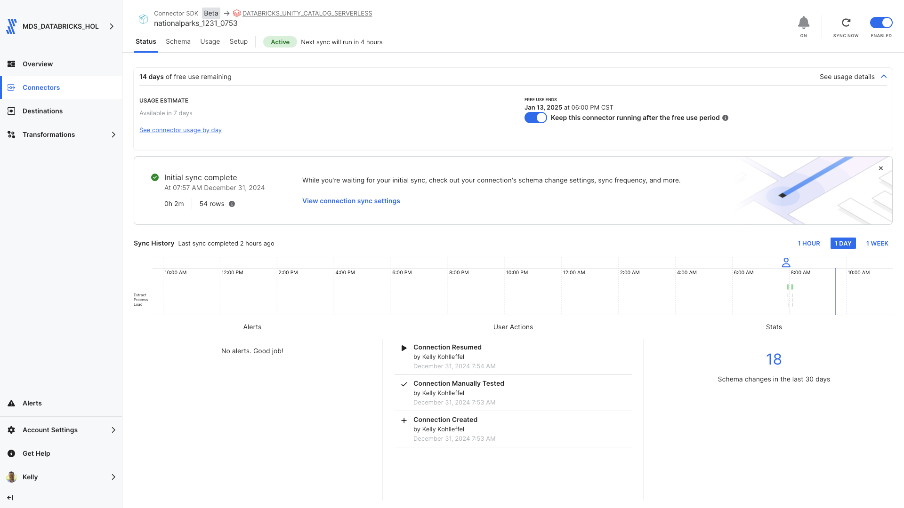
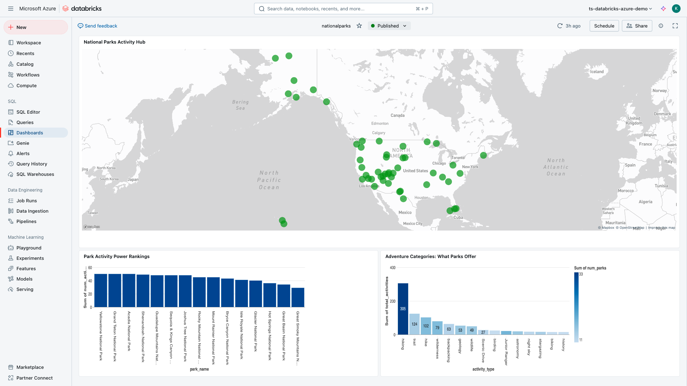

# Fivetran_Connector_SDK: National Park Service API

## Overview
This Fivetran custom connector is a simple example that uses the Fivetran Connector SDK to retrieve data from the [National Park Service (NPS) API](https://www.nps.gov/subjects/developer/index.htm), allowing you to sync comprehensive information about U.S. National Parks, including parks details plus fees and passes and activities associated with these parks. 

Fivetran's Connector SDK enables you to use Python to code the interaction with the NPS API data source. This example shows the use of a connector.py file that calls NPS API. From there, the connector is deployed as an extension of Fivetran. Fivetran automatically manages running the connector on your scheduled frequency and manages the required compute resources, orchestration, scaling, resyncs, and log management. In addition, Fivetran handles comprehensive writing to the destination of your choice managing retries, schema inference, security, and idempotency.

See the [Technical Reference documentation](https://fivetran.com/docs/connectors/connector-sdk/technical-reference#update) and [Best Practices documentation](https://fivetran.com/docs/connectors/connector-sdk/best-practices) for details.



## Features
- Retrieves comprehensive data about U.S. National Parks using the NPS API
- Includes park details such as location, description, and activities
- Captures entrance fees and passes information with associated costs and validity periods
- Retrieves things to do at each park
- Implements robust error handling and retry mechanisms
- Uses pagination to handle large data sets efficiently
- Supports incremental syncs through state tracking
- Masks sensitive API credentials in logs
- Provides detailed logging for troubleshooting
- Follows Fivetran Connector SDK best practices
- Simple deployment process using debug script

## API Interaction
The connector establishes a robust interaction with the National Park Service API through several key components:

### Core Functions

#### create_retry_session()
Configures HTTP request sessions with built-in retry logic:
```python
retries = Retry(
    total=3,
    backoff_factor=1,
    status_forcelist=[408, 429, 500, 502, 503, 504]
)
```
- Implements automatic retry for specific HTTP status codes
- Uses exponential backoff to handle rate limits
- Handles connection timeouts and server errors
- Configures session with retry adapter for HTTPS requests

#### make_api_request()
Manages API calls with comprehensive error handling and logging:
- Masks sensitive API credentials in logs for security
- Implements 30-second timeout for requests
- Provides detailed logging of request parameters and response statistics
- Returns standardized response format for consistent data handling
- Handles rate limiting with 60-second cooldown periods

### Data Retrieval Strategy

#### Park Data Collection
The connector implements a targeted approach for National Park data:
- Uses individual park codes for precise data retrieval
- Handles both standard National Parks and special designations:
  - National Park & Preserve
  - National Parks (plural designation)
  - Combined designations (e.g., "National Park and Preserve")

#### Response Processing
Each API response is processed with:
- Validation of response structure
- Extraction of relevant park information
- Logging of retrieval statistics
- Status tracking for data completeness

#### Update Function Implementation
The update function orchestrates three main data syncs:

1. National Parks Sync
- Uses a predefined list of 56 park codes for major National Parks
- Makes individual requests per park for reliable data retrieval
- Filters parks based on "National Park" designation variants
- Processes core park information (location, description, activities)

2. Fees and Passes Sync
- Processes entrance fees and passes for each National Park
- Handles both one-time fees and seasonal/annual passes
- Links all fees/passes to their respective parks

3. Things to Do Sync
- Retrieves recommended activities for each National Park
- Captures activity details including descriptions and accessibility info
- Links activities to specific parks with names and states
- Processes activity tags and durations

Each sync implements:
- Error handling with detailed logging
- Rate limiting protection (0.1s delay between requests)
- Data validation and cleanup
- Safe type conversion for numerical fields

### Error Handling

#### Network Issues
- Automatic retry for transient network failures
- Exponential backoff for rate limit compliance
- Timeout handling for unresponsive endpoints

#### Data Validation
- Checks for required fields in responses
- Handles missing or null values gracefully
- Provides detailed error logging for troubleshooting

### Performance Optimization

#### Request Management
- Implements small delays between requests (0.1s) to prevent API overload
- Uses single-park requests for reliable data retrieval
- Maintains consistent request patterns for predictable performance

#### Data Processing
- Filters park data during processing to minimize memory usage
- Structures data for efficient database insertion
- Logs performance metrics for monitoring

### Security Features
- API key masking in all logs
- Secure handling of configuration data
- Protected credential management through Fivetran's infrastructure

This API interaction design ensures reliable data retrieval while maintaining security and performance standards required for production use.

## Directory Structure
```
nationalparks/
├── __pycache__/        # Python bytecode cache directory
├── files/              # Generated directory for Fivetran files
│   ├── spec.json       # Configuration specification
│   ├── state.json     # State tracking for incremental syncs
│   ├── warehouse.db   # Local testing database
│   └── configuration.json  # Configuration file with credentials
├── images/            # Documentation images and screenshots
│   └── *.png         # Various PNG image files
├── connector.py        # Main connector implementation
├── debug.sh           # Debug deployment script
├── deploy.sh          # Script for Fivetran production deployment
├── README.md         # Project documentation
└── spec.json         # Main specification file
```

## File Details

### connector.py
Main connector implementation file that handles:
- API authentication and requests
- Data retrieval and transformation
- Schema definition for parks and fees/passes tables
- Error handling and logging

### configuration.json
Configuration file containing API credentials:
```json
{
    "api_key": "YOUR_NPS_API_KEY"
}
```
**Note**: This file is automatically copied to the files directory during debug. Do not commit this file to version control.

### deploy.sh
Script for deploying to Fivetran production:
```bash
#!/bin/bash
# Find config.json by searching up through parent directories
CONFIG_PATH=$(pwd)
while [[ "$CONFIG_PATH" != "/" ]]; do
    if [[ -f "$CONFIG_PATH/config.json" ]]; then
        break
    fi
    CONFIG_PATH=$(dirname "$CONFIG_PATH")
done

# Prompt for the Fivetran Account Name
read -p "Enter your Fivetran Account Name [MDS_DATABRICKS_HOL]: " ACCOUNT_NAME
ACCOUNT_NAME=${ACCOUNT_NAME:-"MDS_DATABRICKS_HOL"}

# Read API key from config.json based on account name
API_KEY=$(jq -r ".fivetran.api_keys.$ACCOUNT_NAME" "$CONFIG_PATH/config.json")

if [ "$API_KEY" == "null" ]; then
    echo "Error: Account name not found in config.json"
    exit 1
fi

# Prompt for the Fivetran Destination Name
read -p "Enter your Fivetran Destination Name [ADLS_UNITY_CATALOG]: " DESTINATION_NAME
DESTINATION_NAME=${DESTINATION_NAME:-"ADLS_UNITY_CATALOG"}

# Prompt for the Fivetran Connector Name
read -p "Enter a unique Fivetran Connector Name [default-connection]: " CONNECTION_NAME
CONNECTION_NAME=${CONNECTION_NAME:-"default-connection"}

# Deploy with configuration file
fivetran deploy --api-key "$API_KEY" --destination "$DESTINATION_NAME" \
                --connection "$CONNECTION_NAME" --configuration configuration.json
```

### debug.sh
Debug script for local testing:
```bash
#!/bin/bash
fivetran reset
mkdir -p files
fivetran debug
```

### files/spec.json
Generated copy of the connector specification file.

### files/state.json
Tracks the state of incremental syncs.

### files/warehouse.db
SQLite database used for local testing.

### images/
Contains documentation screenshots and images:
- Directory structure screenshots
- Sample output images
- Configuration examples
- Other visual documentation

### spec.json
Main specification file defining the configuration schema:
```json
{
    "configVersion": 1,
    "connectionSpecification": {
        "type": "object",
        "required": ["api_key"],
        "properties": {
            "api_key": {
                "type": "string",
                "description": "Enter your National Park Service (NPS) API key",
                "configurationGroupKey": "Authentication",
                "secret": true
            }
        }
    }
}
```

### .gitignore
Git ignore file containing:
```
# Generated files
files/
warehouse.db/

# Configuration files with sensitive information
configuration.json

# Python virtual environment
.venv/
__pycache__/
*.pyc

# OS generated files
.DS_Store
.DS_Store?
._*
```

## Setup Instructions

### Prerequisites
- Python 3.8+
- Fivetran Connector SDK
- NPS API Key (obtain from [NPS Developer Portal](https://www.nps.gov/subjects/developer/get-started.htm))
- Fivetran Account with at least one Fivetran destination setup

### Installation Steps

1. Create the project directory structure:
```bash
mkdir -p nationalparks
cd nationalparks
```

2. Create a Python virtual environment:
```bash
python3 -m venv .venv
source .venv/bin/activate  # On Windows: .venv\Scripts\activate
```

3. Install the Fivetran Connector SDK:
```bash
pip install fivetran-connector-sdk
```

4. Create the necessary files:
```bash
touch connector.py configuration.json spec.json
chmod +x debug.sh  # Make debug script executable
```

5. Configure your NPS API key:
- Add your API key to configuration.json
- Keep this file secure and do not commit to version control

6. Set up .gitignore:
```bash
touch .gitignore
# Add the recommended ignore patterns
```

## Usage

### Local Testing
1. Ensure your virtual environment is activated
2. Run the debug script:
```bash
chmod +x debug.sh
./debug.sh
```

The debug process will:
1. Reset any existing state
2. Create the files directory
3. Retrieve National Parks data
4. Log the process details
5. Create local database files for testing

### Production Deployment
Execute the deployment script:
```bash
chmod +x files/deploy.sh
./files/deploy.sh
```

The script will:
- Find and read your Fivetran configuration
- Prompt for account details and deployment options
- Deploy the connector to your Fivetran destination

### Expected Output
The connector will:
1. Reset any existing state
2. Create the files directory
3. Retrieve National Parks data
4. Log the process details
5. Create local database files for testing

## Data Tables

### parks
Primary table containing National Park information:
- park_id (STRING, Primary Key)
- name (STRING)
- description (STRING)
- state (STRING)
- latitude (FLOAT)
- longitude (FLOAT)
- activities (STRING)
- designation (STRING)

### feespasses
Table containing fee and pass information:
- pass_id (STRING, Primary Key)
- park_id (STRING)
- park_name (STRING)
- title (STRING)
- cost (FLOAT)
- description (STRING)
- valid_for (STRING)

### thingstodo
Table containing recommended activities for National Parks:
- activity_id (STRING, Primary Key)
- park_id (STRING)
- park_name (STRING)
- park_state (STRING)
- title (STRING)
- short_description (STRING)
- accessibility_information (STRING)
- location (STRING)
- url (STRING)
- duration (STRING)
- tags (STRING)

## Troubleshooting

### Common Issues

1. API Key Issues:
```
Error retrieving API key: 'No API key found in configuration'
```
- Verify your API key is correctly set in configuration.json

2. Directory Structure:
```
No such file or directory: 'files/configuration.json'
```
- Ensure debug.sh has created the files directory
- Check file permissions

3. Python Environment:
```
ModuleNotFoundError: No module named 'fivetran_connector_sdk'
```
- Verify virtual environment is activated
- Reinstall SDK if necessary

## Security Notes
- Never commit configuration.json containing your API key
- Use .gitignore to prevent accidental commits of sensitive files
- Keep your virtual environment isolated from other projects

## Development Notes
- Make code changes in connector.py
- Test changes using debug.sh
- Monitor logs for any issues
- Use the Fivetran SDK documentation for reference

## Support
For issues or questions:
1. Check the [NPS API Documentation](https://www.nps.gov/subjects/developer/api-documentation.htm)
2. Review the [Fivetran Connector SDK Documentation](https://fivetran.com/docs/connectors/connector-sdk)
3. Contact your organization's Fivetran administrator

## Using the New NPS Dataset
Here is an example of how the new NPS dataset can be used to build a compelling dashboard: [National Parks Dashboard in Databricks](https://github.com/kellykohlleffel/nationalparks_dashboard_in_databricks)

