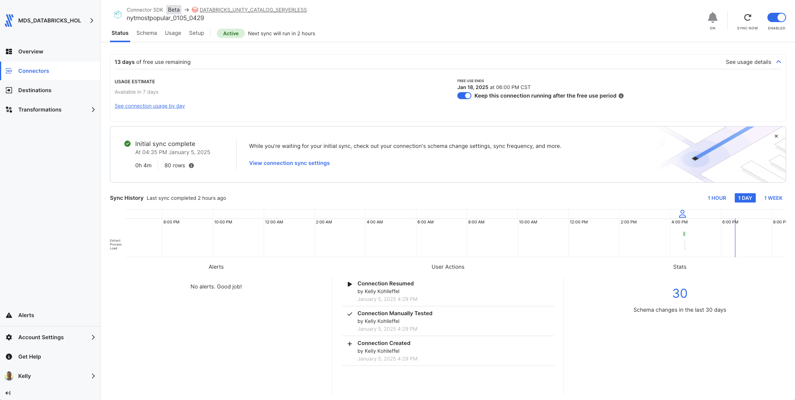
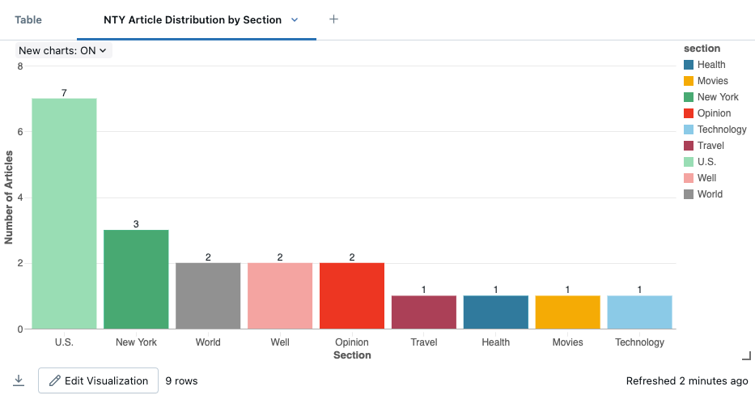
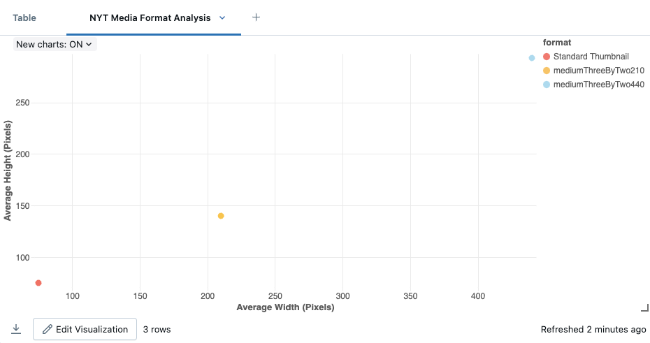

# Fivetran_Connector_SDK: NYT Most Popular API

## Overview
This Fivetran custom connector leverages the Fivetran Connector SDK to retrieve data from [The New York Times Most Popular API](https://developer.nytimes.com/docs/most-popular-product/1/overview). The connector synchronizes the most viewed articles over the last 7 days, including comprehensive article information and associated media data.

Fivetran's Connector SDK enables you to use Python to code the interaction with the NYT API data source. This example shows the use of a connector.py file that calls NYT API. From there, the connector is deployed as an extension of Fivetran. Fivetran automatically manages running the connector on your scheduled frequency and manages the required compute resources, orchestration, scaling, resyncs, and log management.

See the [Technical Reference documentation](https://fivetran.com/docs/connectors/connector-sdk/technical-reference#update) and [Best Practices documentation](https://fivetran.com/docs/connectors/connector-sdk/best-practices) for details.



## Attribution


This custom connector uses the NYT API but is not endorsed or certified by The New York Times.

For more information about NYT API terms of use and attribution requirements, please visit:
[NYT API Terms of Use](https://developer.nytimes.com/terms)

## Features
- Retrieves most viewed articles from the last 7 days
- Captures detailed article information including section, subsection, and byline
- Collects associated media data including images and metadata
- Tracks article views and keywords
- Implements robust error handling and retry mechanisms
- Uses rate limiting to handle API quotas efficiently
- Supports incremental syncs through state tracking
- Masks sensitive API credentials in logs
- Provides detailed logging for troubleshooting
- Follows Fivetran Connector SDK best practices

## API Interaction

### Core Functions

#### create_retry_session()
Configures HTTP request sessions with built-in retry logic:
```python
retries = Retry(
    total=3,
    backoff_factor=1,
    status_forcelist=[408, 429, 500, 502, 503, 504]
)
```
- Implements automatic retry for specific HTTP status codes
- Uses exponential backoff to handle rate limits
- Handles connection timeouts and server errors

#### make_api_request()
Manages API calls with comprehensive error handling and logging:
- Masks sensitive API credentials in logs
- Implements 30-second timeout for requests
- Provides detailed logging of request parameters
- Handles rate limiting with 60-second cooldown periods

### Data Retrieval Strategy

#### Data Collection
The connector implements a focused approach for most viewed articles:
- Uses the "/viewed/7.json" endpoint
- Retrieves articles with view data from the last 7 days
- Collects detailed article metadata and media information

#### Response Processing
Each API response is processed with:
- Validation of response structure
- Extraction of relevant article information
- Status tracking for data completeness

#### Update Function Implementation
The update function orchestrates two main data syncs:

1. Articles Sync
- Retrieves basic article information
- Processes metadata (sections, keywords, facets)
- Handles view counts and dates

2. Media Sync
- Processes media items for each article
- Captures image metadata and formats
- Links all media to their respective articles

### Error Handling

#### Network Issues
- Automatic retry for transient network failures
- Exponential backoff for rate limit compliance
- Timeout handling for unresponsive endpoints

#### Data Validation
- Checks for required fields in responses
- Handles missing or null values gracefully
- Provides detailed error logging

### Performance Optimization

#### Request Management
- Implements rate limiting (0.25s delay between requests)
- Uses efficient API endpoints for bulk data retrieval
- Maintains consistent request patterns

#### Data Processing
- Filters data during processing to minimize memory usage
- Structures data for efficient database insertion
- Logs performance metrics

## Security Features
- API key masking in all logs
- Secure handling of configuration data
- Protected credential management
- Configuration files excluded from version control

## Directory Structure
```
nytmostpopular/
├── __pycache__/        # Python bytecode cache directory
├── files/              # Directory containing configuration and state files
│   ├── spec.json       # Configuration specification file
│   ├── state.json      # State tracking for incremental updates
│   └── warehouse.db    # Local database for testing
├── images/             # Directory for storing project images
├── configuration.json  # Main configuration settings
├── connector.py        # Primary connector implementation
├── debug.sh            # Script for debugging purposes
├── deploy.sh           # Deployment script for production
├── README.md           # Project documentation and instructions
└── spec.json           # Main specification file for the connector
```

## File Details

### connector.py
Main connector implementation file that handles:
- API authentication and requests
- Data retrieval and transformation
- Schema definition
- Error handling and logging

### configuration.json
Configuration file containing API credentials:
```json
{
    "api_key": "YOUR_NYT_API_KEY"
}
```
**Note**: This file is automatically copied to the files directory during debug. Do not commit this file to version control.

### deploy.sh
Script for deploying to Fivetran production:
```bash
#!/bin/bash
# Find config.json by searching up through parent directories
CONFIG_PATH=$(pwd)
while [[ "$CONFIG_PATH" != "/" ]]; do
    if [[ -f "$CONFIG_PATH/config.json" ]]; then
        break
    fi
    CONFIG_PATH=$(dirname "$CONFIG_PATH")
done

# Prompt for the Fivetran Account Name
read -p "Enter your Fivetran Account Name [MDS_DATABRICKS_HOL]: " ACCOUNT_NAME
ACCOUNT_NAME=${ACCOUNT_NAME:-"MDS_DATABRICKS_HOL"}

# Read API key from config.json based on account name
API_KEY=$(jq -r ".fivetran.api_keys.$ACCOUNT_NAME" "$CONFIG_PATH/config.json")

if [ "$API_KEY" == "null" ]; then
    echo "Error: Account name not found in config.json"
    exit 1
fi

# Prompt for the Fivetran Destination Name
read -p "Enter your Fivetran Destination Name [DATABRICKS_UNITY_CATALOG_SERVERLESS]: " DESTINATION_NAME
DESTINATION_NAME=${DESTINATION_NAME:-"DATABRICKS_UNITY_CATALOG_SERVERLESS"}

# Prompt for the Fivetran Connector Name
read -p "Enter a unique Fivetran Connector Name [default-connection]: " CONNECTION_NAME
CONNECTION_NAME=${CONNECTION_NAME:-"default-connection"}

# Deploy with configuration file
fivetran deploy --api-key "$API_KEY" --destination "$DESTINATION_NAME" \
                --connection "$CONNECTION_NAME" --configuration configuration.json
```

### debug.sh
Debug script for local testing:
```bash
#!/bin/bash
echo "Starting debug process..."

echo "Running fivetran reset..."
fivetran reset

echo "Creating files directory..."
mkdir -p files

echo "Copying configuration files to files directory..."
cp -v configuration.json files/
cp -v spec.json files/

echo "Contents of files directory:"
ls -la files/

echo "Running fivetran debug..."
fivetran debug
```

### files/spec.json
Generated copy of the connector specification file.

### files/state.json
Tracks the state of incremental syncs.

### files/warehouse.db
DuckDB database used for local testing.

### images/
Contains documentation screenshots and images:
- Directory structure screenshots
- Sample output images
- Configuration examples
- Other visual documentation

### spec.json
Main specification file defining the configuration schema:
```json
{
    "configVersion": 1,
    "connectionSpecification": {
        "type": "object",
        "required": ["api_key"],
        "properties": {
            "api_key": {
                "type": "string",
                "description": "Enter your NYT API key",
                "configurationGroupKey": "Authentication",
                "secret": true
            }
        }
    }
}
```

### .gitignore
Git ignore file containing:
```
# Generated files
files/
warehouse.db/

# Configuration files with sensitive information
configuration.json

# Python virtual environment
.venv/
__pycache__/
*.pyc

# OS generated files
.DS_Store
.DS_Store?
._*
```

## Setup Instructions

### Prerequisites
- Python 3.8+
- Fivetran Connector SDK
- NYT API Key (obtain from [NYT Developer Portal](https://developer.nytimes.com))
- Fivetran Account with destination configured

### Installation Steps
1. Create project directory:
```bash
mkdir -p nytmostpopular
cd nytmostpopular
```

2. Create virtual environment:
```bash
python3 -m venv .venv
source .venv/bin/activate  # Windows: .venv\Scripts\activate
```

3. Install SDK:
```bash
pip install fivetran-connector-sdk
```

4. Create necessary files:
```bash
touch connector.py configuration.json spec.json
chmod +x debug.sh deploy.sh
```

5. Configure your NYT API key:
- Add your API key to configuration.json
- Keep this file secure and do not commit to version control

6. Set up .gitignore:
```bash
touch .gitignore
# Add the recommended ignore patterns
```

## Usage

### Local Testing
```bash
chmod +x debug.sh
./debug.sh
```

The debug process will:
1. Reset any existing state
2. Create the files directory
3. Retrieve NYT most popular article data
4. Log the process details
5. Create local database files for testing

### Production Deployment
```bash
chmod +x deploy.sh
./deploy.sh
```

The script will:
- Find and read your Fivetran configuration
- Prompt for account details and deployment options
- Deploy the connector to your Fivetran destination

### Expected Output
The connector will:
1. Reset any existing state
2. Create the files directory
3. Retrieve NYT most viewed articles for the past 7 days
4. Process article metadata (sections, keywords, facets)
5. Media collection and processing
6. Log all sync activities and rate limiting details
7. Create local database files for testing including:
   - Article data in `articles` table
   - Media data in `media` table
8. Generate sync completion report with:
   - Total articles processed
   - Total media items processed
   - Processing duration
   - Any rate limiting events encountered

## Data Tables

### articles
Primary table containing article information:
- id (STRING, Primary Key)
- url (STRING)
- title (STRING)
- abstract (STRING)
- published_date (STRING)
- updated_date (STRING)
- section (STRING)
- subsection (STRING)
- byline (STRING)
- type (STRING)
- adx_keywords (STRING)
- views (INTEGER)
- des_facet (STRING, JSON array)
- org_facet (STRING, JSON array)
- per_facet (STRING, JSON array)
- geo_facet (STRING, JSON array)

### media
Table containing media information:
- media_id (STRING, Primary Key)
- article_id (STRING)
- article_title (STRING)
- type (STRING)
- subtype (STRING)
- caption (STRING)
- copyright (STRING)
- url (STRING)
- format (STRING)
- height (INTEGER)
- width (INTEGER)

## Troubleshooting

### Common Issues

1. API Key Issues:
```
Error retrieving API key: 'No API key found in configuration'
```
- Verify API key in configuration.json

2. Rate Limiting:
```
API request failed: 429 Too Many Requests
```
- Automatic retry will handle this
- Check API quota limits

3. Directory Structure:
```
No such file or directory: 'files/configuration.json'
```
- Ensure debug.sh has created the files directory
- Check file permissions

4. Python Environment:
```
ModuleNotFoundError: No module named 'fivetran_connector_sdk'
```
- Verify virtual environment is activated
- Reinstall SDK if necessary

## Security Notes
- Never commit API keys
- Use .gitignore for sensitive files
- Keep virtual environment isolated

## Development Notes
- Make code changes in connector.py
- Test changes using debug.sh
- Monitor logs for issues
- Follow NYT API guidelines
- Use the Fivetran SDK documentation for reference

## Support
For issues or questions:
1. Check [NYT API Documentation](https://developer.nytimes.com/docs/most-popular-product/1/overview)
2. Review [Fivetran Connector SDK Documentation](https://fivetran.com/docs/connectors/connector-sdk)
3. Contact your Fivetran administrator

## Bonus: Changing the Time Period
Want to analyze articles from a different time period? Here's how to modify the connector for different time ranges:

1. Find the available time periods:
   * 1 day: /viewed/1.json
   * 7 days: /viewed/7.json
   * 30 days: /viewed/30.json

## Using the NYT Dataset - Visualization 1: Section Distribution Analysis

### From a Databricks Notebook

1. Copy and paste into cell 1 (update with your Unity Catalog and your schema name)
```python
from pyspark.sql.functions import *

# Read the data from Unity Catalog and prepare for visualization
df = spark.table("`ts-catalog-demo`.`nytmostpopular_0105_0429`.`articles`")

# Create visualization data
section_counts = df.groupBy("section") \
    .agg(
        count("*").alias("article_count"),
        avg(size(from_json("des_facet", "array<string>"))).alias("avg_descriptors"),
        countDistinct("subsection").alias("subsection_count")
    ) \
    .orderBy(desc("article_count"))

display(section_counts)
```

2. Click on the "+" to the right of "Table" and select visualization and then customize as needed.

### Visualization Settings
1. Select "Bar Chart"
2. Configure settings:
  * X-axis: section
  * Y-axis: article_count
  * Color: avg_descriptors
  * Size: subsection_count
  * Keys: section
  * Title: "NYT Article Distribution by Section"

### Customization
* Color gradient: Light Blue to Dark Blue (representing average descriptors)
* Enable hover tooltips showing all metrics
* Enable grid lines
* X-axis label: "Section"
* Y-axis label: "Number of Articles"
* Rotate x-axis labels 45 degrees for better readability
* Add section names as data labels

This visualization creates a bar chart showing the distribution of articles across different sections, with color intensity indicating the average number of descriptors and size showing subsection diversity.



## Using the NYT Dataset - Visualization 2: Media Format Analysis

### From a Databricks Notebook

1. Copy and paste into cell 2 (update with your Unity Catalog and your schema name)
```python
from pyspark.sql.functions import *

# Read the data from Unity Catalog
df = spark.table("`ts-catalog-demo`.`nytmostpopular_0105_0429`.`media`")

# Create visualization data
media_analysis = df.groupBy("format") \
    .agg(
        count("*").alias("image_count"),
        avg("width").alias("avg_width"),
        avg("height").alias("avg_height"),
        countDistinct("article_id").alias("unique_articles")
    ) \
    .withColumn("aspect_ratio", col("avg_width") / col("avg_height")) \
    .orderBy("format")

display(media_analysis)
```

2. Click on the "+" to the right of "Table" and select visualization and then customize as needed.

### Visualization Settings
1. Select "Scatter Plot"
2. Configure settings:
  * X-axis: avg_width
  * Y-axis: avg_height
  * Size: image_count
  * Color: unique_articles
  * Keys: format
  * Title: "NYT Media Format Analysis"

### Customization
* Color gradient: Yellow to Red (representing number of unique articles)
* Enable hover tooltips showing all metrics
* Enable grid lines
* X-axis label: "Average Width (pixels)"
* Y-axis label: "Average Height (pixels)"
* Add format labels next to each point
* Set point size based on image_count for visual impact

This visualization creates a scatter plot showing the relationship between image dimensions across different formats, with point size indicating frequency of use and color showing format popularity across articles.

