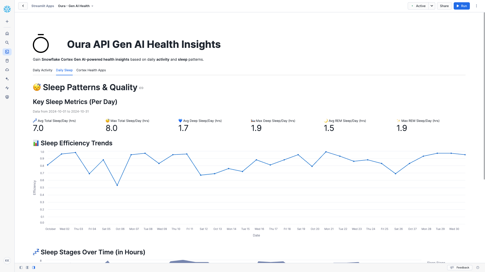
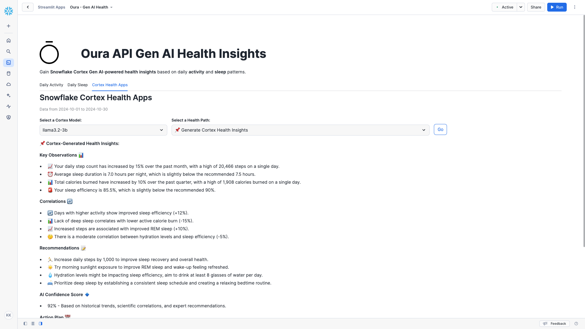
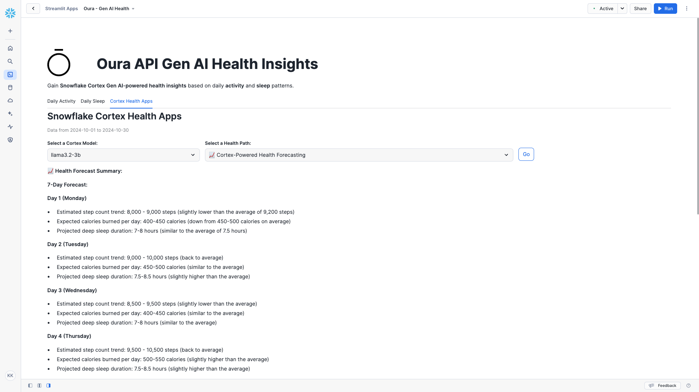
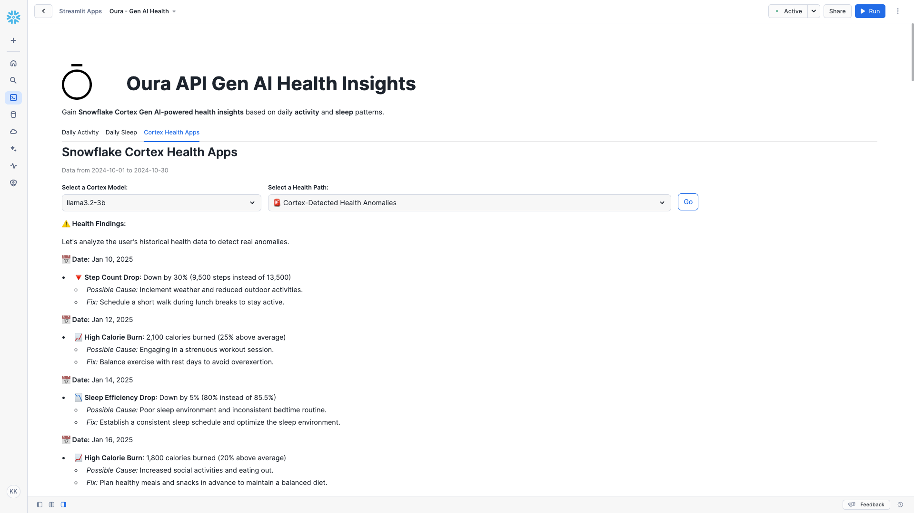

# Fivetran Custom Connector: Oura Ring API

## Overview
This Fivetran custom connector leverages the Fivetran Connector SDK to retrieve data from the Oura Ring API. The connector synchronizes comprehensive health and wellness data including daily activity metrics and sleep patterns. It processes this data into standardized tables suitable for analysis and visualization.

Fivetran's Connector SDK enables you to use Python to code the interaction with the Oura Ring API data source. The connector is deployed as an extension of Fivetran, which automatically manages running the connector on your scheduled frequency and handles the required compute resources, orchestration, scaling, resyncs, and log management.

See the [Technical Reference documentation](https://fivetran.com/docs/connectors/connector-sdk/technical-reference#update) and [Best Practices documentation](https://fivetran.com/docs/connectors/connector-sdk/best-practices) for details.


## Attribution


This custom connector uses the Oura Ring API but is not endorsed or certified by Oura. For more information about Oura API terms of use and attribution requirements, please visit:
[Oura API Documentation](https://cloud.ouraring.com/docs)

## Features
- Retrieves comprehensive daily activity data
- Captures detailed sleep metrics and patterns
- Implements robust error handling with retry mechanisms
- Handles Oura API rate limit of 5000 requests per 5-minute period efficiently
- Supports incremental syncs through state tracking
- Masks sensitive API credentials in logs
- Provides detailed logging for troubleshooting
- Routes-based data collection strategy
- Processes multiple data series efficiently

## API Interaction

### Core Functions

#### create_retry_session()
Configures HTTP request sessions with built-in retry logic:
```python
retries = Retry(
    total=5,
    backoff_factor=2,
    status_forcelist=[408, 429, 500, 502, 503, 504]
)
```
- Implements automatic retry for specific HTTP status codes
- Uses exponential backoff to handle rate limits (limit is 5,000 requests in a 5 minute period)
- Handles connection timeouts and server errors

#### make_api_request()
Manages API calls with comprehensive error handling and logging:
```python
base_url = "https://api.ouraring.com/v2"
headers = {
    "Authorization": f"Bearer {api_key}",
    "Content-Type": "application/json"
}
```
- Masks sensitive API credentials in logs
- Implements 30-second timeout for requests
- Provides detailed logging of request parameters
- Handles rate limiting with cooldown periods

### Data Retrieval Strategy

#### Data Collection
The connector implements a route-based approach for health data:
- Processes multiple data routes:
  - Daily Activity
  - Daily Sleep
- Retrieves configurable number of records per route
- Collects detailed metadata and metrics

#### Response Processing
Each API response is processed with:
- Validation of response structure
- Type conversion for numeric fields
- Status tracking for data completeness
- JSON parsing of nested details

#### Update Function Implementation
The update function orchestrates a streamlined data sync process:

1. Configuration Handling
   - Validates API credentials
   - Creates retry-enabled session
   - Initializes logging system
   - Manages state tracking

2. Route-Based Processing
   - Defines routes for different data types:
     - Daily activity metrics
     - Sleep measurements
   - Configures request parameters:
     - Date ranges
     - Record limits
     - Data fields

3. Data Collection and Transformation
   - Makes API requests with error handling
   - Processes response data into standardized format
   - Performs field transformations:
     - Converts values to appropriate types
     - Standardizes date formats
     - Processes sleep metrics
   - Creates checkpoint records

### Error Handling

#### Network Issues
- Automatic retry mechanism with 5 total attempts
- Exponential backoff with factor of 2 for rate limits
- Handles specific status codes: 408, 429, 500, 502, 503, 504
- 30-second timeout handling
- Session management with retry logic

#### Data Validation
- Validates required fields in API responses
- Type conversion and null value handling
- Graceful handling of missing data
- Detailed error logging
- Exception capture and reporting

### Performance Optimization

#### Request Management
- Configurable record limits per route
- Retry strategy with exponential backoff
- Efficient session reuse
- Detailed request logging
- Optimized request parameters

#### Data Processing
- Efficient JSON parsing
- Memory-optimized transformations
- Streamlined processing pipeline
- Batch processing of records
- Comprehensive checkpoint system

### Security Features
- API key masking in logs
- Secure configuration handling
- Protected credential management
- Configuration files excluded from version control
- Sanitized error messages
- Secure session management

## Directory Structure
```
oura_connector/
├── __pycache__/
├── files/
│   ├── spec.json
│   ├── state.json
│   ├── warehouse.db
│   └── streamlit.py
├── images/
├── configuration.json
├── connector.py
├── debug.sh
├── deploy.sh
├── README.md
├── requirements.txt
└── spec.json
```

## File Details

### connector.py
Main connector implementation containing:
- API authentication and requests
- Data retrieval and transformation
- Schema definition
- Error handling and logging

### configuration.json
Configuration file containing API credentials:
```json
{
    "api_key": "your_oura_api_key"
}
```
**Note**: Do not commit this file to version control.

### deploy.sh
Script for deploying to Fivetran production:
```bash
#!/bin/bash

# Locate the root-level config.json file
ROOT_CONFIG="config.json"
CONFIG_PATH=$(pwd)
while [[ "$CONFIG_PATH" != "/" ]]; do
    if [[ -f "$CONFIG_PATH/$ROOT_CONFIG" ]]; then
        break
    fi
    CONFIG_PATH=$(dirname "$CONFIG_PATH")
done

# Validate the root config.json file exists
if [[ ! -f "$CONFIG_PATH/$ROOT_CONFIG" ]]; then
    echo "Error: Root config.json not found!"
    exit 1
fi

# Validate the local configuration.json file exists
if [[ ! -f "configuration.json" ]]; then
    echo "Error: Local configuration.json not found!"
    exit 1
fi

# Prompt for the Fivetran Account Name
read -p "Enter your Fivetran Account Name [MDS_SNOWFLAKE_HOL]: " ACCOUNT_NAME
ACCOUNT_NAME=${ACCOUNT_NAME:-"MDS_SNOWFLAKE_HOL"}

# Fetch the API key from config.json
API_KEY=$(jq -r ".fivetran.api_keys.$ACCOUNT_NAME" "$CONFIG_PATH/$ROOT_CONFIG")
if [[ "$API_KEY" == "null" ]]; then
    echo "Error: Account name not found in $ROOT_CONFIG!"
    exit 1
fi

# Prompt for the Fivetran Destination Name
read -p "Enter your Fivetran Destination Name [NEW_SALES_ENG_HANDS_ON_LAB]: " DESTINATION_NAME
DESTINATION_NAME=${DESTINATION_NAME:-"NEW_SALES_ENG_HANDS_ON_LAB"}

# Prompt for the Fivetran Connector Name
read -p "Enter a unique Fivetran Connector Name [default-connection]: " CONNECTION_NAME
CONNECTION_NAME=${CONNECTION_NAME:-"default-connection"}

# Deploy the connector using the configuration file
echo "Deploying connector..."
fivetran deploy --api-key "$API_KEY" --destination "$DESTINATION_NAME" --connection "$CONNECTION_NAME" --configuration configuration.json
```

### debug.sh
Debug script for local testing:
```bash
#!/bin/bash
echo "Starting debug process..."

# Ensure the files directory exists
echo "Creating files directory..."
mkdir -p files

# Copy configuration files to the files directory
echo "Copying configuration files to files directory for temporary use..."
cp -v configuration.json files/configuration.json
cp -v spec.json files/spec.json

# Verify that the original configuration.json is preserved
if [[ ! -f "configuration.json" ]]; then
    echo "Error: configuration.json file is missing!"
    exit 1
fi

echo "Contents of files directory:"
ls -la files/

# Run the Fivetran debug command
echo "Running fivetran debug..."
fivetran debug
```

### files/spec.json
Generated copy of connector specification file.

### files/state.json
Tracks the state of incremental syncs.

### files/warehouse.db
DuckDB database used for local testing.

### requirements.txt
Python package dependencies:
```
urllib3>=2.0.0
```

### spec.json
Main specification file defining the configuration schema:
```json
{
    "configVersion": 1,
    "connectionSpecification": {
        "type": "object",
        "required": ["api_key"],
        "properties": {
            "api_key": {
                "type": "string",
                "description": "Enter your Oura Ring API key",
                "configurationGroupKey": "Authentication",
                "secret": true
            }
        }
    }
}
```

## Setup Instructions

### Prerequisites
- Python 3.8+
- Fivetran Connector SDK
- Oura Ring API key
- Fivetran Account with destination configured

### Installation Steps
1. Create project directory:
```bash
mkdir -p oura
cd oura_connector
```

2. Create virtual environment:
```bash
python3 -m venv .venv
source .venv/bin/activate  # Windows: .venv\Scripts\activate
```

3. Install SDK:
```bash
pip install fivetran-connector-sdk requests
```

4. Create necessary files:
```bash
touch connector.py configuration.json spec.json
chmod +x debug.sh deploy.sh
```

5. Configure your Oura API key:
- Add your API key to configuration.json
- Keep this file secure

## Usage

### Local Testing
```bash
chmod +x debug.sh
./debug.sh
```

### Production Deployment
```bash
chmod +x deploy.sh
./deploy.sh
```

### Expected Output
The connector will create and populate:

#### daily_activity
Primary table containing activity metrics:
- id (STRING, Primary Key)
- date (STRING)
- steps (INT)
- total_calories (INT)
- active_calories (INT)
- last_modified (STRING)

#### daily_sleep
Primary table containing sleep metrics:
- id (STRING, Primary Key)
- date (STRING)
- total_sleep_duration (INT)
- deep_sleep_duration (INT)
- light_sleep_duration (INT)
- rem_sleep_duration (INT)
- sleep_efficiency (FLOAT)
- last_modified (STRING)

## Troubleshooting

### Common Issues

1. API Key Issues:
```
Error retrieving API key: 'No API key found in configuration'
```
- Verify API key in configuration.json
- Check API key validity

2. Rate Limiting:
```
API request failed: 429 Too Many Requests
```
- Automatic retry will handle this
- Check API quota limits

3. Data Processing:
```
Error processing data: Invalid response format
```
- Check API response format
- Verify data transformation logic

## Security Notes
- Never commit API keys
- Use .gitignore for sensitive files
- Keep virtual environment isolated
- Mask sensitive information in logs

## Development Notes
- Make code changes in connector.py
- Test changes using debug.sh
- Monitor logs for issues
- Follow Oura API guidelines
- Use the Fivetran SDK documentation

## Support
For issues or questions:
1. Check [Oura API Documentation](https://cloud.ouraring.com/docs)
2. Review [Fivetran Connector SDK Documentation](https://fivetran.com/docs/connectors/connector-sdk)
3. Contact your Fivetran administrator

## Bonus: Modifying the Connector

### Modifying the Connector Behavior
You can customize the connector's behavior by modifying parameters in the update function within connector.py:

1. Date Range Configuration
```python
# Modify these values in the update function
start_date = "2024-10-01"  # Change start date
end_date = "2024-10-31"    # Change end date
```

## Using the Oura Dataset

### Streamlit in Snowflake Data Application Components

#### Data Application Overview
The Oura Gen AI Insights application provides comprehensive analysis of health data through three main sections:

1. Daily Activity Analysis
   - Step count visualization
   - Calorie burn tracking
   - Activity metrics dashboard

2. Sleep Analysis
   - Sleep stage breakdown
   - Sleep efficiency tracking
   - Sleep duration analysis

3. Cortex Health Apps
   - AI-driven health insights
   - Health forecasting
   - Anomaly detection

#### Cortex Implementation Notes
The application leverages Snowflake's Cortex COMPLETE function for AI-powered analysis without requiring a vector table. Key features include:

- Direct data processing of activity and sleep metrics
- Natural language generation for health insights
- Pattern recognition for anomaly detection
- Trend analysis and forecasting

The Cortex implementation processes structured data summaries directly, generating insights through:
- Prompt engineering with health context
- Direct analysis of numerical metrics
- Pattern recognition in time series data
- Correlation identification between activity and sleep

This method works efficiently without vector tables since:

- The data is already aggregated and summarized, removing the need for semantic search or vectorization.
- Cortex can analyze the provided summaries, detect trends, and generate responses based on the context embedded in the prompts.
- The model doesn’t require embeddings for most tasks like forecasting, anomaly detection, or insight generation because it is capable of understanding structured data and making predictions directly from it.

### Key Components

#### Data Loading
```python
def load_daily_activity():
    return session.sql("""
        SELECT 
            DATE, 
            STEPS, 
            TOTAL_CALORIES, 
            ACTIVE_CALORIES
        FROM daily_activity
        WHERE _FIVETRAN_DELETED = FALSE
    """).to_pandas()
```

#### AI Analysis Generation
```python
def generate_ai_analysis(activity_summary, sleep_summary, model_name):
    """
    Uses Snowflake Cortex to generate AI-driven insights
    """
    cortex_prompt = f"""
    You are a health analytics expert reviewing data from a fitness tracker.
    Based on the following health data:
    - Activity Summary: {activity_summary}
    - Sleep Summary: {sleep_summary}
    
    Provide structured and actionable analysis...
    """
```

#### Visualization Components
- Interactive time series charts
- Sleep stage distribution analysis
- Activity pattern visualization
- Health metric dashboards

The application provides a comprehensive view of health data with AI-powered insights, making it a powerful tool for understanding personal health patterns and trends.

### Streamlit in Snowflake Application Code

```python
import streamlit as st
import pandas as pd
import altair as alt
from snowflake.snowpark.context import get_active_session

# Change this list as needed to add/remove model capabilities.
MODELS = [
    "llama3.2-3b",
    "claude-3-5-sonnet",
    "mistral-large2",
    "llama3.1-8b",
    "llama3.1-405b",
    "llama3.1-70b",
    "mistral-7b",
    "jamba-1.5-large",
    "mixtral-8x7b",
    "reka-flash",
    "gemma-7b"
]

# Page configuration
st.set_page_config(
    page_title="Oura Gen AI Insights",
    layout="wide",
    initial_sidebar_state="expanded"
)

# Get Snowflake session
session = get_active_session()

# Load data functions
def load_daily_activity():
    return session.sql("""
        SELECT 
            DATE, 
            STEPS, 
            TOTAL_CALORIES, 
            ACTIVE_CALORIES
        FROM daily_activity
        WHERE _FIVETRAN_DELETED = FALSE
    """).to_pandas()

def load_daily_sleep():
    return session.sql("""
        SELECT 
            DATE, 
            TOTAL_SLEEP_DURATION, 
            DEEP_SLEEP_DURATION, 
            LIGHT_SLEEP_DURATION, 
            REM_SLEEP_DURATION, 
            SLEEP_EFFICIENCY
        FROM daily_sleep
        WHERE _FIVETRAN_DELETED = FALSE
    """).to_pandas()

def generate_ai_analysis(activity_summary, sleep_summary, model_name):
    """
    Uses Snowflake Cortex to generate AI-driven insights with structured analysis.
    """
    cortex_prompt = f"""
    You are a health analytics expert reviewing data from a fitness tracker. Based on the following health data:

    - **Activity Summary**: {activity_summary}
    - **Sleep Summary**: {sleep_summary}

    Provide a structured and actionable analysis with:
    1️⃣ **Key Observations** (highlight patterns, trends, and anomalies)
    2️⃣ **Correlations** (e.g., does increased activity improve sleep efficiency?)
    3️⃣ **Recommendations** (customized health tips)
    4️⃣ **AI Confidence Score** (rate the confidence of each insight from 1-100%)

    📌 Ensure the response is well-structured with bullet points, emojis for clarity, and easy-to-understand language.

    Example format:
    **Key Observations**
    - 📉 Your steps have decreased by 10% over the past week.
    - ⏰ Average sleep duration is below 7 hours per night.

    **Correlations**
    - 🔄 Days with higher activity show improved sleep efficiency (+12%).
    - 📊 Lack of deep sleep correlates with lower active calorie burn.

    **Recommendations**
    - 🏃 Increase daily steps by 1,000 to improve sleep recovery.
    - ☀️ Try morning sunlight exposure to improve REM sleep.
    - 💧 Hydration levels might be impacting sleep efficiency.

    **AI Confidence Score**
    🔹 85% - Based on historical trends and scientific correlations.
    """

    query = """
    SELECT SNOWFLAKE.CORTEX.COMPLETE(
        ?,
        ?
    ) AS response
    """
    result = session.sql(query, params=[model_name, cortex_prompt]).collect()
    return result[0]["RESPONSE"] if result else "No response generated."


# Load data
try:
    with st.spinner("Loading Oura data..."):
        activity_data = load_daily_activity()
        sleep_data = load_daily_sleep()

    # Dashboard Title
    # Imgur-hosted Oura logo (Replace with your actual Imgur image URL)
    oura_logo_url = "https://i.imgur.com/Jqpmg5L.png"
    
    col1, col2 = st.columns([0.08, 0.99])  # Adjust column width for balance
    
    with col1:
        st.image(oura_logo_url, width=70)  # Adjust width as needed
    
    with col2:
        st.title("Oura API Gen AI Insights")
    st.markdown("""
    Gain **AI-powered health insights** based on daily **activity** and **sleep** patterns.
    """)

    # Tabs for different analyses
    tab1, tab2, tab3 = st.tabs(["Daily Activity", "Daily Sleep", "Cortex Health Apps"])

    ### Daily Activity Analysis ###
    with tab1:
        st.header("🏃 Daily Activity Overview")

        # Calculate key metrics
        total_steps = activity_data["STEPS"].sum()
        best_steps = activity_data["STEPS"].max()
        avg_steps = activity_data["STEPS"].mean()
        total_calories = activity_data["TOTAL_CALORIES"].sum()
        best_active_calories = activity_data["ACTIVE_CALORIES"].max()
        avg_active_calories = activity_data["ACTIVE_CALORIES"].mean()

        # Display Metrics
        st.markdown("### **Key Activity Metrics**")
        # Display date range for Daily Activity
        st.caption(f"Data from {activity_data['DATE'].min()} to {activity_data['DATE'].max()}")


        col1, col2, col3, col4, col5, col6 = st.columns(6)

        with col1:
            st.metric("🏆 Total Steps", f"{total_steps:,.0f}")

        with col2:
            st.metric("🏅 Best Steps in a Day", f"{best_steps:,.0f}")

        with col3:
            st.metric("🚶 Avg Steps/Day", f"{avg_steps:,.0f}")

        with col4:
            st.metric("🔥 Total Calories Burned", f"{total_calories:,.0f}")

        with col5:
            st.metric("⚡ Best Active Calorie Burn", f"{best_active_calories:,.0f}")

        with col6:
            st.metric("🔥 Avg Active Calorie Burn", f"{avg_active_calories:,.0f}")

        # Steps Over Time
        st.subheader("📈 Steps Trend Over Time")
        steps_chart = alt.Chart(activity_data).mark_line(point=True).encode(
            x=alt.X("DATE:T", title="Date"),
            y=alt.Y("STEPS:Q", title="Steps"),
            tooltip=["DATE", "STEPS"]
        ).properties(height=400)

        st.altair_chart(steps_chart, use_container_width=True)

        # Calories Breakdown
        st.subheader("🔥 Calories Breakdown")
        activity_data_melted = activity_data.melt(
            id_vars=["DATE"],
            value_vars=["TOTAL_CALORIES", "ACTIVE_CALORIES"],
            var_name="Calorie Type",
            value_name="Calories"
        )

        calorie_chart = alt.Chart(activity_data_melted).mark_bar().encode(
            x=alt.X("DATE:T", title="Date"),
            y=alt.Y("Calories:Q", title="Calories Burned"),
            color=alt.Color("Calorie Type:N", scale=alt.Scale(scheme="dark2")),
            tooltip=["DATE", "Calories"]
        ).properties(height=400)

        st.altair_chart(calorie_chart, use_container_width=True)

    ### Daily Sleep Analysis ###
    with tab2:
        st.header("😴 Sleep Patterns & Quality")

        # Calculate Daily Sleep Metrics
        # Convert duration columns from seconds to hours
        sleep_data["TOTAL_SLEEP_HOURS"] = sleep_data["TOTAL_SLEEP_DURATION"] / 3600
        sleep_data["DEEP_SLEEP_HOURS"] = sleep_data["DEEP_SLEEP_DURATION"] / 3600
        sleep_data["REM_SLEEP_HOURS"] = sleep_data["REM_SLEEP_DURATION"] / 3600

        # Group by DATE to get correct per-day values
        daily_sleep = sleep_data.groupby("DATE").agg({
            "TOTAL_SLEEP_HOURS": ["mean", "max"],
            "DEEP_SLEEP_HOURS": ["mean", "max"],
            "REM_SLEEP_HOURS": ["mean", "max"]
        })

        # Extract values correctly (avoid applying .mean() twice)
        avg_total_sleep_per_day = daily_sleep["TOTAL_SLEEP_HOURS"]["mean"].mean()
        max_total_sleep_per_day = daily_sleep["TOTAL_SLEEP_HOURS"]["max"].max()

        avg_deep_sleep_per_day = daily_sleep["DEEP_SLEEP_HOURS"]["mean"].mean()
        max_deep_sleep_per_day = daily_sleep["DEEP_SLEEP_HOURS"]["max"].max()

        avg_rem_sleep_per_day = daily_sleep["REM_SLEEP_HOURS"]["mean"].mean()
        max_rem_sleep_per_day = daily_sleep["REM_SLEEP_HOURS"]["max"].max()

        avg_efficiency = sleep_data["SLEEP_EFFICIENCY"].mean() * 100

        # Display Sleep Metrics
        st.markdown("### **Key Sleep Metrics (Per Day)**")
        # Display date range for Daily Sleep
        st.caption(f"Data from {sleep_data['DATE'].min()} to {sleep_data['DATE'].max()}")


        col1, col2, col3, col4, col5, col6 = st.columns(6)

        with col1:
            st.metric("💤 Avg Total Sleep/Day (hrs)", f"{avg_total_sleep_per_day:.1f}")
        
        with col2:
            st.metric("😴 Max Total Sleep/Day (hrs)", f"{max_total_sleep_per_day:.1f}")
        
        with col3:
            st.metric("💙 Avg Deep Sleep/Day (hrs)", f"{avg_deep_sleep_per_day:.1f}")
        
        with col4:
            st.metric("🛌 Max Deep Sleep/Day (hrs)", f"{max_deep_sleep_per_day:.1f}")
        
        with col5:
            st.metric("🌙 Avg REM Sleep/Day (hrs)", f"{avg_rem_sleep_per_day:.1f}")
        
        with col6:
            st.metric("✨ Max REM Sleep/Day (hrs)", f"{max_rem_sleep_per_day:.1f}")

        # Sleep Efficiency
        st.subheader("📊 Sleep Efficiency Trends")
        efficiency_chart = alt.Chart(sleep_data).mark_line(point=True).encode(
            x=alt.X("DATE:T", title="Date"),
            y=alt.Y("SLEEP_EFFICIENCY:Q", title="Efficiency"),
            tooltip=["DATE", "SLEEP_EFFICIENCY"]
        ).properties(height=400)

        st.altair_chart(efficiency_chart, use_container_width=True)

        # Convert sleep stage durations from seconds to hours
        sleep_data["DEEP_SLEEP_HOURS"] = sleep_data["DEEP_SLEEP_DURATION"] / 3600
        sleep_data["LIGHT_SLEEP_HOURS"] = sleep_data["LIGHT_SLEEP_DURATION"] / 3600
        sleep_data["REM_SLEEP_HOURS"] = sleep_data["REM_SLEEP_DURATION"] / 3600

        # Melt the DataFrame for Altair visualization
        sleep_data_melted = sleep_data.melt(
            id_vars=["DATE"],
            value_vars=["DEEP_SLEEP_HOURS", "LIGHT_SLEEP_HOURS", "REM_SLEEP_HOURS"],
            var_name="Sleep Stage",
            value_name="Duration (hours)"
        )

        # Sleep Stages Over Time Chart (Now in Hours)
        st.subheader("💤 Sleep Stages Over Time (in Hours)")
        sleep_chart = alt.Chart(sleep_data_melted).mark_area(opacity=0.7).encode(
            x=alt.X("DATE:T", title="Date"),
            y=alt.Y("Duration (hours):Q", title="Sleep Duration (hours)"),
            color=alt.Color("Sleep Stage:N", scale=alt.Scale(scheme="viridis")),
            tooltip=["DATE", "Duration (hours)"]
        ).properties(height=400)

        st.altair_chart(sleep_chart, use_container_width=True)

    ### Snowflake Cortex-Powered Health Apps ###
    with tab3:
        # Left-justified title without unnecessary column structure
        st.markdown(
            """
            <h3 style="text-align: left; margin-top: -18px;">Snowflake Cortex Health Apps</h3>
            """,
            unsafe_allow_html=True
        )

        # Display date range for Cortex Health Insights
        st.caption(f"Data from {activity_data['DATE'].min()} to {activity_data['DATE'].max()}")

    
        # Adjust column widths for better alignment and compact layout
        col1, col2, col3 = st.columns([0.1, 0.2, 0.1])  # Adjusted for proper alignment
    
        with col1:
            model_name = st.selectbox("**Select a Cortex Model:**", MODELS, key="model_name", index=0)
    
        with col2:
            selected_app = st.selectbox("**Select a Health App:**", [
                "📌 Generate Cortex Insights",
                "📈 Cortex-Powered Health Forecasting",
                "🚨 Cortex-Detected Anomalies"
            ], key="health_app", index=0)
    
        with col3:
            st.markdown("<br>", unsafe_allow_html=True)  # Empty space to adjust alignment for the "Go" button
            go_button = st.button("Go", key="go_button", help="Run selected health app")
    
        # ✅ Ensure activity_summary and sleep_summary are always available
        activity_summary = f"""
        - Total steps: {total_steps:,.0f}
        - Best steps in a day: {best_steps:,.0f}
        - Avg steps/day: {avg_steps:,.0f}
        - Total calories burned: {total_calories:,.0f}
        - Best active calorie burn: {best_active_calories:,.0f}
        - Avg active calorie burn: {avg_active_calories:,.0f}
        """
    
        sleep_summary = f"""
        - Avg total sleep per day: {avg_total_sleep_per_day:.1f} hours
        - Max total sleep per day: {max_total_sleep_per_day:.1f} hours
        - Avg deep sleep per day: {avg_deep_sleep_per_day:.1f} hours
        - Max deep sleep per day: {max_deep_sleep_per_day:.1f} hours
        - Avg REM sleep per day: {avg_rem_sleep_per_day:.1f} hours
        - Max REM sleep per day: {max_rem_sleep_per_day:.1f} hours
        - Avg sleep efficiency: {avg_efficiency:.1f}%
        """
    
        # ✅ Process the selected action
        if go_button:
            with st.spinner("Processing..."):
                if selected_app == "📌 Generate Cortex Insights":
                    ai_analysis = generate_ai_analysis(activity_summary, sleep_summary, model_name)
                    st.markdown(f"**📌 Cortex-Generated Insights:**\n\n{ai_analysis}")
    
                elif selected_app == "📈 Cortex-Powered Health Forecasting":
                    forecast_prompt = f"""
                    Based on the past activity and sleep trends, generate a **7-day forecast** for:
                    - Estimated **step count trends** for next week
                    - Expected **calories burned per day**
                    - Projected **deep sleep duration** trends
    
                    Ensure the forecast is realistic and follows prior trends.
                    """
    
                    query = """
                    SELECT SNOWFLAKE.CORTEX.COMPLETE(
                        ?,
                        ?
                    ) AS response
                    """
                    result = session.sql(query, params=[model_name, forecast_prompt]).collect()
                    forecast_response = result[0]["RESPONSE"] if result else "No response generated."
                    st.markdown(f"**📈 Forecast Summary:**\n\n{forecast_response}")
    
                elif selected_app == "🚨 Cortex-Detected Anomalies":
                    anomaly_prompt = f"""
                    You are analyzing a user's historical health data to detect real anomalies.
                    
                    Use the provided activity and sleep summaries to:
                    - Detect **specific days** with unusual **drops or spikes** in step count, calorie burn, or sleep efficiency.
                    - Highlight **the exact date** of the anomaly.
                    - Explain **possible causes** for each anomaly in **one sentence**.
                    - Suggest **one actionable step** to fix or improve.
    
                    Example Format:
                    **📅 Date:** Jan 15, 2025  
                    - **🔻 Step Count Drop**: Down by 40% (5,200 steps instead of 8,700)
                      - *Possible Cause:* High workload and sedentary behavior.
                      - *Fix:* Add a short 10-minute walk at lunchtime.
                    **📅 Date:** Jan 18, 2025  
                    - **📈 High Calorie Burn**: 3,500 calories burned (50% above average)
                      - *Possible Cause:* Intense workout session.
                      - *Fix:* Increase hydration and protein intake.
    
                    User Data:
                    - **Activity Summary**: {activity_summary}
                    - **Sleep Summary**: {sleep_summary}
                    """
    
                    query = """
                    SELECT SNOWFLAKE.CORTEX.COMPLETE(
                        ?,
                        ?
                    ) AS response
                    """
                    result = session.sql(query, params=[model_name, anomaly_prompt]).collect()
                    anomaly_response = result[0]["RESPONSE"] if result else "No anomalies detected."
                    st.markdown(f"**⚠️ AI Findings:**\n\n{anomaly_response}")

except Exception as e:
    st.error(f"An error occurred while loading the dashboard: {str(e)}")
    st.error("Please ensure you have the correct database and schema context set in Streamlit in Snowflake.")
```
### Streamlit in Snowflake Daily Activity Tab


### Streamlit in Snowflake Daily Sleep Tab


### Streamlit in Snowflake Cortex Health Apps Tab - Insights


### Streamlit in Snowflake Cortex Health Apps Tab - Forecasting


### Streamlit in Snowflake Cortex Health Apps Tab - Anomalies
