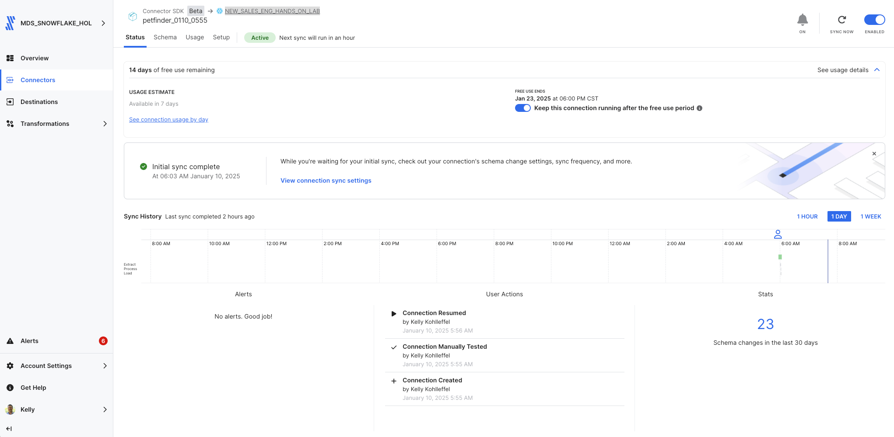
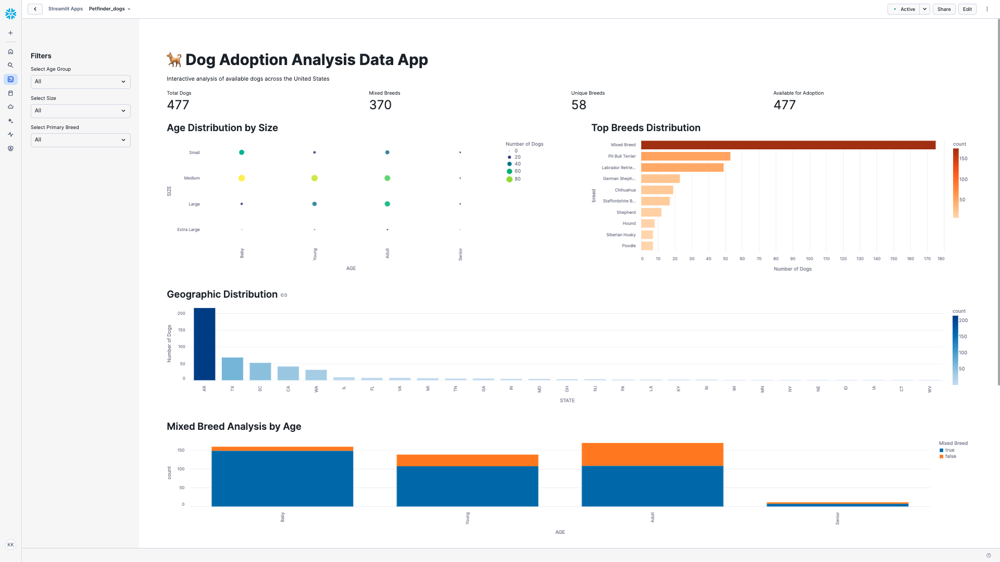

# Fivetran_Connector_SDK: Petfinder API

## Overview
This Fivetran custom connector leverages the Fivetran Connector SDK to retrieve dog adoption data from the [Petfinder powered by Purina API](https://www.petfinder.com/developers/v2/docs/). The connector focuses on extracting detailed information about adoptable dogs, including breed, size, age, location, and status information.

The connector uses Python to interact with the Purina Petfinder API and is deployed as a Fivetran extension. Fivetran automatically manages the connector's execution schedule, compute resources, orchestration, scaling, resyncs, and log management. Additionally, Fivetran handles comprehensive writing to your chosen destination, managing retries, schema inference, security, and idempotency.

See the [Technical Reference documentation](https://fivetran.com/docs/connectors/connector-sdk/technical-reference#update) and [Best Practices documentation](https://fivetran.com/docs/connectors/connector-sdk/best-practices) for details.



## Attribution


This custom connector uses the Petfinder powered by Purina API but is not endorsed or certified by Petfinder powered by Purina. For more information about the Petfinder powered by Purina API terms of use and attribution requirements, please visit:
[Petfinder API Terms](https://www.petfinder.com/developers/v2/docs/)

## Features
- Retrieves comprehensive dog adoption information
- Captures detailed animal attributes including:
  - Breed information (primary, secondary, mixed status)
  - Physical characteristics (size, age, gender)
  - Location and organization details
  - Adoption status and description
- Implements robust error handling and retry mechanisms
- Uses rate limiting to handle API quotas efficiently (1,000 requests/day, 50 requests/second)
- Supports incremental syncs through state tracking
- Masks sensitive API credentials in logs
- Provides detailed logging for troubleshooting
- Follows Fivetran Connector SDK best practices

## API Interaction

### Core Functions

#### create_retry_session()
Configures HTTP request sessions with built-in retry logic:
```python
retries = Retry(
    total=3,
    backoff_factor=1,
    status_forcelist=[408, 429, 500, 502, 503, 504]
)
```
- Implements automatic retry for specific HTTP status codes
- Uses exponential backoff to handle rate limits
- Handles connection timeouts and server errors

#### get_auth_token()
Manages OAuth2 authentication with Petfinder API:
- Handles client credentials flow
- Manages token refresh
- Secures API credentials

### Data Retrieval Strategy

#### Data Collection
The connector implements a focused approach for dog data:
- Uses the "/animals" endpoint with type=dog filter
- Retrieves most recent additions/updates first
- Implements pagination with configurable limits
- Processes up to 500 records per sync

#### Response Processing
Each API response is processed with:
- Validation of response structure
- Extraction of relevant dog information
- Status tracking for data completeness

#### Update Function Implementation
The update function orchestrates the data sync:

1. Authentication
   - Obtains OAuth2 token
   - Handles token refresh

2. Data Retrieval
   - Implements pagination
   - Applies rate limiting
   - Tracks progress

3. Data Processing
   - Extracts dog information
   - Handles breed details
   - Processes location data

### Error Handling

#### Network Issues
- Automatic retry for transient failures
- Exponential backoff for rate limits
- Timeout handling for unresponsive endpoints

#### Data Validation
- Checks for required fields
- Handles missing or null values
- Provides detailed error logging

### Performance Optimization

#### Request Management
- Respects 50 requests/second rate limit
- Maximum 1,000 requests per day
- Implements 1-second delay between pages
- Efficient pagination handling

#### Data Processing
- Direct data transformation
- Efficient memory usage
- Comprehensive logging
- Clean state management

## Security Features
- OAuth2 token management
- API key masking in logs
- Secure credential handling
- Configuration files excluded from version control

## Directory Structure
```
petfinder/
├── __pycache__/        # Python bytecode cache directory
├── files/              # Directory containing configuration and state files
│   ├── spec.json       # Configuration specification file
│   ├── state.json      # State tracking for incremental updates
│   └── warehouse.db    # Local database for testing
├── images/             # Directory for storing project images
├── configuration.json  # Main configuration settings
├── connector.py        # Primary connector implementation
├── debug.sh           # Script for debugging purposes
├── deploy.sh          # Deployment script for production
├── README.md          # Project documentation and instructions
└── spec.json          # Main specification file for the connector
```

## File Details

### connector.py
Main connector implementation handling:
- API authentication and requests
- Data retrieval and transformation
- Schema definition
- Error handling and logging

### configuration.json
Configuration file containing API credentials:
```json
{
    "client_id": "YOUR_PETFINDER_CLIENT_ID",
    "client_secret": "YOUR_PETFINDER_CLIENT_SECRET"
}
```
**Note**: This file is automatically copied to the files directory during debug. Do not commit this file to version control.

### deploy.sh
Script for deploying to Fivetran production:
```bash
#!/bin/bash

# Find config.json by searching up through parent directories
CONFIG_PATH=$(pwd)
while [[ "$CONFIG_PATH" != "/" ]]; do
    if [[ -f "$CONFIG_PATH/config.json" ]]; then
        break
    fi
    CONFIG_PATH=$(dirname "$CONFIG_PATH")
done

# Prompt for the Fivetran Account Name
read -p "Enter your Fivetran Account Name [MDS_SNOWFLAKE_HOL]: " ACCOUNT_NAME
ACCOUNT_NAME=${ACCOUNT_NAME:-"MDS_SNOWFLAKE_HOL"}

# Read API key from config.json based on account name
API_KEY=$(jq -r ".fivetran.api_keys.$ACCOUNT_NAME" "$CONFIG_PATH/config.json")

if [ "$API_KEY" == "null" ]; then
    echo "Error: Account name not found in config.json"
    exit 1
fi

# Prompt for the Fivetran Destination Name
read -p "Enter your Fivetran Destination Name [NEW_SALES_ENG_HANDS_ON_LAB]: " DESTINATION_NAME
DESTINATION_NAME=${DESTINATION_NAME:-"NEW_SALES_ENG_HANDS_ON_LAB"}

# Prompt for the Fivetran Connector Name
read -p "Enter a unique Fivetran Connector Name [default-connection]: " CONNECTION_NAME
CONNECTION_NAME=${CONNECTION_NAME:-"default-connection"}

# Deploy with configuration file
fivetran deploy --api-key "$API_KEY" --destination "$DESTINATION_NAME" \
                --connection "$CONNECTION_NAME" --configuration configuration.json
```

### debug.sh
Debug script for local testing:
```bash
#!/bin/bash
echo "Starting debug process..."

echo "Running fivetran reset..."
fivetran reset

echo "Creating files directory..."
mkdir -p files

echo "Copying configuration files to files directory..."
cp -v configuration.json files/
cp -v spec.json files/

echo "Contents of files directory:"
ls -la files/

echo "Running fivetran debug..."
fivetran debug
```

### files/spec.json
Generated copy of the connector specification file.

### files/state.json
Tracks the state of incremental syncs.

### files/warehouse.db
DuckDB database used for local testing.

### images/
Contains documentation screenshots and images:
- sync_status.png: Fivetran sync status
- streamlit_app.png: Application dashboard
- Other visual documentation

### spec.json
Main specification file defining the configuration schema:
```json
{
    "configVersion": 1,
    "connectionSpecification": {
        "type": "object",
        "required": ["client_id", "client_secret"],
        "properties": {
            "client_id": {
                "type": "string",
                "description": "Enter your Petfinder API key (Client ID)",
                "configurationGroupKey": "Authentication",
                "secret": true
            },
            "client_secret": {
                "type": "string",
                "description": "Enter your Petfinder Client Secret",
                "configurationGroupKey": "Authentication",
                "secret": true
            }
        }
    }
}
```

### .gitignore
Git ignore file containing:
```
# Generated files
files/
warehouse.db/

# Configuration files with sensitive information
configuration.json

# Python virtual environment
.venv/
__pycache__/
*.pyc

# OS generated files
.DS_Store
.DS_Store?
._*
```

## Setup Instructions

### Prerequisites
- Python 3.8+
- Fivetran Connector SDK and a virtual environment
- Petfinder API credentials (obtain from [Petfinder Developer Portal](https://www.petfinder.com/developers/))
- Fivetran Account with destination configured

### Installation Steps
1. Create project directory:
```bash
mkdir -p petfinder
cd petfinder
```

2. Create virtual environment:
```bash
python3 -m venv .venv
source .venv/bin/activate  # Windows: .venv\Scripts\activate
```

3. Install SDK:
```bash
pip install fivetran-connector-sdk
```

4. Create necessary files:
```bash
touch connector.py configuration.json spec.json
chmod +x debug.sh deploy.sh
```

5. Configure your Petfinder API credentials:
- Add your client_id and client_secret to configuration.json
- Keep this file secure and do not commit to version control

## Usage

### Local Testing
```bash
chmod +x debug.sh
./debug.sh
```

The debug process will:
1. Reset any existing state
2. Create the files directory
3. Retrieve Petfinder dogs data
4. Log the process details
5. Create local database files for testing

### Production Deployment
```bash
chmod +x deploy.sh
./deploy.sh
```

The script will:
- Find and read your Fivetran configuration
- Prompt for account details and deployment options
- Deploy the connector to your Fivetran destination

### Expected Output
The connector will sync up to 500 dog records with detailed information about each animal.

## Data Tables

### dogs
Primary table containing dog information:
- id (STRING, Primary Key)
- name (STRING)
- age (STRING)
- gender (STRING)
- size (STRING)
- coat (STRING)
- status (STRING)
- primary_breed (STRING)
- secondary_breed (STRING)
- mixed_breed (BOOLEAN)
- colors_primary (STRING)
- colors_secondary (STRING)
- colors_tertiary (STRING)
- organization_id (STRING)
- description (STRING)
- tags (STRING, JSON array)
- city (STRING)
- state (STRING)
- distance (FLOAT)
- published_at (TIMESTAMP)
- last_updated (TIMESTAMP)

## Troubleshooting

### Common Issues

1. Authentication Issues:
```
Error getting auth token: 401 Unauthorized
```
- Verify client_id and client_secret in configuration.json
- Check token expiration handling

2. Rate Limiting:
```
429 Too Many Requests
```
- Automatic retry will handle this
- Check daily quota usage

3. Directory Structure:
```
No such file or directory: 'files/configuration.json'
```
- Ensure debug.sh has created files directory
- Check file permissions

4. Python Environment:
```
ModuleNotFoundError: No module named 'fivetran_connector_sdk'
```
- Verify virtual environment is activated
- Reinstall SDK if necessary

## Security Notes
- Never commit API credentials
- Use .gitignore for sensitive files
- Keep virtual environment isolated
- Follow Petfinder API usage guidelines

## Development Notes
- Make code changes in connector.py
- Test changes using debug.sh
- Monitor API rate limits
- Monitor logs for issues
- Use the Fivetran SDK documentation

## Support
For issues or questions:
1. Check [Petfinder API Documentation](https://www.petfinder.com/developers/v2/docs/)
2. Review [Fivetran Connector SDK Documentation](https://fivetran.com/docs/connectors/connector-sdk)
3. Contact your Fivetran administrator

## Using the Petfinder Dataset - Dog Adoption Streamlit in Snowflake Data App

### Required Setup

1. Create a CLEAN_DOGS Table

Open up a new Snowflake Snowsight worksheet and run this SQL to create a CLEAN_DOGS table that provides for:

#### Null Value Handling

* Replaced all NULL values with meaningful defaults like 'Unknown', 'None', or 'Mixed Breed'
* Eliminated the 'age is null' errors we were getting in Streamlit
* Made visualizations more reliable by having no missing data


#### Standardized Ordering

* Added SIZE_ORDER (1,2,3,4) for Small to Extra Large
* Added AGE_ORDER (1,2,3,4) for Baby to Senior
* Enabled proper sorting in visualizations instead of alphabetical


#### Data Quality

* Filtered out deleted records (_FIVETRAN_DELETED = FALSE)
* Standardized boolean values for MIXED_BREED
* Created consistent text values for categorical fields (breed, size, age)

### CLEAN_DOGS table SQL - run in a Snowflake Snowsight worksheet

``` sql
CREATE OR REPLACE TABLE CLEAN_DOGS AS
SELECT 
    ID,
    COALESCE(NAME, 'Unnamed') as NAME,
    COALESCE(AGE, 'Unknown') as AGE,
    COALESCE(GENDER, 'Unknown') as GENDER,
    COALESCE(SIZE, 'Unknown') as SIZE,
    COALESCE(PRIMARY_BREED, 'Mixed Breed') as PRIMARY_BREED,
    COALESCE(SECONDARY_BREED, 'None') as SECONDARY_BREED,
    COALESCE(STATUS, 'Unknown') as STATUS,
    COALESCE(CITY, 'Unknown') as CITY,
    COALESCE(STATE, 'Unknown') as STATE,
    ORGANIZATION_ID,
    CASE 
        WHEN MIXED_BREED IS NULL THEN FALSE
        ELSE MIXED_BREED 
    END as MIXED_BREED,
    CASE
        WHEN SIZE = 'Small' THEN 1
        WHEN SIZE = 'Medium' THEN 2
        WHEN SIZE = 'Large' THEN 3
        WHEN SIZE = 'Extra Large' THEN 4
        ELSE 0
    END as SIZE_ORDER,
    CASE
        WHEN AGE = 'Baby' THEN 1
        WHEN AGE = 'Young' THEN 2
        WHEN AGE = 'Adult' THEN 3
        WHEN AGE = 'Senior' THEN 4
        ELSE 0
    END as AGE_ORDER,
    PUBLISHED_AT
FROM DOGS
WHERE _FIVETRAN_DELETED = FALSE;
```

This Streamlit in Snowflake data application provides interactive analysis of dog adoption data with geographic insights and key metrics.

### Streamlit in Snowflake Data App Components

#### This Streamlit app provides:

1. Top-level metrics showing:
* Total dogs
* Mixed breeds
* Unique breeds
* Available for adoption

2. Interactive sidebar filters for:
* Age Group
* Size
* Primary Breed

3. Four main visualizations:
* Age Distribution by Size (bubble chart)
* Top Breeds Distribution (bar chart)
* Geographic Distribution (bar chart)
* Mixed Breed Analysis by Age (stacked bar chart)

4. Interactive data table with sortable columns showing:
* Name
* Age
* Size
* Primary Breed
* Gender
* State
* Status

#### Key features:

* Responsive layout using columns and spacers
* Consistent color schemes (viridis, oranges, blues)
* Interactive tooltips on all charts
* Intuitive sidebar filtering
* Proper categorical sorting (Age, Size)
* Comprehensive error handling

#### The app allows users to:

* Filter data across multiple dimensions
* Analyze age and size relationships
* Explore breed distributions
* Track mixed breed patterns
* View geographic trends
* Access detailed adoption records

### Streamlit in Snowflake Implementation Notes
* Requires the CLEAN_DOGS table created from the dogs table
* Uses pandas crosstab for complex visualizations
* Implements responsive column-based layout
* Provides comprehensive error handling
* Utilizes Altair for all visualizations
* Properly handles categorical sorting
* Includes tooltips for all charts

### Streamlit in Snowflake Code Block

# Petfinder Dog Adoption Analysis Streamlit App

```python
import streamlit as st
import pandas as pd
import altair as alt
from snowflake.snowpark.context import get_active_session

# Set page configuration
st.set_page_config(page_title="Dog Adoption Analysis Data App", layout="wide")

# Get the active Snowflake session
session = get_active_session()

# Load data function
def load_adoption_data():
    return session.sql("""
        SELECT 
            ID,
            NAME,
            AGE,
            GENDER,
            SIZE,
            PRIMARY_BREED,
            SECONDARY_BREED,
            STATUS,
            CITY,
            STATE,
            ORGANIZATION_ID,
            MIXED_BREED,
            SIZE_ORDER,
            AGE_ORDER,
            PUBLISHED_AT
        FROM CLEAN_DOGS
        ORDER BY AGE_ORDER, SIZE_ORDER
    """).to_pandas()

# Main dashboard
try:
    # Load data
    with st.spinner("Loading adoption data..."):
        df = load_adoption_data()

    # Title and description
    st.title("🐕 Dog Adoption Analysis Data App")
    st.markdown("Interactive analysis of available dogs across the United States")

    # Sidebar filters
    st.sidebar.header("Filters")
    
    # Age filter
    age_options = ['All'] + sorted(df['AGE'].unique().tolist())
    selected_age = st.sidebar.selectbox("Select Age Group", age_options)
    
    # Size filter
    size_options = ['All'] + sorted(df['SIZE'].unique().tolist())
    selected_size = st.sidebar.selectbox("Select Size", size_options)
    
    # Breed filter
    breed_options = ['All'] + sorted(df[df['PRIMARY_BREED'] != 'Mixed Breed']['PRIMARY_BREED'].unique().tolist())
    selected_breed = st.sidebar.selectbox("Select Primary Breed", breed_options)

    # Apply filters
    filtered_df = df.copy()
    if selected_age != 'All':
        filtered_df = filtered_df[filtered_df['AGE'] == selected_age]
    if selected_size != 'All':
        filtered_df = filtered_df[filtered_df['SIZE'] == selected_size]
    if selected_breed != 'All':
        filtered_df = filtered_df[filtered_df['PRIMARY_BREED'] == selected_breed]

    # Metrics Row
    col1, col2, col3, col4 = st.columns(4)
    
    with col1:
        total_dogs = len(filtered_df)
        st.metric("Total Dogs", f"{total_dogs:,}")
    
    with col2:
        mixed_breeds = filtered_df['MIXED_BREED'].sum()
        st.metric("Mixed Breeds", f"{mixed_breeds:,}")
    
    with col3:
        unique_breeds = filtered_df['PRIMARY_BREED'].nunique()
        st.metric("Unique Breeds", unique_breeds)
    
    with col4:
        adoptable = len(filtered_df[filtered_df['STATUS'] == 'adoptable'])
        st.metric("Available for Adoption", f"{adoptable:,}")

    # Create two columns for main charts
    chart_col1, spacer, chart_col2 = st.columns([1, 0.1, 1])

    with chart_col1:
        st.subheader("Age Distribution by Size")
        age_size_data = pd.crosstab(filtered_df['AGE'], filtered_df['SIZE'])
        age_size_data = age_size_data.reset_index().melt('AGE', var_name='SIZE', value_name='count')
        
        age_size_chart = alt.Chart(age_size_data).mark_circle(opacity=0.8).encode(
            x=alt.X('AGE:N', sort=['Baby', 'Young', 'Adult', 'Senior']),
            y=alt.Y('SIZE:N', sort=['Small', 'Medium', 'Large', 'Extra Large']),
            size=alt.Size('count:Q', legend=alt.Legend(title="Number of Dogs")),
            color=alt.Color('count:Q', scale=alt.Scale(scheme='viridis')),
            tooltip=['AGE:N', 'SIZE:N', 'count:Q']
        ).properties(height=400)
        
        st.altair_chart(age_size_chart, use_container_width=True)

    with chart_col2:
        st.subheader("Top Breeds Distribution")
        breed_data = (
            filtered_df['PRIMARY_BREED']
            .value_counts()
            .head(10)
            .reset_index()
        )
        breed_data.columns = ['breed', 'count']
        
        breed_chart = alt.Chart(breed_data).mark_bar().encode(
            y=alt.Y('breed:N', sort='-x'),
            x=alt.X('count:Q', title='Number of Dogs'),
            color=alt.Color('count:Q', scale=alt.Scale(scheme='oranges')),
            tooltip=['breed:N', 'count:Q']
        ).properties(height=400)
        
        st.altair_chart(breed_chart, use_container_width=True)

    # Geographic Distribution
    st.subheader("Geographic Distribution")
    state_data = (
        filtered_df[filtered_df['STATE'] != 'Unknown']
        .groupby('STATE')
        .size()
        .reset_index(name='count')
        .sort_values('count', ascending=False)
    )
    
    state_chart = alt.Chart(state_data).mark_bar().encode(
        x=alt.X('STATE:N', sort='-y'),
        y=alt.Y('count:Q', title='Number of Dogs'),
        color=alt.Color('count:Q', scale=alt.Scale(scheme='blues')),
        tooltip=['STATE:N', 'count:Q']
    ).properties(height=300)
    
    st.altair_chart(state_chart, use_container_width=True)

    # Mixed Breed Analysis
    st.subheader("Mixed Breed Analysis by Age")
    mixed_data = pd.crosstab(filtered_df['AGE'], filtered_df['MIXED_BREED'])
    mixed_data = mixed_data.reset_index().melt('AGE', var_name='Mixed Breed', value_name='count')
    
    mixed_chart = alt.Chart(mixed_data).mark_bar().encode(
        x=alt.X('AGE:N', sort=['Baby', 'Young', 'Adult', 'Senior']),
        y='count:Q',
        color=alt.Color('Mixed Breed:N', 
                       scale=alt.Scale(domain=[True, False],
                                     range=['#1f77b4', '#ff7f0e'])),
        tooltip=['AGE:N', 'Mixed Breed:N', 'count:Q']
    ).properties(height=300)
    
    st.altair_chart(mixed_chart, use_container_width=True)

    # Available Dogs Table
    st.subheader("Available Dogs")
    st.markdown("Click on any column header to sort")
    
    display_cols = ['NAME', 'AGE', 'SIZE', 'PRIMARY_BREED', 'GENDER', 'STATE', 'STATUS']
    st.dataframe(
        filtered_df[display_cols],
        height=400
    )

except Exception as e:
    st.error(f"An error occurred: {str(e)}")
```

### Streamlit in Snowflake Data App
