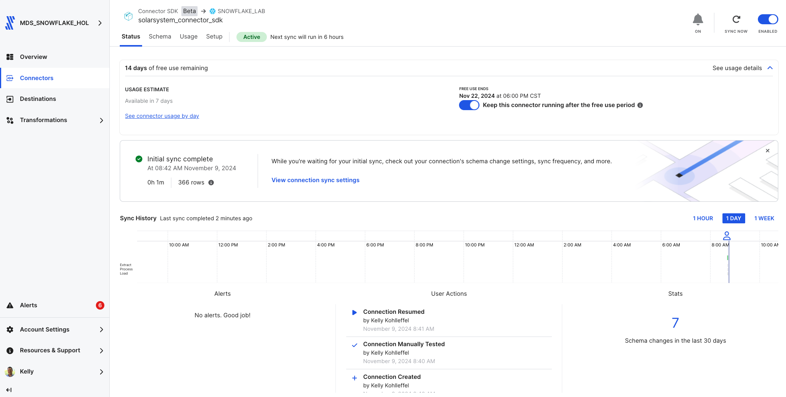
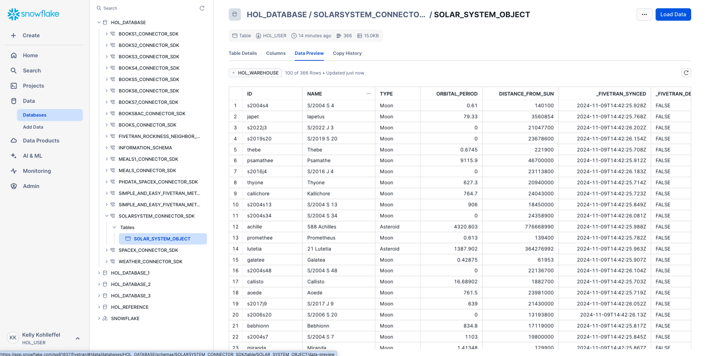
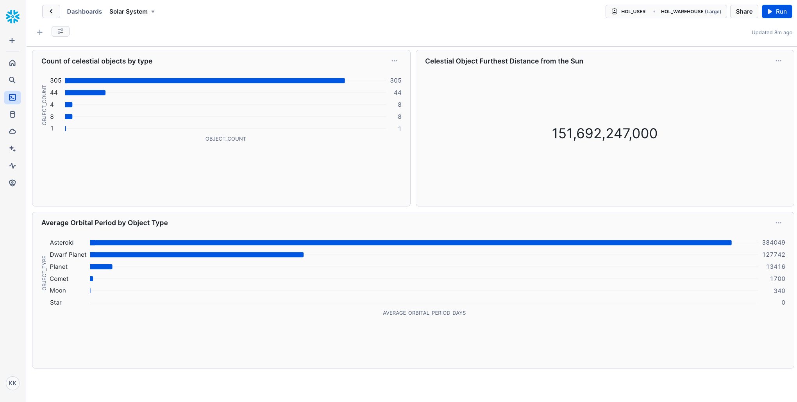

# Fivetran_Connector_SDK: Solar System Data
 ## Quickly build a custom Solar System data connector using the Fivetran Connector SDK

[Fivetran's Connector SDK](https://fivetran.com/docs/connectors/connector-sdk) allows you to code a custom data connector using Python and deploy it as an extension of Fivetran. Fivetran automatically manages running the connector on your scheduled frequency and manages the required compute resources.

This is a simple example for how to work with the fivetran_connector_sdk module. 

It shows the use of a connector.py file that calls a publicly available API.

It also shows how to use the logging functionality provided by fivetran_connector_sdk, by logging important steps using log.info() and log.fine()

See the [Technical Reference documentation](https://fivetran.com/docs/connectors/connector-sdk/technical-reference#update) and [Best Practices documentation](https://fivetran.com/docs/connectors/connector-sdk/best-practices) for details.

## Celestial objects data from the Solar System OpenData API

[Solar System OpenData API](https://api.le-systeme-solaire.net/en/)

This script connects to the Solar System OpenData API using the Fivetran Connector SDK. It retrieves information about celestial objects in our Solar System, including object names, types, orbital periods, and distances from the Sun, and stores this data in Fivetran using the SDK's upsert operation.

**Example usage**: This script can be used to demonstrate pulling Solar System data from the Solar System OpenData API, showcasing how the Fivetran Connector SDK works.

## Quick reference bash commands for running in the VS Code terminal

### From this path: 
(.venv) kelly.kohlleffel@kelly Fivetran_Connector_SDK %

### Navigate to the quick_start_example/solarsystem
```
cd examples/quick_start_examples/solarsystem
```
### Run the custom connector code
```
python connector.py
```
### Deploy the connector to Fivetran
```
fivetran deploy --api-key <FIVETRAN-API-KEY> --destination <DESTINATION-NAME> --connection <CONNECTION-NAME>
```
## Alternatively: 

### Navigate to the Fivetran_Connector_SDK directory in Documents/Github
```
cd ~/Documents/Github/Fivetran_Connector_SDK
```
### Navigate up one level from weather to solarsystem, for example
```
cd ../solarsystem
```
### Ensure the directory exists
```
mkdir -p files
```
### Activate your virtual environment
```
source .venv/bin/activate
```
### Navigate to the quick_start_example/solarsystem
```
cd examples/quick_start_examples/solarsystem
```
### Install the Fivetran requirements.txt file
```
pip install -r requirements.txt
```
### Run the custom connector code
```
python connector.py
```
### Deploy the connector to Fivetran
```
fivetran deploy --api-key <FIVETRAN-API-KEY> --destination <DESTINATION-NAME> --connection <CONNECTION-NAME>
```
## Fivetran Connector SDK in action

### Fivetran Connector SDK: Fivetran Sync Status



### Fivetran Connector SDK: Data moved with the Connector SDK to Snowflake



### Fivetran Connector SDK: Snowflake Snowsight Dashboard with the new SolarSystem data



### SQL queries for SolarSystem data (update the database and schema names)

### Count of Celestial Objects by Type
```
SELECT 
    type AS Object_Type,
    COUNT(id) AS Object_Count
FROM 
    HOL_DATABASE.SOLARSYSTEM_CONNECTOR_SDK.solar_system_object
GROUP BY 
    type
ORDER BY 
    Object_Count DESC;
```
### Celestial Object Furthest Distance from the Sun
```
SELECT 
    name AS Object_Name,
    distance_from_sun AS Distance_from_Sun_km
FROM 
    HOL_DATABASE.SOLARSYSTEM_CONNECTOR_SDK.solar_system_object
WHERE 
    distance_from_sun IS NOT NULL
ORDER BY 
    Distance_from_Sun_km DESC
LIMIT 1;
```
### Average Orbital Period by Object Type
```
SELECT 
    type AS Object_Type,
    ROUND(AVG(orbital_period)) AS Average_Orbital_Period_days
FROM 
    HOL_DATABASE.SOLARSYSTEM_CONNECTOR_SDK.solar_system_object
WHERE 
    orbital_period IS NOT NULL
GROUP BY 
    type
ORDER BY 
    Average_Orbital_Period_days DESC;
```
