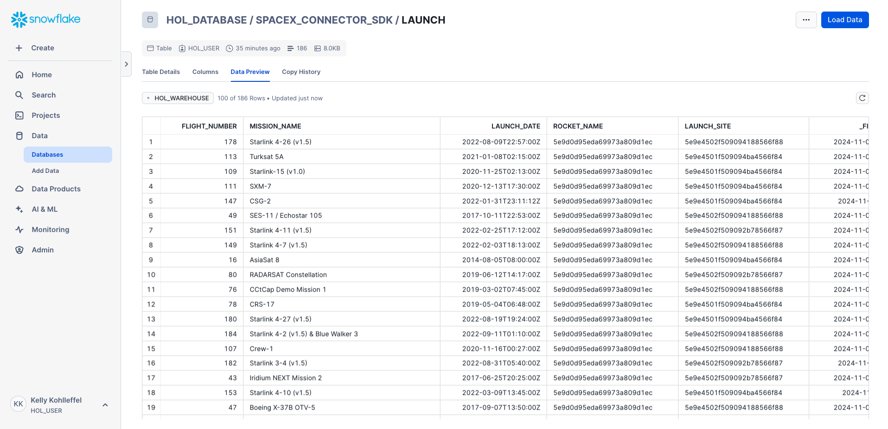
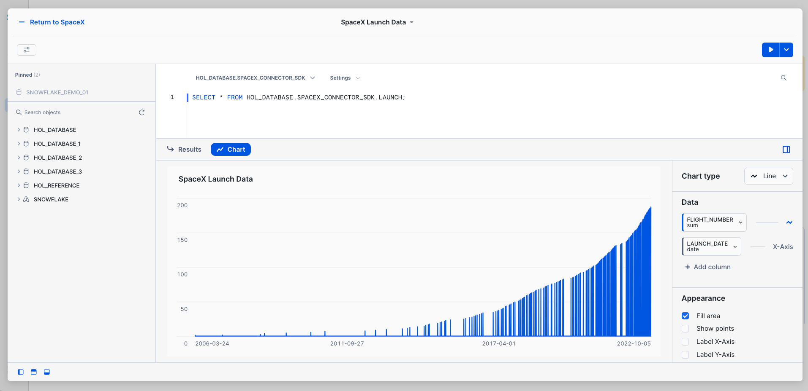

# Fivetran_Connector_SDK: SpaceX Launch Data
 ## Quickly build a custom SpaceX data connector using the Fivetran Connector SDK

[Fivetran's Connector SDK](https://fivetran.com/docs/connectors/connector-sdk) allows you to code a custom data connector using Python and deploy it as an extension of Fivetran. Fivetran automatically manages running the connector on your scheduled frequency and manages the required compute resources.

This is a simple example for how to work with the fivetran_connector_sdk module. 

It shows the use of a connector.py file that calls a publicly available API.

It also shows how to use the logging functionality provided by fivetran_connector_sdk, by logging important steps using log.info() and log.fine()

See the [Technical Reference documentation](https://fivetran.com/docs/connectors/connector-sdk/technical-reference#update) and [Best Practices documentation](https://fivetran.com/docs/connectors/connector-sdk/best-practices) for details.

## SpaceX launch data from the SpaceX API

[SpaceX API](https://github.com/r-spacex/SpaceX-API/tree/master/docs#rspacex-api-docs)

This script connects to the SpaceX API using the Fivetran Connector SDK. It retrieves information about past SpaceX launches, including mission name, launch date, rocket type, and launch site, and stores this data in Fivetran using the SDK's upsert operation.

**Example usage**: This script can be used to demonstrate pulling launch data from SpaceX, making it useful for showcasing how the Fivetran Connector SDK works.

## Quick reference bash commands for running in the VS Code terminal

### From this path: 
(.venv) kelly.kohlleffel@kelly Fivetran_Connector_SDK %

### Navigate to the quick_start_example/spacex
```
cd examples/quick_start_examples/spacex
```
### Run the custom connector code
```
python connector.py
```

### Deploy the connector to Fivetran

This repo uses a **deploy.sh** file to prompt for the following:
* Fivetran Account Name (this references an API key in the config.json file that is associated with the Fivetran Account Name input)
* Fivetran Destination Name
* Fivetran Connector Name

For demo purposes, there is a default Fivetran account (in brackets) and default Fivetran destination. Simply clicking ENTER will use those defaults. A Fivetran connector name is required.

* You will be prompted for the **Fivetran Account Name** **Fivetran Destination Name** and a unique **Fivetran Connector Name**

```
chmod +x files/deploy.sh
./files/deploy.sh
```

### For reference, this is the Fivetran deployment script that runs in the deploy.sh file when executed.
```
fivetran deploy --api-key <FIVETRAN-API-KEY> --destination <DESTINATION-NAME> --connection <CONNECTION-NAME>
```
## Alternatively: 

### Navigate to the Fivetran_Connector_SDK directory in Documents/Github
```
cd ~/Documents/Github/Fivetran_Connector_SDK
```
### Navigate up one level from weather to spacex, for example
```
cd ../spacex
```
### Ensure the directory exists
```
mkdir -p files
```
### Activate your virtual environment
```
source .venv/bin/activate
```
### Navigate to the quick_start_example/spacex
```
cd examples/quick_start_examples/spacex
```
### Install the Fivetran requirements.txt file
```
pip install -r requirements.txt
```
### Run the custom connector code
```
python connector.py
```
### Deploy the connector to Fivetran

This repo uses a **deploy.sh** file to prompt for the following:
* Fivetran Account Name (this references an API key in the config.json file that is associated with the Fivetran Account Name input)
* Fivetran Destination Name
* Fivetran Connector Name

For demo purposes, there is a default Fivetran account (in brackets) and default Fivetran destination. Simply clicking ENTER will use those defaults. A Fivetran connector name is required.

* You will be prompted for the **Fivetran Account Name** **Fivetran Destination Name** and a unique **Fivetran Connector Name**

```
chmod +x files/deploy.sh
./files/deploy.sh
```

### For reference, this is the Fivetran deployment script that runs in the deploy.sh file when executed.
```
fivetran deploy --api-key <FIVETRAN-API-KEY> --destination <DESTINATION-NAME> --connection <CONNECTION-NAME>
```
## Fivetran Connector SDK in action

### Fivetran Connector SDK: Fivetran Sync Status


### Fivetran Connector SDK: Data moved with the Connector SDK to Snowflake



### Fivetran Connector SDK: Snowflake Snowsight Dashboard with the new SpaceX data



### SQL query for all SpaceX launches (update the database and schema names)
```
SELECT * FROM HOL_DATABASE.SPACEX_CONNECTOR_SDK.LAUNCH;
```
