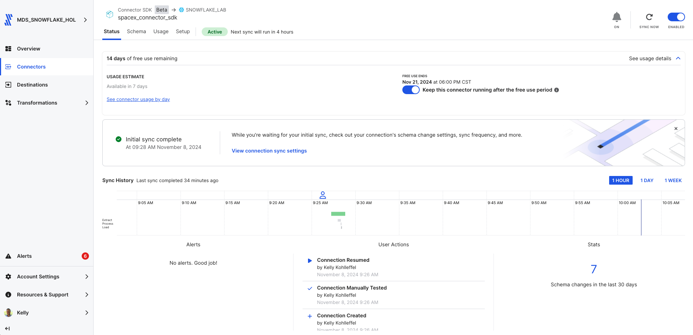

# Fivetran_Connector_SDK: SpaceX API

## Overview
This Fivetran custom connector leverages the Fivetran Connector SDK to retrieve data from the [SpaceX API](https://github.com/r-spacex/SpaceX-API/tree/master/docs), enabling syncing of comprehensive SpaceX information including launches, rockets, and capsules.

Fivetran's Connector SDK enables you to use Python to code the interaction with the SpaceX API data source. This example shows the use of a connector.py file that calls SpaceX API. From there, the connector is deployed as an extension of Fivetran. Fivetran automatically manages running the connector on your scheduled frequency and manages the required compute resources, orchestration, scaling, resyncs, and log management. In addition, Fivetran handles comprehensive writing to the destination of your choice managing retries, schema inference, security, and idempotency.

See the [Technical Reference documentation](https://fivetran.com/docs/connectors/connector-sdk/technical-reference) and [Best Practices documentation](https://fivetran.com/docs/connectors/connector-sdk/best-practices) for details.



## Attribution


This custom connector uses the SpaceX API. While attribution is not required, we acknowledge SpaceX as the data source.

For more information about the SpaceX API, please visit:
[SpaceX API Documentation](https://github.com/r-spacex/SpaceX-API)

## Features
- Retrieves comprehensive SpaceX data from SpaceX API v4
- Processes launch information including success rates and details
- Handles rocket specifications and performance data
- Tracks capsule status and reuse metrics
- Supports debug mode for local testing
- Provides detailed logging for troubleshooting
- No authentication required
- Leverages Fivetran's automatic data type inference

## API Interaction
The connector establishes interaction with SpaceX API through several key components:

### Core Functions

#### API Request Implementation
```python
base_url = "https://api.spacexdata.com/v4"
response = rq.get(f"{base_url}/launches")
```
- Uses simple GET requests to SpaceX API v4 endpoints
- Handles three main endpoints: launches, rockets, and capsules
- No authentication required
- Default timeout handling via requests library
- Native error handling for HTTP responses

#### Data Processing Functions
- Extracts details from JSON responses for each endpoint:
  ```python
  launch.get("id")
  launch.get("flight_number")
  launch.get("name")
  ```
- Processes multiple data types including strings, integers, and booleans
- Provides debug logging of processed records
- Handles data type inference through Fivetran

#### Error Handling
- Manages empty responses
- Handles missing fields gracefully
- Validates record IDs
- Logs processing details for debugging

### Data Retrieval Strategy

#### Multi-Entity Collection
- Retrieves launches data with flight details
- Collects rocket specifications and metrics
- Gathers capsule status and usage statistics

#### Response Processing 
- Field validation and extraction
- Default value handling for missing data
- Data transformation for Fivetran schema
- Automatic data type inference by Fivetran

### Security Features
- No API key required
- Safe handling of configuration data
- Protected credential management through Fivetran's infrastructure
- Secure logging practices

## Directory Structure
```
spacex/
├── __pycache__/       # Python bytecode cache directory
├── files/             # Generated directory for Fivetran files
│   ├── state.json     # State tracking for incremental syncs
│   └── warehouse.db   # Local testing database
├── images/            # Documentation images
├── connector.py       # Main connector implementation
├── debug.sh           # Debug deployment script
├── deploy.sh          # Production deployment script
├── README.md          # Project documentation
└── requirements.txt   # Python dependencies
```

## File Details

### connector.py
Main connector implementation file that handles:
- API requests and response processing
- Schema definition with Fivetran type inference
- Multi-entity data processing
- Error handling and logging

### deploy.sh
```bash
#!/bin/bash

# Find config.json by searching up through parent directories
CONFIG_PATH=$(pwd)
while [[ "$CONFIG_PATH" != "/" ]]; do
    if [[ -f "$CONFIG_PATH/config.json" ]]; then
        break
    fi
    CONFIG_PATH=$(dirname "$CONFIG_PATH")
done

# Prompt for the Fivetran Account Name
read -p "Enter your Fivetran Account Name [MDS_DATABRICKS_HOL]: " ACCOUNT_NAME
ACCOUNT_NAME=${ACCOUNT_NAME:-"MDS_DATABRICKS_HOL"}

# Read API key from config.json based on account name
API_KEY=$(jq -r ".fivetran.api_keys.$ACCOUNT_NAME" "$CONFIG_PATH/config.json")

if [ "$API_KEY" == "null" ]; then
    echo "Error: Account name not found in config.json"
    exit 1
fi

# Prompt for the Fivetran Destination Name
read -p "Enter your Fivetran Destination Name [DATABRICKS_UNITY_CATALOG_SERVERLESS]: " DESTINATION_NAME
DESTINATION_NAME=${DESTINATION_NAME:-"DATABRICKS_UNITY_CATALOG_SERVERLESS"}

# Prompt for the Fivetran Connector Name
read -p "Enter a unique Fivetran Connector Name [default-connection]: " CONNECTION_NAME
CONNECTION_NAME=${CONNECTION_NAME:-"default-connection"}

fivetran deploy --api-key "$API_KEY" --destination "$DESTINATION_NAME" --connection "$CONNECTION_NAME"
```

### debug.sh
```bash
#!/bin/bash
echo "Starting debug process..."

echo "Running fivetran reset..."
fivetran reset

echo "Creating files directory..."
mkdir -p files

echo "Contents of files directory:"
ls -la files/

echo "Running fivetran debug..."
fivetran debug
```

### images/
Contains documentation screenshots and images:
- Directory structure screenshots
- Sample output images
- Configuration examples
- Other visual documentation

## Setup Instructions

### Prerequisites
* Python 3.8+
* Fivetran Connector SDK and a virtual environment
* Fivetran Account with at least one Fivetran destination setup

### Installation Steps
1. Create the project directory structure:
```bash
mkdir -p spacex
cd spacex
```

2. Create a Python virtual environment:
```bash
python3 -m venv .venv
source .venv/bin/activate  # On Windows: .venv\Scripts\activate
```

3. Install the Fivetran Connector SDK:
```bash
pip install fivetran-connector-sdk
```

4. Create the necessary files:
```bash
touch connector.py debug.sh deploy.sh
chmod +x debug.sh deploy.sh
```

5. Set up .gitignore:
```bash
touch .gitignore
echo "files/
__pycache__/
*.pyc
.DS_Store" > .gitignore
```

## Usage

### Local Testing
1. Ensure your virtual environment is activated
2. Run the debug script:
```bash
chmod +x debug.sh
./debug.sh
```

The debug process will:
1. Reset any existing state
2. Create the files directory
3. Retrieve SpaceX data
4. Log the process details
5. Create local database files for testing

### Production Deployment
Execute the deployment script:
```bash
chmod +x deploy.sh
./deploy.sh
```

The script will:
* Find and read your Fivetran configuration
* Prompt for account details and deployment options
* Deploy the connector to your Fivetran destination

### Expected Output
The connector will:
1. Display process status
2. Show number of records retrieved
3. Print formatted tables for:
   - Launches (Flight #, Name, Date, Success)
   - Rockets (Name, Type, Active, Success Rate)
   - Capsules (Serial, Type, Status, Reuse Count)
4. Log sync statistics

## Data Tables

### launches
Primary table containing launch information:
* id (Primary Key) - inferred by Fivetran
* flight_number
* name
* date_utc
* success
* details
* rocket_id
* launchpad_id

### rockets
Primary table containing rocket information:
* id (Primary Key) - inferred by Fivetran
* name
* type
* active
* stages
* boosters
* cost_per_launch
* success_rate_pct
* description

### capsules
Primary table containing capsule information:
* id (Primary Key) - inferred by Fivetran
* serial
* status
* type
* last_update
* reuse_count
* water_landings
* land_landings

Note: All column data types are automatically inferred by Fivetran based on the data values.

## Troubleshooting

### Common Issues
1. API Response Issues:
```
Error: No data found in response
```
* Verify SpaceX API is accessible
* Check network connectivity

2. Directory Structure:
```
No such file or directory: 'files/warehouse.db'
```
* Ensure debug.sh has created the files directory
* Check file permissions

3. Python Environment:
```
ModuleNotFoundError: No module named 'fivetran_connector_sdk'
```
* Verify virtual environment is activated
* Reinstall SDK if necessary

## Security Notes
* Use .gitignore to prevent accidental commits of sensitive files
* Keep your virtual environment isolated from other projects
* Follow Fivetran's security best practices for deployment

## Development Notes
* Make code changes in connector.py
* Test changes using debug.sh
* Monitor logs for any issues
* Use the Fivetran SDK documentation for reference

## Support
For issues or questions:
1. Check the [SpaceX API Documentation](https://github.com/r-spacex/SpaceX-API/tree/master/docs)
2. Review the [Fivetran Connector SDK Documentation](https://fivetran.com/docs/connectors/connector-sdk)
3. Contact your organization's Fivetran administrator

## Using the new SpaceX dataset - Visualization 1

### From a Databricks Notebook

1. Copy and paste into cell 1 (update with your Unity Catalog and your schema name)

```
from pyspark.sql.functions import year, count, sum, when, col, round

# Read the data from Unity Catalog
df = spark.table("`ts-catalog-demo`.spacex_0103_1047.launches")

# Create a visualization of success rate by year
display(df.withColumn("year", year("date_utc"))
         .groupBy("year")
         .agg(
            count("*").alias("total_launches"),
            sum(when(col("success") == 1, 1).otherwise(0)).alias("successful_launches")
         )
         .withColumn("success_rate", 
                    round((col("successful_launches") / col("total_launches")) * 100, 2))
         .orderBy("year"))
```

2. Click on the "+" to the right of "Table" and select visualization and then customize as needed.

### Visualization Settings

1. Select visualization icon (bar chart)
2. Choose "Line Chart"
3. Configure settings:
   * X-axis: year
   * Y-axis: success_rate
   * Series groupings: none
   * Point labels: On
   * Y-axis range: 0-100
   * Title: "SpaceX Launch Success Rate by Year (%)"

### Customization
* Line color: SpaceX red (#FF0000)
* Line thickness: 2px
* Enable grid lines
* Y-axis label: "Success Rate (%)"

This visualization tells the story of SpaceX's journey from early challenges to consistent success in their launch program.


## Using the new SpaceX dataset - Visualization 2: Launch Volume and Success Rate

### From a Databricks Notebook

1. Copy and paste into cell 2 (update with your Unity Catalog and your schema name)

```python
from pyspark.sql.functions import year, count, sum, when, col, round

# Read the data from Unity Catalog
df = spark.table("`ts-catalog-demo`.spacex_0103_1047.launches")

# Create visualization combining launch volume and success rate
display(df.withColumn("year", year("date_utc"))
         .groupBy("year")
         .agg(
            count("*").alias("total_launches"),
            sum(when(col("success") == 1, 1).otherwise(0)).alias("successful_launches"),
            round((sum(when(col("success") == 1, 1).otherwise(0)) / count("*")) * 100, 2).alias("success_rate")
         )
         .orderBy("year"))
```

2. Click on the "+" to the right of "Table" and select visualization and then customize as needed.

### Visualization Settings

1. Select "Combination Chart"
2. Configure settings:
   * X-axis: year
   * Y-axis (left): total_launches (Bars)
   * Y-axis (right): success_rate (Line)
   * Show data labels: Yes
   * Title: "SpaceX Launches: Volume and Success Rate by Year"

### Customization
* Line color: SpaceX red (#FF0000)
* Bar color: Dark Gray (#404040)
* Enable grid lines
* Left Y-axis label: "Number of Launches"
* Right Y-axis label: "Success Rate (%)"
* Show Y-axis lines: Yes

This visualization combines both launch frequency and success rate, showing how SpaceX has scaled up operations while maintaining reliability.

