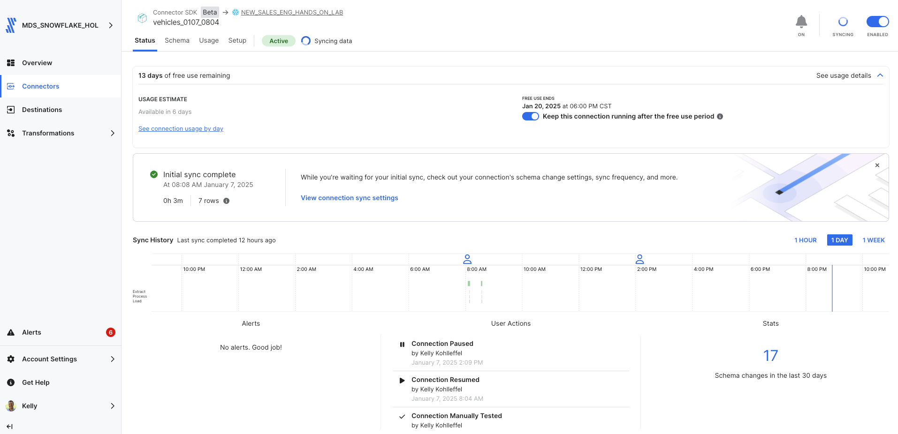
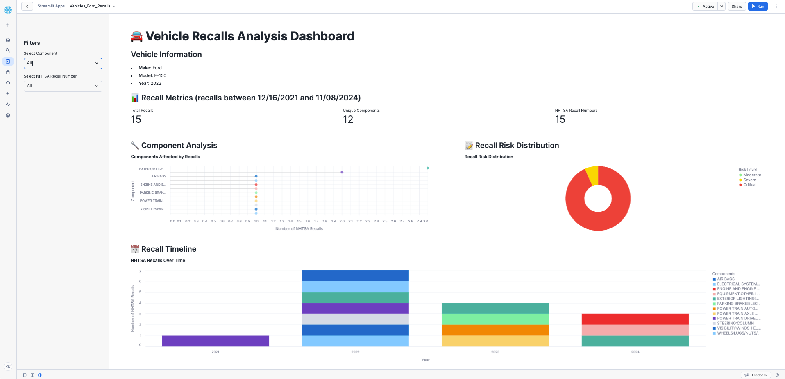

# Fivetran_Connector_SDK: NHTSA Vehicle API

## Overview
This Fivetran custom connector leverages the Fivetran Connector SDK to retrieve vehicle and recall data from the [NHTSA API](https://vpic.nhtsa.dot.gov/api/). The connector focuses on extracting a single table that includes detailed vehicle information, including make and model details, specifications, and recall notices. 

The connector uses Python to interact with the NHTSA API and is deployed as a Fivetran extension. Fivetran automatically manages the connector's execution schedule, compute resources, orchestration, scaling, resyncs, and log management. Additionally, Fivetran handles comprehensive writing to your chosen destination, managing retries, schema inference, security, and idempotency.

See the [Technical Reference documentation](https://fivetran.com/docs/connectors/connector-sdk/technical-reference#update) and [Best Practices documentation](https://fivetran.com/docs/connectors/connector-sdk/best-practices) for details.



## Attribution 


This custom connector uses the NHTSA API but is not endorsed or certified by the National Highway Traffic Safety Administration.

For more information about NHTSA API terms of use, please visit:
[NHTSA API Terms](https://vpic.nhtsa.dot.gov/api/)

## Features
- Retrieves comprehensive recall information for specified makes and models
- Tracks recall notices including:
  - Campaign numbers and dates
  - Components affected
  - Detailed summaries
  - Consequences and remedies
- Implements robust error handling and retry mechanisms
- Supports incremental updates through state tracking
- Includes comprehensive logging for troubleshooting
- Configurable make/model filtering
- Interactive Streamlit in Snowflake data app

## API Interaction

### Core Functions

#### rate_limit_api_call()
Makes API calls with built-in rate limiting and retry logic:
```python
max_retries = 3
retry_delay = 1  # seconds
```
- Implements automatic retry with exponential backoff
- Handles API errors and timeouts
- Provides detailed request logging

#### get_vehicle_recalls()
Fetches recall data for specific vehicle combinations:
```python
url = f"https://api.nhtsa.gov/recalls/recallsByVehicle"
params = {
    "make": make,
    "model": model,
    "modelYear": year,
    "format": "json"
}
```
- Retrieves comprehensive recall information
- Includes campaign numbers and dates
- Provides detailed consequences and remedies

### Data Retrieval Strategy

#### Data Collection
- Maintains configurable make/model filtering
- Processes vehicle data based on user configuration
- Collects comprehensive recall information

#### Response Processing
Each API response is processed with:
- Validation of response structure
- Extraction of relevant recall information
- Proper error handling and logging

#### Update Function Implementation
The update function orchestrates a streamlined data sync process:
1. Configuration Handling
  - Loads vehicle configuration that is set in connector.py
  - Validates make, model, and year parameters
  - Prepares API request parameters

2. Recall Data Retrieval
  - Makes rate-limited API calls to NHTSA's recall endpoint
  - Processes JSON responses into structured data
  - Handles empty results and API errors

3. Data Transformation and Upsert
  - Creates standardized recall records
  - Enriches records with make and model information
  - Performs direct upserts to vehicle_recalls table
  - Maintains proper data relationships

4. State Management
  - Tracks sync progress
  - Updates checkpoint state
  - Ensures incremental updates work correctly

This approach provides:
- Direct data flow
- Reduced complexity
- Easier maintenance
- Better error handling
- Clearer logging and monitoring

### Error Handling

#### Network Issues
- Implements retry logic for failed requests
- Provides configurable retry attempts
- Handles API timeouts gracefully

#### Data Validation
- Validates required fields in responses
- Handles missing or null values
- Provides detailed error logging

### Performance Optimization

#### Request Management
- Maximum 3 retry attempts for failed API calls
- Exponential backoff for retries with 1 second base delay
- Detailed request logging for monitoring
- Graceful handling of API timeouts

#### Data Processing
- Direct data transformation from API to records
- Single-table architecture reduces overhead
- Efficient memory usage through generator pattern
- Comprehensive logging for debugging
- Clean state management
- Exception handling at every step
- Validation of required fields before processing

## Directory Structure
```
vehicles/
├── __pycache__/
├── files/
│   ├── state.json
│   └── warehouse.db
├── images/
├── connector.py
├── debug.sh
├── deploy.sh
├── README.md
```
## File Details

### connector.py
Main connector implementation handling:
- API authentication and requests
- Data retrieval and filters
- Schema definition
- Error handling and logging

### deploy.sh
```bash
#!/bin/bash

# Locate the root-level config.json file
ROOT_CONFIG="config.json"
CONFIG_PATH=$(pwd)
while [[ "$CONFIG_PATH" != "/" ]]; do
    if [[ -f "$CONFIG_PATH/$ROOT_CONFIG" ]]; then
        break
    fi
    CONFIG_PATH=$(dirname "$CONFIG_PATH")
done

# Validate the root config.json file exists
if [[ ! -f "$CONFIG_PATH/$ROOT_CONFIG" ]]; then
    echo "Error: Root config.json not found!"
    exit 1
fi

# Prompt for the Fivetran Account Name
read -p "Enter your Fivetran Account Name [MDS_SNOWFLAKE_HOL]: " ACCOUNT_NAME
ACCOUNT_NAME=${ACCOUNT_NAME:-"MDS_SNOWFLAKE_HOL"}

# Fetch the API key from config.json
API_KEY=$(jq -r ".fivetran.api_keys.$ACCOUNT_NAME" "$CONFIG_PATH/$ROOT_CONFIG")
if [[ "$API_KEY" == "null" ]]; then
    echo "Error: Account name not found in $ROOT_CONFIG!"
    exit 1
fi

# Prompt for the Fivetran Destination Name
read -p "Enter your Fivetran Destination Name [NEW_SALES_ENG_HANDS_ON_LAB]: " DESTINATION_NAME
DESTINATION_NAME=${DESTINATION_NAME:-"NEW_SALES_ENG_HANDS_ON_LAB"}

# Prompt for the Fivetran Connector Name
read -p "Enter a unique Fivetran Connector Name [default-connection]: " CONNECTION_NAME
CONNECTION_NAME=${CONNECTION_NAME:-"default-connection"}

# Deploy the connector using the configuration file
echo "Deploying connector..."
fivetran deploy --api-key "$API_KEY" --destination "$DESTINATION_NAME" --connection "$CONNECTION_NAME"
```

### debug.sh
```bash
#!/bin/bash
echo "Starting debug process..."

# Ensure files directory exists
echo "Ensuring files directory exists..."
mkdir -p files

# List contents of the files directory
echo "Contents of files directory:"
ls -la files/

# Run fivetran debug
echo "Running fivetran debug..."
fivetran debug

echo "Debug process complete."
```

### files/state.json
Tracks the state of incremental syncs.

### files/warehouse.db
DuckDB database used for local testing.

### images/
Contains documentation screenshots and images.

## Configuration
The connector is preconfigured with the following default values in `connector.py`:

    make_name = "toyota"       # Set the vehicle make
    model_filter = "tundra"    # Set the vehicle model
    start_year = 2022          # Set the starting year
    end_year = 2022            # Set the ending year

To customize the configuration:

1. Open `connector.py`.
2. Update the values for `make_name`, `model_filter`, `start_year`, and `end_year` directly in the script.
3. Save your changes.
4. Run `debug.sh` to test the new configuration or `deploy.sh` to deploy the updated connector.

### Example NHTSA Database Verified Make/Model Combinations (2022 Model Year)

| Make          | Model        | Vehicle Type    | Origin    |
|---------------|--------------|-----------------|-----------|
| Toyota        | Camry        | Sedan          | Japan     |
| Toyota        | RAV4         | SUV            | Japan     |
| Toyota        | Tundra       | Pickup         | Japan     |
| Honda         | Civic        | Sedan          | Japan     |
| Honda         | CR-V         | SUV            | Japan     |
| Honda         | Accord       | Sedan          | Japan     |
| Ford          | F-150        | Pickup         | USA       |
| Ford          | Mustang      | Coupe          | USA       |
| Ford          | Explorer     | SUV            | USA       |
| Chevrolet     | Silverado    | Pickup         | USA       |
| Chevrolet     | Malibu       | Sedan          | USA       |
| Chevrolet     | Equinox      | SUV            | USA       |
| Nissan        | Altima       | Sedan          | Japan     |
| Nissan        | Rogue        | SUV            | Japan     |
| Nissan        | Sentra       | Sedan          | Japan     |
| BMW           | 330i         | Sedan          | Germany   |
| BMW           | X5           | SUV            | Germany   |
| Mercedes-Benz | C300         | Sedan          | Germany   |
| Mercedes-Benz | GLE          | SUV            | Germany   |
| Lexus         | ES           | Sedan          | Japan     |
| Lexus         | RX           | SUV            | Japan     |
| Jeep          | Wrangler     | SUV            | USA       |
| Jeep          | Cherokee     | SUV            | USA       |
| Hyundai       | Sonata       | Sedan          | Korea     |
| Hyundai       | Tucson       | SUV            | Korea     |
| Ram           | 1500         | Pickup         | USA       |
| Ram           | 2500         | Pickup         | USA       |
| Chrysler      | Pacifica     | Minivan        | USA       |
| Dodge         | Challenger   | Coupe          | USA       |
| Cadillac      | Escalade     | SUV            | USA       |

Note: All combinations have been verified in the NHTSA database for the **2022** model year.

Important Notes:
- Configuration changes must be made in connector.py before running debug or deployment
    -  Make Name: `toyota`
    - Model Filter: `tundra`
    - Start Year: `2022`
    - End Year: `2022`
- Make names and model names are case-insensitive
- Only one model can be selected at a time unless using "ALL"
- Year range must be between 1995 and 2024
- Test combinations with NHTSA API to ensure data availability
- Configuration values cannot be modified in the Fivetran UI after deployment

### Verifying Make/Model Combinations in NHTSA Database

You can verify if a make/model combination exists in the NHTSA database using their public API tool:

1. Visit the NHTSA vPIC API website:
   `https://vpic.nhtsa.dot.gov/api/`

2. Scroll down to the "GetModelsForMakeYear" endpoint
   - This endpoint lets you check which models exist for a specific make and year

3. Click on the endpoint to expand it and see the example URL:
   `https://vpic.nhtsa.dot.gov/api/vehicles/GetModelsForMakeYear/make/honda/modelyear/2022?format=json`

4. Modify the URL with your desired:
   - make (e.g., change 'honda' to your desired manufacturer)
   - modelyear (e.g., change '2022' to your desired year)
   - keep '?format=json' at the end

5. Paste the modified URL into your browser
   - The response will show all models available for that make/year
   - Look for your desired model in the "Model_Name" field of the results

Example URLs:
```
Honda Civic 2022:
https://vpic.nhtsa.dot.gov/api/vehicles/GetModelsForMakeYear/make/honda/modelyear/2022?format=json

Toyota Tundra 2022:
https://vpic.nhtsa.dot.gov/api/vehicles/GetModelsForMakeYear/make/toyota/modelyear/2022?format=json
```

Note: The make and model names in the URL are case-insensitive, so "HONDA", "Honda", and "honda" will all work.

## Setup Instructions

### Prerequisites
- Python 3.8+
- Fivetran Connector SDK and a virtual environment
- NHTSA API access
- Fivetran Account with destination configured

### Installation Steps
1. Create project directory:
    ```bash
    mkdir -p vehicles
    cd vehicles
    ```

2. Create virtual environment:
    ```bash
    python3 -m venv .venv
    source .venv/bin/activate  # Windows: .venv\Scripts\activate
    ```

3. Install SDK:
    ```bash
    pip install fivetran-connector-sdk requests
    ```

4. Clone the repository or create necessary files:
    ```bash
    git clone <repository-url> .  # If applicable
    touch connector.py
    ```

5. Create debug script:
    ```bash
    #!/bin/bash
    echo "Starting debug process..."

    # Clear Python cache
    echo "Clearing Python cache..."
    find . -type d -name "__pycache__" -exec rm -r {} +

    # Run fivetran reset
    echo "Running fivetran reset..."
    fivetran reset

    # Ensure files directory exists
    echo "Ensuring files directory exists..."
    mkdir -p files

    # List contents of the files directory
    echo "Contents of files directory:"
    ls -la files/

    # Run fivetran debug
    echo "Running fivetran debug..."
    fivetran debug

    echo "Debug process complete."
    ```

    Note: The debug.sh script includes cache clearing to ensure configuration changes are properly picked up between runs.

## Usage

### Update connector.py with your desired vehicle

To configure the connector for your desired vehicle, edit the following section in `connector.py`:

```python
# Extract parameters from configuration
make_name = "toyota"       # Set the vehicle make
model_filter = "tundra"    # Set the vehicle model
start_year = 2022          # Set the starting year
end_year = 2022            # Set the ending year
```

### Local Testing
```bash
chmod +x debug.sh
./debug.sh
```

The debug process will:
1. Reset any existing state
2. Create the files directory
3. Retrieve NHTSA vehicle data
4. Log the process details
5. Create local database files for testing

### Production Deployment
```bash
chmod +x deploy.sh
./deploy.sh
```

The script will:
- Find and read your Fivetran configuration
- Prompt for account details and deployment options
- Deploy the connector to your Fivetran destination

### Expected Output
The connector will:
1. Reset any existing state
2. Create the files directory
3. Retrieve recall data for the configured make/model/year
4. Process NHTSA API data following rate limits:
  - Maximum 3 retry attempts
  - Exponential backoff for failures
5. Store extracted data in vehicle_recalls table
6. Log detailed process information:
  - API request details
  - Records processed
  - Data validation results
  - Error handling
7. Create local database files for testing:
  - warehouse.db
  - state.json

Expected output will show successful:
- Schema creation
- Data extraction
- Record processing
- State management

## Data Tables

### vehicle_recalls
Primary table containing recall information:
```python
{
    "recall_id": str,              # Primary Key (NHTSACampaignNumber)
    "make_name": str,              # Vehicle manufacturer
    "model_name": str,             # Vehicle model
    "campaign_number": str,        # NHTSA Campaign Number
    "report_received_date": str,   # Date recall was reported
    "component": str,              # Affected component
    "summary": str,                # Recall description
    "consequence": str,            # Potential consequences
    "remedy": str,                 # Fix/remedy details
    "notes": str                   # Additional information
}
```

Note: The NHTSA API provides comprehensive recall data that may include additional fields not listed here.

## Troubleshooting

### Common Issues

1. API Connection Issues:
```
API request failed with status 404
```
- Verify make/model combination exists in NHTSA database and check spelling
- Check API endpoint URLs

2. Configuration Issues:
```
Invalid configuration parameters
```
- Check make/model filters

3. Python Environment:
```
ModuleNotFoundError: No module named 'fivetran_connector_sdk'
```
- Verify virtual environment is activated
- Reinstall SDK if necessary

## Security Notes
- Use .gitignore for sensitive files
- Keep your virtual environment isolated from other projects
- Monitor API usage and rate limits
- Follow Fivetran's security best practices for deployment

## Development Notes
- Make code changes in connector.py 
- Monitor rate limiting carefully
- Test changes using debug.sh
- Monitor logs for issues
- Follow NHTSA API guidelines
- Use the Fivetran SDK documentation

## Support
For issues or questions:
1. Check [NHTSA API Documentation](https://vpic.nhtsa.dot.gov/api/)
2. Review [Fivetran Connector SDK Documentation](https://fivetran.com/docs/connectors/connector-sdk)
3. Contact your Fivetran administrator

## Using the Vehicles Dataset - NHTSA Recall Analysis Data Application

This Streamlit in Snowflake application provides interactive analysis of vehicle recall data with the following features:

### Streamlit in Snowflake Data App Components
1. Vehicle Information Display
   - Make, Model, and Year information
   - Date range of available recalls

2. Interactive Filters
   - Component selection
   - NHTSA Recall Number selection

3. Key Metrics
   - Total Recalls
   - Unique Components
   - NHTSA Recall Numbers

4. Visualizations
   - Component Analysis (Lollipop Chart)
   - Recall Risk Distribution (Radial Chart)
   - Recall Timeline (Stacked Bar Chart)
   - Detailed Recall Information Table

### Streamlit in Snowflake Implementation Notes
- Requires that you set your Streamlit in Snowflake database and schema context
- Leverages the vehicle_recalls table
- Implements responsive layout
- Provides comprehensive error handling

### Streamlit in Snowflake Code Block

```python
# Vehicle Recalls Analysis Application
# A Streamlit in Snowflake application visualizing NHTSA vehicle recall data.
import streamlit as st
import pandas as pd
import altair as alt
from snowflake.snowpark.context import get_active_session

# Set page configuration
st.set_page_config(page_title="Vehicle Recalls Analysis App", layout="wide")

# Get the active Snowflake session
session = get_active_session()

# Load data functions
def load_recall_data():
    return session.sql("""
        SELECT 
            RECALL_ID,
            CAMPAIGN_NUMBER,
            TO_DATE(REPORT_RECEIVED_DATE, 'DD/MM/YYYY') as REPORT_RECEIVED_DATE,
            COMPONENT,
            SUMMARY,
            CONSEQUENCE,
            REMEDY,
            MAKE_NAME,
            MODEL_NAME,
            NOTES
        FROM VEHICLE_RECALLS
        WHERE _FIVETRAN_DELETED = FALSE
    """).to_pandas()

# Main dashboard
try:
    # Load data
    with st.spinner("Loading vehicle recall data..."):
        recall_data = load_recall_data()

    # Sidebar filters
    st.sidebar.header("Filters")
    
    # Apply filters
    filtered_data = recall_data.copy()
    # Ensure filtered_data is defined before using it
    if not recall_data.empty:
        components_list = recall_data["COMPONENT"].unique().tolist()
        selected_component = st.sidebar.selectbox("Select Component", ["All"] + components_list)
        campaign_list = recall_data["CAMPAIGN_NUMBER"].unique().tolist()
        selected_campaign = st.sidebar.selectbox("Select NHTSA Recall Number", ["All"] + campaign_list)

        if selected_component != "All":
            filtered_data = filtered_data[filtered_data["COMPONENT"] == selected_component]
        if selected_campaign != "All":
            filtered_data = filtered_data[filtered_data["CAMPAIGN_NUMBER"] == selected_campaign]
    else:
        filtered_data = pd.DataFrame()  # Ensure filtered_data exists even if recall_data is empty

    # Dashboard Title and Info
    st.title("🚘 Vehicle Recalls Analysis Dashboard")

    # Extract dynamic vehicle information from the dataset
    if not filtered_data.empty:
        dynamic_make = filtered_data["MAKE_NAME"].iloc[0].capitalize()
        dynamic_model = filtered_data["MODEL_NAME"].iloc[0].capitalize()
        dynamic_year = pd.to_datetime(filtered_data["REPORT_RECEIVED_DATE"]).dt.year.mode()[0]
    else:
        dynamic_make = "N/A"
        dynamic_model = "N/A"
        dynamic_year = "N/A"

    # Subtitle section with dynamic vehicle information
    st.markdown(f"""
    ### Vehicle Information
    - **Make:** {dynamic_make}
    - **Model:** {dynamic_model}
    - **Year:** {dynamic_year}
    """)

    # Summary metrics section with date range
    if not filtered_data.empty:
        oldest_recall = filtered_data['REPORT_RECEIVED_DATE'].min().strftime('%m/%d/%Y')
        newest_recall = filtered_data['REPORT_RECEIVED_DATE'].max().strftime('%m/%d/%Y')
    
        st.subheader(f"📊 Recall Metrics (recalls between {oldest_recall} and {newest_recall})")
        total_recalls = len(filtered_data)
        unique_components = filtered_data["COMPONENT"].nunique()
        unique_campaigns = filtered_data["CAMPAIGN_NUMBER"].nunique()

        metric_col1, metric_col2, metric_col3 = st.columns(3)
        with metric_col1:
            st.metric("Total Recalls", f"{total_recalls:,}")
        with metric_col2:
            st.metric("Unique Components", unique_components)
        with metric_col3:
            st.metric("NHTSA Recall Numbers", unique_campaigns)

        st.markdown("<div style='margin-bottom: 30px;'></div>", unsafe_allow_html=True)

        # Create layout columns with padding
        col1, spacer, col2 = st.columns([1, 0.1, 1])
        
        # Component Analysis in col1
        with col1:
            st.subheader("🔧 Component Analysis")
            component_chart_data = (
                filtered_data.groupby("COMPONENT").size().reset_index(name="Recall_Count")
            )
            total = component_chart_data["Recall_Count"].sum()
            component_chart_data["Percentage"] = (component_chart_data["Recall_Count"] / total * 100).round(1)
        
            line_chart = alt.Chart(component_chart_data).mark_rule(color='lightgray').encode(
                x=alt.X('Recall_Count:Q', title="Number of NHTSA Recalls", axis=alt.Axis(grid=True)),
                y=alt.Y('COMPONENT:N', title="Component", sort='-x', axis=alt.Axis(grid=True))
            )
            point_chart = alt.Chart(component_chart_data).mark_circle(size=100).encode(
                x=alt.X('Recall_Count:Q'),
                y=alt.Y('COMPONENT:N', sort='-x'),
                color=alt.Color('COMPONENT:N', legend=None),
                tooltip=[
                    alt.Tooltip("COMPONENT:N", title="Component"),
                    alt.Tooltip("Recall_Count:Q", title="Number of NHTSA Recalls"),
                    alt.Tooltip("Percentage:Q", title="Percentage of Total", format=".1f")
                ]
            )
            component_chart = (line_chart + point_chart).properties(
                title=alt.TitleParams(text="Components Affected by Recalls", fontSize=16),
                width=500,
                height=300
            )
            st.altair_chart(component_chart, use_container_width=True)
        
        # Spacer column
        with spacer:
            st.markdown("")
        
        # Recall Analysis in col2
        with col2:
            st.subheader("📝 Recall Risk Distribution")
            def classify_risk_level(consequence):
                consequence = str(consequence).lower()
                if any(term in consequence for term in ['death', 'fatal', 'crash', 'serious', 'fire']):
                    return "Critical"
                elif any(term in consequence for term in ['injury', 'hazard', 'damage']):
                    return "Severe"
                else:
                    return "Moderate"
        
            filtered_data['RISK_LEVEL'] = filtered_data['CONSEQUENCE'].apply(classify_risk_level)
            risk_data = filtered_data['RISK_LEVEL'].value_counts().reset_index()
            risk_data.columns = ['Risk Level', 'Count']
        
            donut_chart = alt.Chart(risk_data).mark_arc(innerRadius=50).encode(
                theta=alt.Theta("Count:Q"),
                color=alt.Color("Risk Level:N", scale=alt.Scale(
                    domain=["Moderate", "Severe", "Critical"],
                    range=["#90EE90", "#FFD700", "#FF4136"]
                )),
                tooltip=["Risk Level:N", "Count:Q"]
            ).properties(
                width=300,
                height=300,
                title="Recall Risk Distribution"
            )
            st.altair_chart(donut_chart, use_container_width=True)

        # Recall Timeline
        st.subheader("📅 Recall Timeline")
        timeline_data = (
            filtered_data.groupby(["CAMPAIGN_NUMBER", "COMPONENT"])
            .agg({"REPORT_RECEIVED_DATE": "min"})
            .reset_index()
        )
        timeline_data["YEAR"] = pd.to_datetime(timeline_data["REPORT_RECEIVED_DATE"]).dt.year

        timeline_chart = alt.Chart(timeline_data).mark_bar().encode(
            x=alt.X("YEAR:O", title="Year", axis=alt.Axis(labelAngle=0)),
            y=alt.Y("count(CAMPAIGN_NUMBER):Q", title="Number of NHTSA Recalls"),
            color=alt.Color("COMPONENT:N", title="Component", legend=alt.Legend(title="Components")),
            tooltip=[
                alt.Tooltip("YEAR:O", title="Year"),
                alt.Tooltip("COMPONENT:N", title="Component"),
                alt.Tooltip("count(CAMPAIGN_NUMBER):Q", title="Recall Count"),
            ]
        ).properties(
            width=900,
            height=400,
            title="NHTSA Recalls Over Time"
        )
        st.altair_chart(timeline_chart, use_container_width=True)

        # Recall Details
        st.subheader("🔍 Recall Details")
        with st.expander("View Detailed Recall Information"):
            st.dataframe(filtered_data[["CAMPAIGN_NUMBER", "COMPONENT", "SUMMARY", "CONSEQUENCE", "REMEDY"]])

except Exception as e:
    st.error(f"An error occurred: {str(e)}")
```
### Streamlit in Snowflake Data App
