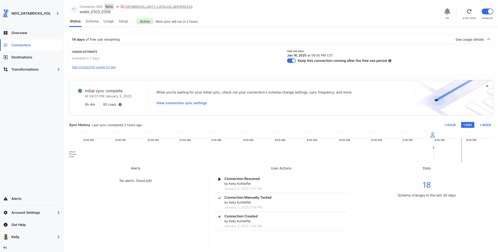
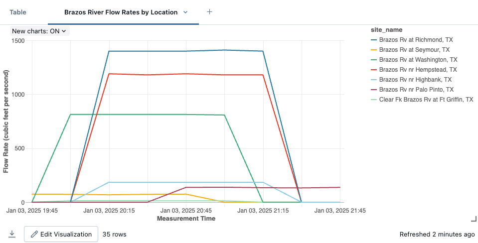
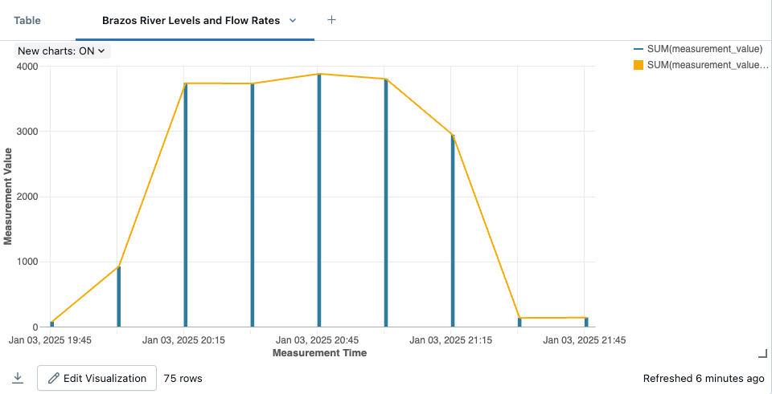

# Fivetran_Connector_SDK: USGS Water Services API

## Overview
This Fivetran custom connector leverages the Fivetran Connector SDK to retrieve data from the [USGS Water Services API](https://waterservices.usgs.gov/docs/), enabling syncing of comprehensive water data including streamflow, gauge height, and water temperature measurements from multiple Brazos River monitoring sites in Texas.

Fivetran's Connector SDK enables you to use Python to code the interaction with the USGS Water Services API data source. This example shows the use of a connector.py file that calls USGS Water Services API. From there, the connector is deployed as an extension of Fivetran. Fivetran automatically manages running the connector on your scheduled frequency and manages the required compute resources, orchestration, scaling, resyncs, and log management. In addition, Fivetran handles comprehensive writing to the destination of your choice managing retries, schema inference, security, and idempotency.

See the [Technical Reference documentation](https://fivetran.com/docs/connectors/connector-sdk/technical-reference) and [Best Practices documentation](https://fivetran.com/docs/connectors/connector-sdk/best-practices) for details.



## Attribution


This custom connector uses the USGS Water Services API. Data provided by the United States Geological Survey.

For more information about the USGS Water Services, please visit:
[USGS Water Services](https://waterservices.usgs.gov/)

## Features
- Retrieves water data from eight Brazos River monitoring sites
- Collects three key measurements:
  - Streamflow (discharge)
  - Gauge height
  - Water temperature (auto-converted from Celsius to Fahrenheit)
- Implements 10-day data window retrieval
- Displays 5 most recent measurements per parameter
- Tracks site metadata including location and elevation
- Supports debug mode for local testing
- Provides detailed logging for troubleshooting
- No authentication required
- Leverages Fivetran's automatic data type inference

## API Interaction
The connector establishes interaction with USGS Water Services API through several key components:

### Core Functions

#### API Request Implementation
```python
base_url = "https://waterservices.usgs.gov/nwis/iv"
params = {
    "format": "json",
    "sites": site_filter,
    "startDT": start_time.strftime("%Y-%m-%dT%H:%M%z"),
    "endDT": end_time.strftime("%Y-%m-%dT%H:%M%z"),
    "parameterCd": "00060,00065,00010",  # Discharge, Gauge height, Temperature
    "siteStatus": "active"
}
response = rq.get(base_url, params=params)
```
- Uses parameterized GET requests to USGS endpoint
- Handles multiple site codes
- Supports date range filtering
- No authentication required
- Default timeout handling via requests library

#### Data Processing Functions
- Extracts site and measurement details from JSON response
- Handles temperature conversion:
  ```python
  def celsius_to_fahrenheit(celsius):
      return (celsius_float * 9/5) + 32
  ```
- Processes multiple parameter types
- Maintains most recent measurements
- Provides debug logging of processed records

#### Error Handling
- Manages empty responses
- Validates measurement values
- Handles missing data fields
- Logs processing details for debugging

### Data Retrieval Strategy

#### Multi-Site Collection
- Retrieves data for eight Brazos River locations
- Processes three measurement parameters
- Implements 10-day rolling window
- Tracks site metadata

#### Response Processing 
- Field validation and extraction
- Default value handling for missing data
- Temperature unit conversion
- Data transformation for Fivetran schema

### Security Features
- No API key required
- Safe handling of configuration data
- Protected credential management through Fivetran's infrastructure
- Secure logging practices

## Directory Structure
```
water/
├── pycache/           # Python bytecode cache directory
├── files/             # Generated directory for Fivetran files
│   ├── state.json     # State tracking for incremental syncs
│   └── warehouse.db   # Local testing database
├── images/            # Documentation images
├── connector.py       # Main connector implementation
├── debug.sh           # Debug deployment script
├── deploy.sh          # Production deployment script
├── README.md          # Project documentation
└── requirements.txt   # Python dependencies
```

## File Details

### connector.py
Main connector implementation file that handles:
- API requests and response processing
- Multi-site data collection
- Temperature conversion
- Error handling and logging

### deploy.sh
```bash
#!/bin/bash

# Find config.json by searching up through parent directories
CONFIG_PATH=$(pwd)
while [[ "$CONFIG_PATH" != "/" ]]; do
    if [[ -f "$CONFIG_PATH/config.json" ]]; then
        break
    fi
    CONFIG_PATH=$(dirname "$CONFIG_PATH")
done

# Prompt for the Fivetran Account Name
read -p "Enter your Fivetran Account Name [MDS_DATABRICKS_HOL]: " ACCOUNT_NAME
ACCOUNT_NAME=${ACCOUNT_NAME:-"MDS_DATABRICKS_HOL"}

# Read API key from config.json based on account name
API_KEY=$(jq -r ".fivetran.api_keys.$ACCOUNT_NAME" "$CONFIG_PATH/config.json")

if [ "$API_KEY" == "null" ]; then
    echo "Error: Account name not found in config.json"
    exit 1
fi

# Prompt for the Fivetran Destination Name
read -p "Enter your Fivetran Destination Name [ADLS_UNITY_CATALOG]: " DESTINATION_NAME
DESTINATION_NAME=${DESTINATION_NAME:-"ADLS_UNITY_CATALOG"}

# Prompt for the Fivetran Connector Name
read -p "Enter a unique Fivetran Connector Name [default-connection]: " CONNECTION_NAME
CONNECTION_NAME=${CONNECTION_NAME:-"default-connection"}

fivetran deploy --api-key "$API_KEY" --destination "$DESTINATION_NAME" --connection "$CONNECTION_NAME"
```
### debug.sh
```bash
#!/bin/bash
echo "Starting debug process..."

echo "Running fivetran reset..."
fivetran reset

echo "Creating files directory..."
mkdir -p files

echo "Contents of files directory:"
ls -la files/

echo "Running fivetran debug..."
fivetran debug
```

### images/
Contains documentation screenshots and images:
- Directory structure screenshots
- Sample output images
- Configuration examples
- Other visual documentation

## Setup Instructions

### Prerequisites
* Python 3.8+
* Fivetran Connector SDK
* Fivetran Account with at least one Fivetran destination setup

### Installation Steps
1. Create the project directory structure:
```bash
mkdir -p weather
cd weather
```

2. Create a Python virtual environment:
```bash
python3 -m venv .venv
source .venv/bin/activate  # On Windows: .venv\Scripts\activate
```

3. Install the Fivetran Connector SDK:
```bash
pip install fivetran-connector-sdk
```

4. Create the necessary files:
```bash
touch connector.py debug.sh deploy.sh
chmod +x debug.sh deploy.sh
```

5. Set up .gitignore:
```bash
touch .gitignore
echo "files/
__pycache__/
*.pyc
.DS_Store" > .gitignore
```

## Usage

### Local Testing
1. Ensure your virtual environment is activated
2. Run the debug script:
```bash
chmod +x debug.sh
./debug.sh
```

The debug process will:
1. Reset any existing state
2. Create the files directory
3. Retrieve weather forecast data
4. Log the process details
5. Create local database files for testing

### Production Deployment
Execute the deployment script:
```bash
chmod +x deploy.sh
./deploy.sh
```

The script will:
* Find and read your Fivetran configuration
* Prompt for account details and deployment options
* Deploy the connector to your Fivetran destination

### Expected Output
The connector will:
1. Display process status
2. Show number of sites and measurements retrieved
3. Print formatted tables for:
  - Site Code
  - Site Name
  - Parameter
  - Value
  - Unit
  - Time
4. Log sync statistics

## Data Tables

### sites
Primary table containing monitoring station information:
* site_code (STRING, Primary Key) - inferred by Fivetran
* site_name (STRING)
* latitude (FLOAT)
* longitude (FLOAT)
* county (STRING)
* elevation (FLOAT)

### measurements
Primary table containing water measurements:
* id (STRING, Primary Key) - inferred by Fivetran
* site_code (STRING)
* site_name (STRING)
* parameter_code (STRING)
* parameter_name (STRING)
* value (FLOAT)
* unit (STRING)
* measurement_time (TIMESTAMP)
* quality_code (STRING)

Note: All column data types are automatically inferred by Fivetran based on the data values.

## Troubleshooting

### Common Issues
1. API Response Issues:
```
Error: No data received from USGS API
```
* Verify USGS Water Services API is accessible
* Check site codes are valid
* Verify date range parameters

2. Directory Structure:
```
No such file or directory: 'files/warehouse.db'
```
* Ensure debug.sh has created the files directory
* Check file permissions

3. Python Environment:
```
ModuleNotFoundError: No module named 'fivetran_connector_sdk'
```
* Verify virtual environment is activated
* Reinstall SDK if necessary

## Security Notes
* Use .gitignore to prevent accidental commits of sensitive files
* Keep your virtual environment isolated from other projects
* Follow Fivetran's security best practices for deployment

## Development Notes
* Make code changes in connector.py
* Test changes using debug.sh
* Monitor logs for any issues
* Use the Fivetran SDK documentation for reference

## Support
For issues or questions:
1. Check the [USGS Water Services API Documentation](https://waterservices.usgs.gov/docs/)
2. Review the [Fivetran Connector SDK Documentation](https://fivetran.com/docs/connectors/connector-sdk)
3. Contact your organization's Fivetran administrator

## Using the new Water dataset - Visualization 1: Flow Rate Analysis

### From a Databricks Notebook

1. Copy and paste into cell 1 (update with your Unity Catalog and your schema name)
```python
from pyspark.sql.functions import *

# Read the data from Unity Catalog
df = spark.table("`ts-catalog-demo`.`water_0103_0356`.`measurements`")

# Create visualization of flow rates by site
display(df.filter(col("parameter_code") == "00060")  # Streamflow data
         .groupBy("site_name", "measurement_time")
         .agg(avg("value").alias("flow_rate"))
         .orderBy("measurement_time"))
```
2. Click on the "+" to the right of "Table" and select visualization and then customize as needed.

### Visualization Settings
1. Select "Line Chart"
2. Configure settings:
  * X-axis: measurement_time
  * Y-axis: flow_rate
  * Series grouping: site_name
  * Show data labels: No
  * Title: "Brazos River Flow Rates by Location"

### Customization
* Multiple line colors for different sites  
* Enable grid lines
* Y-axis label: "Flow Rate (cubic feet per second)"
* X-axis label: "Measurement Time"

This visualization shows flow rate variations across different Brazos River monitoring sites, helping identify patterns in water flow throughout the river system.



## Using the new Water dataset - Visualization 2: Water Levels and Flow

### From a Databricks Notebook

1. Copy and paste into cell 2 (update with your Unity Catalog and your schema name)
```python
from pyspark.sql.functions import *

# Read the data from Unity Catalog
df = spark.table("`ts-catalog-demo`.`water_0103_0356`.`measurements`")

# Create visualization combining gauge height and streamflow
display(df.filter(col("parameter_code").isin(["00060", "00065"]))  # Streamflow and Gage height
         .groupBy("site_name", "parameter_code", "measurement_time")
         .agg(avg("value").alias("measurement_value"))
         .orderBy("measurement_time"))
```
2. Click on the "+" to the right of "Table" and select visualization and then customize as needed.

### Visualization Settings
1. Select "Combination Chart"
2. Configure settings:
  * X-axis: measurement_time
  * Y-axis (left): measurement_value (when parameter_code = "00060")
  * Y-axis (right): measurement_value (when parameter_code = "00065")
  * Series grouping: parameter_code, site_name
  * Title: "Brazos River Water Levels and Flow Rates"

### Customization
* Flow rate lines: Blue shades
* Gauge height lines: Green shades
* Enable grid lines
* Left Y-axis label: "Streamflow (cubic feet per second)"
* Right Y-axis label: "Gauge Height (feet)"

This visualization combines flow rates and water levels, showing the relationship between these measurements at different monitoring sites.



## Bonus: Finding USGS Sites

Want to monitor different USGS water monitoring sites? Here's how to find site codes:

1. Visit the [USGS Site Mapper](https://maps.waterdata.usgs.gov/mapper/)

2. Using the Site Mapper:
   * Zoom to your area of interest
   * Click on a monitoring site (shown as dots on the map)
   * Note the Site Number in the popup window

3. Update the sites array in connector.py:
```python
brazos_river_sites = [
    "08098450",  # Brazos River at Hearne, TX
    "YOUR_NEW_SITE_CODE"  # Your new site description
]
```

4. Key Parameters:
   * 00060: Discharge (flow rate)
   * 00065: Gauge height (water level)
   * 00010: Temperature

Note: Make sure your selected sites monitor the parameters you're interested in, as not all sites measure all parameters.
