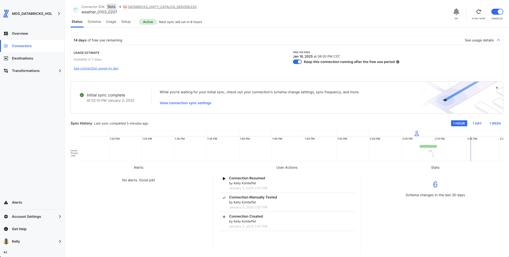
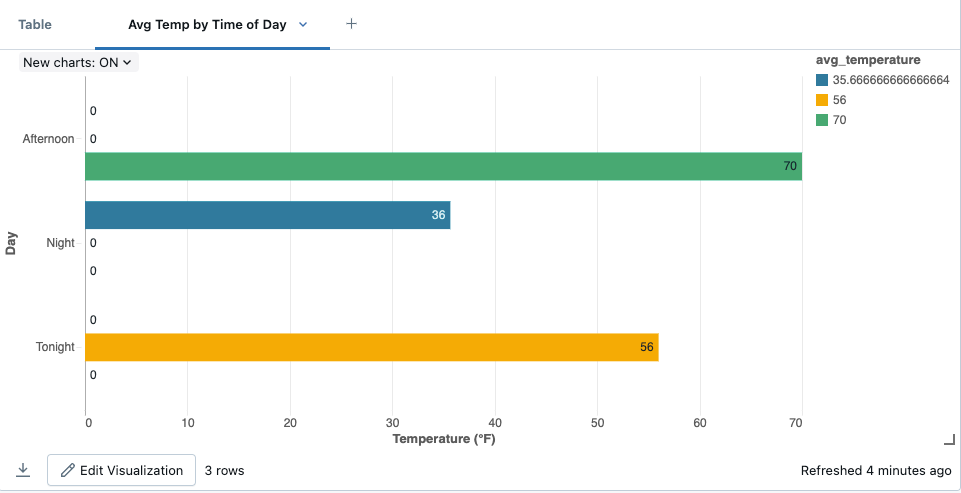
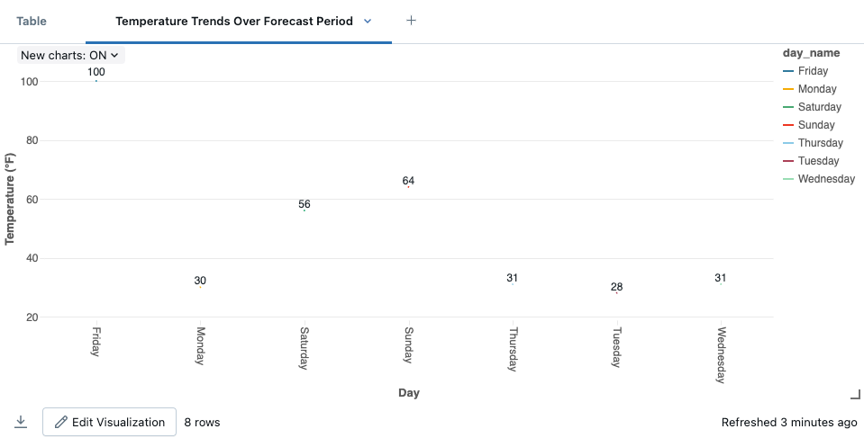

# Fivetran_Connector_SDK: Weather API

## Overview
This Fivetran custom connector leverages the Fivetran Connector SDK to retrieve data from the [National Weather Service API](https://www.weather.gov/documentation/services-web-api), enabling syncing of comprehensive weather forecast information including temperature data and forecast periods. This example uses gridpoints for Cypress, TX (HGX/52,106) but can be customized for any location.

Fivetran's Connector SDK enables you to use Python to code the interaction with the Weather API data source. This example shows the use of a connector.py file that calls Weather API. From there, the connector is deployed as an extension of Fivetran. Fivetran automatically manages running the connector on your scheduled frequency and manages the required compute resources, orchestration, scaling, resyncs, and log management. In addition, Fivetran handles comprehensive writing to the destination of your choice managing retries, schema inference, security, and idempotency.

See the [Technical Reference documentation](https://fivetran.com/docs/connectors/connector-sdk/technical-reference) and [Best Practices documentation](https://fivetran.com/docs/connectors/connector-sdk/best-practices) for details.



## Attribution


This custom connector uses the National Weather Service API. Data provided by the National Weather Service (NWS).

For more information about the NWS API, please visit:
[Weather.gov API Documentation](https://www.weather.gov/documentation/services-web-api)

## Features
- Retrieves weather forecast data from National Weather Service API
- Configurable location using gridpoints (default: Cypress, TX - HGX/52,106)
- Implements incremental syncs using startTime as cursor
- Processes forecast periods with temperature data
- Supports debug mode for local testing
- Provides detailed logging for troubleshooting
- No authentication required

## API Interaction
The connector establishes interaction with Weather API through several key components:

### Core Functions

#### API Request Implementation
```python
response = rq.get("https://api.weather.gov/gridpoints/HGX/52,106/forecast")
```
- Uses simple GET request to weather forecast endpoint
- Returns JSON response with forecast periods
- No authentication required
- Default timeout handling via requests library
- Native error handling for HTTP responses

#### Data Processing Functions
- Extracts forecast details from JSON response
- Handles datetime conversions:
  ```python
  def str2dt(incoming: str) -> datetime:
      return datetime.strptime(incoming, "%Y-%m-%dT%H:%M:%S%z")
  ```
- Processes temperature data
- Provides debug logging of processed records

#### Error Handling
- Manages empty responses
- Validates datetime formats
- Implements cursor-based filtering
- Logs processing details for debugging

### Data Retrieval Strategy

#### Forecast Collection
- Uses gridpoint-based location targeting
- Processes forecast periods
- Handles temperature measurements

#### Response Processing 
- Field validation and extraction
- Cursor-based incremental updates
- UTC datetime standardization
- Data transformation for Fivetran schema

### Security Features
- No API key required
- Safe handling of configuration data
- Protected credential management through Fivetran's infrastructure
- Secure logging practices

## Directory Structure
```
weather/
├── __pycache__/        # Python bytecode cache directory
├── files/              # Generated directory for Fivetran files
│   ├── state.json     # State tracking for incremental syncs
│   └── warehouse.db   # Local testing database
├── images/            # Documentation images
├── connector.py       # Main connector implementation
├── debug.sh          # Debug deployment script
├── deploy.sh         # Production deployment script
├── README.md         # Project documentation
└── requirements.txt   # Python dependencies
```

## File Details

### connector.py
Main connector implementation file that handles:
- API requests and response processing
- Data transformation and schema definition
- Cursor-based incremental sync
- Error handling and logging

### deploy.sh
```bash
#!/bin/bash

# Find config.json by searching up through parent directories
CONFIG_PATH=$(pwd)
while [[ "$CONFIG_PATH" != "/" ]]; do
    if [[ -f "$CONFIG_PATH/config.json" ]]; then
        break
    fi
    CONFIG_PATH=$(dirname "$CONFIG_PATH")
done

# Prompt for the Fivetran Account Name
read -p "Enter your Fivetran Account Name [MDS_DATABRICKS_HOL]: " ACCOUNT_NAME
ACCOUNT_NAME=${ACCOUNT_NAME:-"MDS_DATABRICKS_HOL"}

# Read API key from config.json based on account name
API_KEY=$(jq -r ".fivetran.api_keys.$ACCOUNT_NAME" "$CONFIG_PATH/config.json")

if [ "$API_KEY" == "null" ]; then
    echo "Error: Account name not found in config.json"
    exit 1
fi

# Prompt for the Fivetran Destination Name
read -p "Enter your Fivetran Destination Name [ADLS_UNITY_CATALOG]: " DESTINATION_NAME
DESTINATION_NAME=${DESTINATION_NAME:-"ADLS_UNITY_CATALOG"}

# Prompt for the Fivetran Connector Name
read -p "Enter a unique Fivetran Connector Name [default-connection]: " CONNECTION_NAME
CONNECTION_NAME=${CONNECTION_NAME:-"default-connection"}

fivetran deploy --api-key "$API_KEY" --destination "$DESTINATION_NAME" --connection "$CONNECTION_NAME"
```

### debug.sh
```bash
#!/bin/bash
echo "Starting debug process..."

echo "Running fivetran reset..."
fivetran reset

echo "Creating files directory..."
mkdir -p files

echo "Contents of files directory:"
ls -la files/

echo "Running fivetran debug..."
fivetran debug
```

### images/
Contains documentation screenshots and images:
- Directory structure screenshots
- Sample output images
- Configuration examples
- Other visual documentation

## Setup Instructions

### Prerequisites
* Python 3.8+
* Fivetran Connector SDK
* Fivetran Account with at least one Fivetran destination setup

### Installation Steps
1. Create the project directory structure:
```bash
mkdir -p weather
cd weather
```

2. Create a Python virtual environment:
```bash
python3 -m venv .venv
source .venv/bin/activate  # On Windows: .venv\Scripts\activate
```

3. Install the Fivetran Connector SDK:
```bash
pip install fivetran-connector-sdk
```

4. Create the necessary files:
```bash
touch connector.py debug.sh deploy.sh
chmod +x debug.sh deploy.sh
```

5. Set up .gitignore:
```bash
touch .gitignore
echo "files/
__pycache__/
*.pyc
.DS_Store" > .gitignore
```

## Usage

### Local Testing
1. Ensure your virtual environment is activated
2. Run the debug script:
```bash
chmod +x debug.sh
./debug.sh
```

The debug process will:
1. Reset any existing state
2. Create the files directory
3. Retrieve weather forecast data
4. Log the process details
5. Create local database files for testing

### Production Deployment
Execute the deployment script:
```bash
chmod +x deploy.sh
./deploy.sh
```

The script will:
* Find and read your Fivetran configuration
* Prompt for account details and deployment options
* Deploy the connector to your Fivetran destination

### Expected Output
The connector will:
1. Display process status
2. Show number of forecast periods retrieved
3. Print a formatted table of periods:
   - Name
   - Start Time
   - End Time
   - Temperature
4. Log sync statistics

## Data Tables

### period
Primary table containing forecast information:
* name (STRING)
* startTime (UTC_DATETIME, Primary Key)
* endTime (UTC_DATETIME)
* temperature (INT)

## Troubleshooting

### Common Issues
1. API Response Issues:
```
Error: No forecast data found in response
```
* Verify Weather API is accessible
* Check gridpoint coordinates

2. Directory Structure:
```
No such file or directory: 'files/warehouse.db'
```
* Ensure debug.sh has created the files directory
* Check file permissions

3. Python Environment:
```
ModuleNotFoundError: No module named 'fivetran_connector_sdk'
```
* Verify virtual environment is activated
* Reinstall SDK if necessary

## Security Notes
* Use .gitignore to prevent accidental commits of sensitive files
* Keep your virtual environment isolated from other projects
* Follow Fivetran's security best practices for deployment

## Development Notes
* Make code changes in connector.py
* Test changes using debug.sh
* Monitor logs for any issues
* Use the Fivetran SDK documentation for reference

## Support
For issues or questions:
1. Check the [National Weather Service API Documentation](https://www.weather.gov/documentation/services-web-api)
2. Review the [Fivetran Connector SDK Documentation](https://fivetran.com/docs/connectors/connector-sdk)
3. Contact your organization's Fivetran administrator

## Using the new Weather dataset - Visualization 1: Temperature Variation by Time of Day

### From a Databricks Notebook

1. Copy and paste into cell 1 (update with your Unity Catalog and your schema name)
```python
from pyspark.sql.functions import col, regexp_extract, avg

# Read the data from Unity Catalog
df = spark.table("`ts-catalog-demo`.`weather_0103_0207`.`period`")

# Create visualization of temperature variation by time of day
display(df.withColumn("day_period", 
            regexp_extract(col("name"), "(Night|Afternoon|Morning|Today|Tonight)", 1))
         .filter(col("day_period") != "")
         .groupBy("day_period")
         .agg(avg("temperature").alias("avg_temperature"))
         .orderBy("avg_temperature"))
```

2. Click on the "+" to the right of "Table" and select visualization and then customize as needed.

### Visualization Settings
1. Select "Bar Chart"
2. Configure settings:
   * X-axis: day_period
   * Y-axis: avg_temperature
   * Sort: By avg_temperature descending
   * Show data labels: Yes
   * Title: "Average Temperature by Time of Day"

### Customization
* Bar color: Deep Blue (#1E88E5)
* Enable grid lines
* Y-axis label: "Temperature (°F)"
* Show Y-axis lines: Yes

This visualization shows how temperatures vary throughout different times of day, highlighting the daily temperature cycle.



## Using the new Weather dataset - Visualization 2: Temperature Trends Over Forecast Period

### From a Databricks Notebook

1. Copy and paste into cell 2 (update with your Unity Catalog and your schema name)
```python
from pyspark.sql.functions import to_date, date_format, col

# Read the data from Unity Catalog
df = spark.table("`ts-catalog-demo`.`weather_0103_0207`.`period`")

# Create visualization of temperature trends
display(df.withColumn("date", to_date("start_time"))
         .withColumn("day_name", date_format("date", "EEEE"))
         .groupBy("date", "day_name")
         .agg(
             {"temperature": "max", "temperature": "min"}
         )
         .orderBy("date"))
```

2. Click on the "+" to the right of "Table" and select visualization and then customize as needed.

### Visualization Settings
1. Select "Line Chart with Points"
2. Configure settings:
   * X-axis: day_name
   * Y-axis: both max and min temperature
   * Show data labels: Yes
   * Title: "Daily Temperature Range Forecast"

### Customization
* High temp line: Red (#FF4444)
* Low temp line: Blue (#4444FF)
* Enable grid lines
* Y-axis label: "Temperature (°F)"
* Show legend: Yes with labels "High" and "Low"

This visualization shows the forecasted temperature range for each day, displaying both high and low temperatures to help visualize daily temperature variations.



## Bonus: Finding Gridpoints for Different Locations

Want to get weather for a different location? Here's how to find the correct gridpoints (using New York City as an example):

1. Getting Your Location's Coordinates:
   Option 1 - Using Google Maps:
   - Visit [Google Maps](https://www.google.com/maps)
   - Right-click on your location
   - The coordinates will appear at the top of the menu
   - They'll be in format "40.7128, -74.0060" (ready to use in next step)

   Option 2 - Google Search:
   - Search for your city in Google
   - Add "coordinates" to the search (e.g., "New York City coordinates")
   - Google will show latitude and longitude

   Example coordinates for NYC: Latitude 40.7128° N, Longitude -74.0060° W

2. Use these coordinates in the NWS API points endpoint:
   - Open Terminal (Mac/Linux) or Command Prompt (Windows)
   - Run this command:
```bash
curl "https://api.weather.gov/points/40.7128,-74.0060"
```

Alternative methods:

- Simply paste the URL into your web browser
- Use Postman or similar API testing tool

3. The response will include your gridpoints in the properties section:
```json
"properties": {
    "gridId": "OKX",
    "gridX": 32,
    "gridY": 34,
    ...
}
```

4. Your gridpoints format would be: OKX/32,34

So while this example uses Cypress, TX (HGX/52,106), you could use these steps to find gridpoints for any US location and update the endpoint in the connector.py file accordingly:
```python
# Example format
f"https://api.weather.gov/gridpoints/OKX/32,34/forecast"
```

5. Update your connector.py file:
   - Locate the comment describing the location (around line 37):
     ```python
     # Get weather forecast for Cypress, TX from National Weather Service API.
     ```
   - Update the location description to match your new location
   - Update the API endpoint with your new gridpoints (around line 38):
     ```python
     response = rq.get("https://api.weather.gov/gridpoints/HGX/52,106/forecast")
     ```
     Change to:
     ```python
     response = rq.get("https://api.weather.gov/gridpoints/OKX/32,34/forecast")  # NYC example
     ```

Note: The National Weather Service API only covers locations within the United States and its territories.
